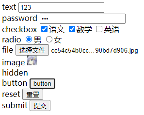
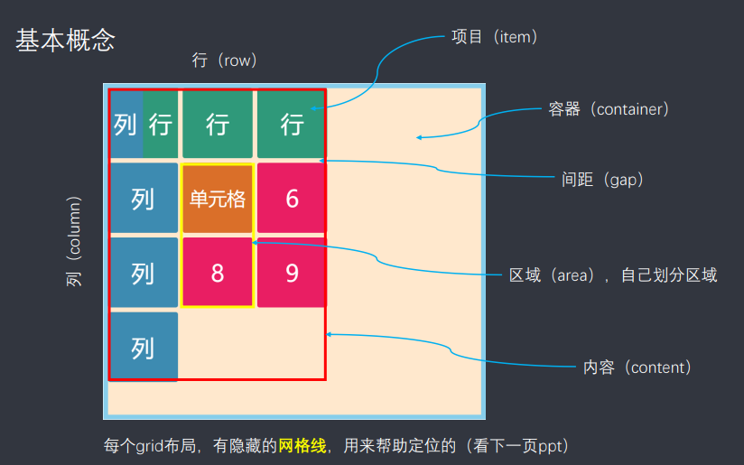

# 方向

## 普通路线

* 阶段一 网页基础

  * HTML
  * CSS

* 阶段二 JavaScript

  * JavaScript入门
  * JQuery入门
  * AJAX入门

* 阶段三 开发工具

  * Git
  * WebPack

* 阶段四 前端框架

  Vue.js

* 阶段五 移动及服务端开发

  移动Web前端开发

  Node.js快速入门与实战

## 大前端知识脉络

### CSS预处理

* SASS 基于Ruby 学习成本高,解析效率高
* LESS 基于NodeJS 学习成本低,解析效率足够

### 原生JS : 按照ECMAScript标准开发

常用ES6标准,但是会webpack打包为ES5支持

目前已经有ES9标准,增加更多新特性

### TypeScript

JavaScript的超集,需要编译成为JS后才能被浏览器正确执行

### JavaScript框架

* JQuery : 简化DOM操作,缺点是DOM操作过于频繁,影响前端性能
* Angular : 将java后台的MVC开发模式搬到了前端,并增加了模块化开发的概念,采用TypeScript语法开发
* React : 高性能JS前端框架,在内存中模拟DOM操作(虚拟DOM),有效提升前端渲染效率,学习成本较高,需要额外学习JSX语言
* Vue : 渐进式JavaScript框架,实现模块化开发,路由,状态管理等新特性,综合了Angular(模块化)和React(虚拟DOM)的优点
* Axios : 前端通信框架 : 因为Vue并不具备通信能力,因此需要额外使用一个通信框架与服务器交互,或是选择JQuery提供的AJAX通信功能

### UI框架

* Ant-Design : 基于React的UI框架

* ElementUI ,iview,ice : 饿了么出品,基于Vue的UI框架

* Bootstrap : Twitter出品前端开源工具包
* AmazeUI : HTML5跨屏前端框架

### JavaScript构建工具

Babel: JS编译工具,主要用于浏览器不支持的ES新特性,比如编译TypeScript

WebPack : 模块打包器,主要作用是打包,压缩,合并及按序加载

### 三端统一

Hybrid App : 主要目的是实现一套代码三端统一(PC,Android,IOS)并能够调用设备底层硬件(传感器,GPS,摄像头等)

打包方式主要为以下两种

* 云打包 : HBuild ->HBuildX
* 本地打包  : Cordova

### 微信小程序

详见微信官网

小程序开发框架(可选) : WeUI

### 后端技术

前端人员为方便开发也需要掌握一定前端技术,但是Java后端庞大复杂,因此出现了NodeJS

NodeJS作者声称已经放弃了NodeJS,开始开发全新架构的Deno

* Express : NodeJS
* Koa : Express简化版
* NPM : 项目管理工具 ,类似于Maven
* YARN : NPM替代方案,类似于Maven和Gradle的关系


# HTML

## 初识HTML

* HTML 超文本标记语言

* W3C标准

  * 结构化标准语言(HTML,XML)
  * 表现标准语言(CSS)
  * 行为标准(DOM,ECMAScript)

* 基本结构

  ```html
  <!DOCTYPE html>
  <html lang="en">
  <head>
      <meta charset="UTF-8">
      <title>Title</title>
  </head>
  <body>
  
  </body>
  </html>
  ```

## 网页基本信息

* 注释

  ```
  <!-- 注释内容 -->
  ```

* ```
  <meta> 用于描述网站信息,例如编码,关键词
  <title> 网站标题
  ```

## 网页基本标签

```html
标题标签:
<h1>
段落标签
<p>
换行标签
<br>
水平线标签
<hr>
字体样式标签(粗体,斜体)
<strong>
<em>
注释
<!-- 注释内容 -->
特殊符号(转义字符),示例表示空格
&nbsp;
```

## 图片标签

* 相对路径

* 绝对路径

```html

```

## 超链接标签及应用

* 可以网址,邮件,页内跳转,电话等各种协议

```html
<a href="http://baidu.com">内容</a>
```

## 块元素和行内元素

* 块元素 : 无论内容多少,该元素独占一行

  p,h1-h6...

* 行内元素 : 内容撑开宽度,可以在同一行

  a,strong...

## 列表标签

* 有序列表

  ```
  <ol>
      <li>有序列表</li>
      <li>有序列表</li>
  </ol>
  ```

* 无序列表

  ```
  <ul>
      <li>无序列表</li>
      <li>无序列表</li>
  </ul>
  ```

* 定义列表

  ```
  <dl>
      <dt>学科</dt>
      <dd>java</dd>
      <dd>python</dd>
      <dt>学员</dt>
      <dd>lisnote</dd>
      <dd>FStudent</dd>
  </dl>
  ```

## 表格标签

```html
<table></table>  创建表格
<caption></caption> 定义表格标题
<tr></tr> 表格：行
<th></th> 表格：表头单元格
<td></td> 表格：内容
<thead></thead> 表格：定义表头
<tbody></tbody> 表格：定义表内容
<tfoot></tfoot> 表格：定义表脚

行列属性
rowspan行宽
colspan列宽
```

## 媒体标签

```html
<video src="video.mp4" controls autoplay></video>
<audio src="video.mp4" controls autoplay></video>
video

属性
控制器
controls
自动播放
autoplay
```

## 页面结构分析

| 标签名  | 作用                         |
| ------- | ---------------------------- |
| header  | 头部区区                     |
| footer  | 底部区域                     |
| section | 页面中的独立区域             |
| article | 文章区域                     |
| aside   | 相关内容或应用(常用于侧边栏) |
| nav     | 导航类区域                   |

## iframe内联框架

```html
<iframe src="index.html"></iframe>
<iframe src="//player.bilibili.com/player.html?aid=376260038&bvid=BV1Bo4y1k7AA&cid=359630127&page=1" scrolling="no" border="0" frameborder="no" framespacing="0" allowfullscreen="true"> </iframe>
</body>
```

## 初识表单post和get提交

```html
<form method="post" action="result.html">
 
 属性
 method 有post和get方法
 action 发送目的地
```

## 表单中的input

```markdown
元素
input

属性
type 有text,password,checkbox,radio,submit,reset,file,hidden,image,button等,默认为text
name 指定表单元素的的名称
value 元素的初始值
size 表单元素的初始宽度
maxlength 最大输入字符数
checked type为radio或checkbox时,指定按钮是否被选中
```





## 列表框文本域

```markdown
select 列表框
	option 列表框内容

textarea 文本域
```

## 滑块,搜索框,简单验证

```html
滑块
<input type="range">
搜索框
<input type="search">

验证邮箱,URL,数字等
<input type="email">
<input type="url">
<input type="number">
```

## 表单的应用

| 属性     | 作用 |
| -------- | ---- |
| value    | 值   |
| hight    | 高度 |
| width    | 宽度 |
| readonly | 只读 |
| hidden   | 隐藏 |
| disable  | 禁用 |

## 表单初级验证

| 属性        | 作用     |
| ----------- | -------- |
| placeholder | 提示     |
| required    | 非空判断 |
| pattern     | 正则验证 |


# CSS

## CSS介绍

* 用于美化HTML工具

## 什么是CSS和CSS发展史

* Cascading style sheet 层叠样式表
* 作用 : 美化网页
* 修饰 : 字体,颜色,高宽,背景图片,网页定位,网页浮动,动画

* 发展史

  * CSS1.0

    基本样式

  * CSS2.0

    div+css		html与css分离,优化SEO

  * CSS2.1

    浮动,定位

  * CSS3.0

    圆角,阴影,动画

* 优势

  * 内容表现分离
  * 结构统一,可以复用
  * 样式丰富

## CSS的快速入门

```html
<!DOCTYPE html>
<html lang="en">
<head>
    <meta charset="UTF-8">
    <title>Title</title>
    <style>
        h1 {
            color: red;
        }
    </style>
</head>
<body>
<h1>HelloWorld</h1>
</body>
</html>
```

## 四种CSS导入方式

* 优先级 : 就近原则

* 行内样式

```html
<h1 style="color: red">HelloWorld</h1>
```

* 内部样式

```html
<style>
    h1 {
        color: red;
    }
</style>
```

* 外部样式

```html
<link href="css/style.css">
```

## 三种基本选择器

* 作用 : 选择页面的某个或某类元素
* 优先级 : id选择器 > Class选择器 > 标签选择器

| 作用       | 用例         |
| ---------- | ------------ |
| 标签选择器 | .tagName{}   |
| 类选择器   | .className{} |
| id选择器   | #idName{}    |

## 层次选择器

| 作用                                                | 用例           |
| --------------------------------------------------- | -------------- |
| 后代选择器 body中的所有h1标签                       | body h1{}      |
| 子选择器 body下一级中的所有h1标签                   | body>h1{}      |
| 相邻兄弟选择器 id为idName的标签同级的下一个h1标签   | #idName + h1{} |
| 通用兄弟选择器 id为idName的标签同级的下方所有h1标签 | #idName~h1{}   |

## 结构伪类选择器

| 作用                                              | 用例                |
| ------------------------------------------------- | ------------------- |
| 选中ul的第一个li子元素                            | ul li:first-child{} |
| 选中ul的最后一个li子元素                          | ul li:last-child{}  |
| 选择父级元素中的第一个子元素,且该元素需要为h1元素 | h1:nth-child(1){}   |
| 选择父级元素中第一个标签为h1的子元素              | h1:nth-of-type(1){} |

## 属性选择器

| 作用                                               | 用例                   |
| -------------------------------------------------- | ---------------------- |
| 选中h1标签中存在id属性的标签                       | h1[id]{}               |
| 选中h1中id为idName的标签(属性名可以使用正则表达式) | h1[id=idName]{}        |
| 选中h1中class为className的标签(完全相等)           | h1[class=className]{}  |
| 选中h1中class存在className的标签(包含等于)         | h1[class*=className]{} |
| 选中h1中id为idN开头的标签                          | h1[id^=idN]{}          |
| 选中h1中id为Name结尾的标签                         | h1[id$=Name]{}         |

## CSS的作用及字体样式

* span 标签 一般用于突出重要内容(行内元素)
* div 区域标签(块级元素)

```css
/* 基本设置 此处为 : 斜体 宽度 大小 字体 */
font:oblique lighter 16px "楷体"
/* 字体 */
font-family:楷体;
/* 字体大小 */
font-size:50px;
/* 字体粗细 */
font-weight:bold;
```

## 文本样式

```css
/* 颜色 */
color:red;
/* 对齐方式 */
text-align:center;
/* 首行缩进 */
text-indent:2em;
/* 行高 */
line-height:20px;
/* 装饰(下划线,删除线等) */
text-decoration:underline;
text-decoration:line-through;
```

水平对齐

```css
img,span{
	vertical-align:middle;
}
```

## 文本阴影和超链接伪类

* 文本阴影 颜色 水平偏移 垂直偏移 阴影半径

  ```css
  {text-shadow: red 10px 10px 10px}
  ```

* 超链接伪类

  | 案例        | 作用         |
  | ----------- | ------------ |
  | a:link{}    | 未访问的连接 |
  | a:visited{} | 已访问的连接 |
  | a:hover{}   | 鼠标悬停时   |
  | a:active{}  | 被选中的连接 |
  
  

## 背景图像应用及渐变

```css
/* 背景颜色 */
background-color: red;
/* 背景图片 */
background-image: url("picture/image.jpg");
/* 平铺方式 */
background-repeat:repeat-x;
/* 渐变色 */
background-image: linear-gradient(10000deg,#FFF,#000);
```

## 盒子模型及边框使用

* margin 外边距
* border 边框
* padding 内边距

```css
/* 边框 厚度 显示 红色 */
border: 1px solid red;
```

## 内外边距及div居中

```css
/* 居中 */
margin: 0 auto;
```

## 圆角边框及阴影和经验分享

```css
/* 圆角 */
border-radius:10px
四角圆率 左上开始,顺时针
border-radius:10px 0 0 0;
```

```css
/* 阴影 x偏移 y偏移 模糊半径 阴影颜色 */
box-shadow:10px 10px 10px red;
```

## display和浮动

```css
display:none; /* 不显示 */
display:block; /* 变为块级元素 */
display:inline;/* 变为行内元素 */
display:inline-block; /* 是块元素,但是可以和其他元素在同一行 */
```

```css
float:left; /* 向左浮动 */
clear:both; /* 两侧不允许有其他浮动元素 */
```

## overflow及父级边框坍塌问题

* overflow : 溢出属性

* 父级边框坍塌问题 : 当子元素都浮动的时候,父级边框的高度会被置零

  * 解决方案1:为父级边框设定固定高度

  * 解决方案2:为父级边框设定一个子元素div,设定该div属性为

    ```css
    clear:both;
    margin:0;
    padding:0;
    ```

  * 为父级元素增加overflow属性

    ```css
    overflow:hidden;
    ```

  * 为父级元素添加一个伪类(推荐使用)

    ```css
    #father:after{
    	content:'';
    	display:block;
    	clear:both;
    }
    ```

## 相对定位的使用及练习

* 相对定位 : 相对自己原来的位置
* 使用相对定位时,原来的位置会被保留,不会造成父级元素塌陷

```css
position:relative
top:10px;
bottom:10px;
left:0px;
right:0px;
```

## 绝对定位和固定定位

* 绝对定位不会保留原来的位置,但会会保留新的位置

* 没有父级元素定位时,会相对浏览器定位
* 父级元素有定位时,会相对父级元素定位

```css
position:absolute;
top:10px;
bottom:10px;
left:0px;
right:0px;
```

* 固定定位不会随着浏览器页面的滑动而改变位置

```css
position:fixed;
top:10px;
bottom:10px;
left:0px;
right:0px;
```

## z-index及透明度

```css
/* 层级 */
z-index:999;
/* 透明度 */
opacity: 0.5;
```

## 动画及视野拓展

* 动画 : keyframes
* 2D转换
* 过渡
* CSS预处理语言 : less

## 流行布局

### Flex

常用属性

```css
*{
	display: flex
	flex: 1;
    flex-direction: column;
  	justify-content: center;
  	align-content: center;
}
```

### Grid



#### 容器属性

| 属性名                               | 作用 |
| ------------------------------------ | ---- |
| 1. grid-template-columns             | 列数量 |
| 2. grid-template-rows          | 行数量 |
| 3. grid-row-gap                | 列间隔 |
| 4. grid-column-gap           | 行间隔 |
| 5. grid-gap      | (3和4的简写) |
| 6. grid-template-areas       | 设定容器区域 |
| 7. grid-auto-flow             | 设定项目横纵排序 |
| 8. justify-items               | 项目在自身切片的水平分布模式 |
| 9. align-items                | 项目在自身切片的垂直分布模式 |
| 10. place-items  | (8和9的简写) |
| 11. justify-content            | 容器内容的水平定位模式 |
| 12. align-content           | 容器内容的垂直定位模式 |
| 13. place-content | (11和12的简写) |
| 14. grid-auto-columns          | 超出容器的列的属性 |
| 15. grid-auto-rows                   | 超出容器的行的属性 |

常用属性

```
grid-template-columns: repeat(3, 100px)
// 等价于 grid-template-columns: 100px 100px 100px;
grid-template-columns: repeat(auto-fill, 100px);
// 单元格确定大小,容器不确定大小
grid-template-columns: repeat(4, 1fr);
// 将宽等分为四段 fr单位,意为片段
grid-template-columns: 1fr minmax(150px, 1fr);
// 最大150px,最小一片段
grid-template-columns: 100px auto 100px;
// 中间部分由浏览器自定宽度
```


#### 项目属性

| 属性名               | 作用           |
| -------------------- | -------------- |
| 1. grid-column-start | 项目垂直起点   |
| 2. grid-column-end   | 项目垂直终点   |
| 3. grid-row-start    | 项目水平起点   |
| 4. grid-row-end      | 项目水平终点   |
| 5. grid-column       | 1,2的简写形式  |
| 6. grid-row          | 3,4的简写形式  |
| 7. grid-area         | 1,3,2,4的简写  |
| 8. justify-self      | 水平内容布局   |
| 9. align-self        | 垂直内容布局   |
| 10. place-self       | 8和9的简写形式 |

## 视频

```css
//全屏按钮
video::-webkit-media-controls-fullscreen-button {
    display: none;
}
//播放按钮
video::-webkit-media-controls-play-button {
    display: none;
}
//进度条
video::-webkit-media-controls-timeline {
    display: none;
}
//观看的当前时间
video::-webkit-media-controls-current-time-display{
    display: none;            
}
//剩余时间
video::-webkit-media-controls-time-remaining-display {
    display: none;            
}
//音量按钮
video::-webkit-media-controls-mute-button {
    display: none;            
}
video::-webkit-media-controls-toggle-closed-captions-button {
    display: none;            
}
//音量的控制条
video::-webkit-media-controls-volume-slider {
    display: none;            
}
//所有控件
video::-webkit-media-controls-enclosure{ 
    display: none;
}
```


# JavaScript

## 语言基础

### HelloWorld

```html
<script>
    alert("HelloWorld!");
</script>
```

引用外部JavaScript文件

```html
<script src = "js/index.js"></script>
```

使用控制台

```javascript
// 控制台答应Hello
console.log("Hello");
```

### 严格检查模式strict

* 启用严格检查模式

  ```html
  <script>
  	'use strict'; //必须放在第一行
  </script>
  ```

### 数据类型

#### 基本类型

既非对象,也没有方法的数据

string,number,bigint,boolean,null,undefined,symbol

#### 数据类型快速浏览

数值,文本,图形,音频,视频

```javascript
// 数值
number 不区分小数和整数
// 字符串
'abc';
"abc";
// 布尔值
true,false
// 与或非
true && false	//false
true || false	//true
!true 			//false

// 比较运算
== // 等于(类型不同,值相同,也会判断为true)
=== // 绝对等于(类型一样,值一样,结果才为true)

// NaN与所有的数值都不相等,包括他自己,判断NaN应使用isNaN()方法
NaN===NaN 返回false
isNaN(NaN) 返回true

// 数组的元素不一定需要相同类型
var arr = [0,"String"];

// 对象 使用大括号包围
var person = {
	name = "lisnote",
	age = 10
}
// 取对象的值
person.name;
// 添加属性到对象
person.gender = "man";
person["adult"] = true;
```


#### 字符串类型详解

* 正常字符串使用 `''` 或 `" "`包裹
* 特殊字符可以用`\`进行转义

```markdown
\`
\n
\t
```

* 支持Unicode编码和ASCII字符

```markdown
\u4e2d
\x41
```

* 多行字符串

```javascript
let helloWorld = `Hello
World`;
```

* 模板字符串

```javascript
let hello = `Hello`;
let helloWorld = `${hello}World!`;
console.log(helloWorld)
//HelloWorld!
```

* 字符串长度

```javascript
str.length
```

* 大小写转换

```javascript
str.toUpperCase();
str.toLowerCase();
```

* 获取索引

```javascript
str.indexOf('t');
```

* 截取字符串

```javascript
str.substring(1);
str.substring(1,3);
```

#### 数组类型详解

* 数组可以包含不同类型的元素
* 对arr.length属性赋值可以改变数组大小

```javascript
//数组排序
arr.sort();
//通过元素获取下标索引
arr.indexof(2);
//截取数组一部分,返回一个新数组
arr.slice(0,2);
//数组填充
arr.fill(1);
//栈操作 往尾部投入和投出
arr.push()
arr.pop()
//往头部投入和投出元素
arr.unshift()
arr.shift()
//元素反转
arr.reverse()
//数组连接,返回新数组
arr.concat([1,2,3]);
//打印数组并使用特定的字符串连接
arr.join('-');
```

* 拓展

```javascript
//按条件排序(奇数在前)
[1,2,3,4,5].sort((x,y)=>y%2-x%2)
//过滤不符合要求的数据(此处只保留字符串)
[1,2,3,"asd","1"].filter(data => typeof data == "string")
//统计符合要求的数据数量
[1,2,3,"asd","1"].reduce((pre,current) => {
    return pre
})
```


#### 对象类型详解

```javascript
// 对象格式
var 对象名 = {
	key1: value1,
	key2: value2,
  //...
}

// 动态删减属性 通过delete除对象属性
delete person.name;

// 动态添加属性 直接给新属性赋值即可
person.name = "lisnote";
```

* 对象中所有属性名都为字符串

```javascript
// 判断一个属性是否在对象中
'toString' in person
//true (在父类中)
// 判断一个属性是否是自身拥有
hasOwnProperty('name');
```

### 结构语句/流程控制

```javascript
//if
if(num == 0){
	console.log("if 0");
}else if(num == 1){
	console.log("if 0");
}else{
	console.log("if else");
};

//switch
switch(num){
	case 0:
		console.log("switch 0");
		break;
	case 1:
		console.log("switch 1");
		break;
	default:
		console.log("switch default");
}

//普通for循环
for (let i = 0; i < 5; i++) {
	console.log(i);
}
//forin循环(获取索引或属性名)
for (let i in arr) {
	console.log(arr[i]);
}
//forof循环(获取内容)
for (let i of arr) {
	console.log(i);
}
//数组forEach
arr.forEach(function(value){
	console.log(value);
})

//while
while (num < 3) {
	console.log(num);
	num++;
};
//do{}while
do {
	console.log(num);
	num++;
}while (num < 3);
```

### 函数

 ```
 function abs(value) {
 	if (value > 0) return value;
 	return -value;
 }
 ```

JavaScript方法可以传递任意个参数,也可以不传递参数

```javascript
function abs() {
	console.log(arguments.length);
	for (let i of arguments) {
		console.log(i);
	}
}
abs(1, 3, 4, 5, 4, 3);
```

手动抛出异常

```javascript
function abs() {
	if (arguments.length > 0) throw "Arguments Exception!";
}
```

额外参数

```javascript
function print(a, ...args) {
	console.log(a);
	console.log(args);
}
```


## 集合操作

**个人见解 : 很多时候使用普通的数组和对象就OK,特别是ES6中新增了不少极其便利的方法后**

### map:映射表

```javascript
map = new Map([['lisnote',100],['FStudent',0]]);
map.get('lisnote');
map.set('didongxiaoli',60);
```

### set:无序不重复集合

```javascript
let set = new Set([1,2,2,3]);
set.add(0);
set.delete(1);
set.has(2);
```

遍历map和set只能用for of循环


## 变量的作用域,var,let,const

* var 的作用域只分为函数作用域和全局作用域,无块级作用域
* let存在块级作用域
* const为不可修改的常量,作用范围同let

* 养成规范 : 

  因为JavaScript中的var定义会自动提升变量声明,但是不提升变量赋值

  因此所有变量在定义之初都应该放在函数的头部,避免局部死区,便于维护

* 默认所有的全局变量都会绑定在windows对象下

```javascript
var str = "Hello";
console.log(str);	//Hello
console.log(window.str);	//Hello
```

* let和const关键字即使在顶端定义也不会再window对象中创建新属性

```javascript
let str = "Hello";
console.log(window.str);	//undefined
```

* JavaScript只有一个全局作用域window
* 由于全局变量都会绑定到window上,因此不同的js文件,如果使用了相同的全局变量就产生冲突,因此一般使用let或自定义一个全局变量,将自己定义的变量全部添加到这个全局变量中

```javascript
var lisnoteApp = {}
lisnoteApp.str = "Hello";
console.log(lisnoteApp.str);
```

## 方法的定义和调用,apply

* 方法就是对象中的函数

```javascript
var student = {
	name: "lisnote",
	age: 20,
	toString: function() {
		return this.name + " " + this.age;
	}
}
```

* this一般代表调用该方法的对象,可以改变this指向

```javascript
var student = {
	name: "lisnote"
}
function getName() {
	console.log(this.name);
}
getName.apply(student);
```

## 常见类型

```javascript
typeof 123
// "number"
typeof NaN
// "number"
typeof '1'
// "string"
typeof true
// "boolean"
typeof []
// "object"
typeof {}
// "object"
typeof Math.abs
// "function"
```

* 数组类型常见方法

  ```javascript
  let arr = [1,2,3];
  arr.push(4);	//数组末尾插入
  console.log(arr);	//1,2,3,4
  arr.pop();		//数组末尾删除
  console.log(arr);	//1,2,3
  arr.unshift(0);	//数组首位插入
  console.log(arr);	//0,1,2,3
  arr.shift();	//数组首位删除
  console.log(arr);	//1,2,3
  arr.reverse();	//数组倒序
  console.log(arr);	//3,2,1
  arr.sort();		//数组排序
  console.log(arr);	//1,2,3
  console.log(arr.join(' '));	//用字符分隔数组元素并返回字符串
  console.log(arr.toString());	//数组转字符串
  ```

JavaScript还有String,Number,Boolean包装类,提供了一系列方法可供部分使用需求

### 进制转换

```javascript
console.log(
    // 十进制转其他
    15..toString(16),
    // 其他进制转十
    parseInt("ff", 16),
    // 二进制0b开头
    0b11,
    // 八进制0开头
    011,
    // 十六进制0x开头
    0xff
);
// output : f 255 3 9 255
```


## Math对象

```javascript
Math.random() //返回一个随机数,大小为[0,1);
```

## Date日期对象

```javascript
let now = new Date();可传入时间戳
console.log(now); //格式化日期
console.log(now.getTime()); //时间戳
console.log(now.getFullYear()); //年
console.log(now.getMonth()); //月
console.log(now.getDate()); //日
console.log(now.getDay()); //星期几
console.log(now.getHours()); //时
console.log(now.getMinutes()); //分
console.log(now.getSeconds()); //秒
```

## JSON对象

* JSON是一种轻量级数据交换格式

```javascript
//对象转换为JSON字符串
JSON.stringify(json);
//JSON字符串转换为对象
JSON.parse('{"name":"lisnote","age":"3"}')
```

## 面向对象原型继承

* JavaScript面向对象是面向原型继承
* 原型可变
* 继承步骤
  1. 定义自己不同于原型的属性
  2. 选择继承的原型

```javascript
let human = {
	name: "unnamed",
	species: "human"
}
let bird = {
	name: "unnamed",
	species: "bird"
}
let lisnote = {
	name: "lisnote"
}
lisnote.__proto__ = human;
console.log(lisnote.species);
lisnote.__proto__ = bird;
console.log(lisnote.species);
```

## 面向对象class继承

* ES6之后可以定义类
* 本质上仍然是继承原型
* 继承步骤
  1. 定义一个类
  2. 使用new关键字构建对象

```javascript
class Person {
	constructor(name) {
		this.name = name;
	}
}
class Student extends Person {
	constructor(name, score) {
		super(name)
		this.score = score;
	}
}
let lisnote = new Student("lisnote", 10);
console.log(lisnote)
```

## 操作BOM对象

* BOM全称Browser Object Model(浏览器对象模型)
* windows : 充当全局作用域,并表示浏览器窗口

```javascript
window.innerWidth	//浏览器内宽
window.innerHeight	//浏览器内高
window.outerWidth	//浏览器外宽
window.outerHeight	//浏览器外高
```

* navigator : 表示浏览器信息(用户可以轻易修改,不一定正确)

```javascript
navigator.appName 		//浏览器名称；
navigator.appVersion 	//浏览器版本；
navigator.language 		//浏览器设置的语言；
navigator.platform 		//操作系统类型；
navigator.userAgent 	//浏览器设定的User-Agent字符串。
```

* screen : 表示浏览器屏幕信息

```javascript
screen.width 		//屏幕宽度，以像素为单位；
screen.height 		//屏幕高度，以像素为单位；
screen.colorDepth 	//返回颜色位深，如8、16、24。
```

* location : 显示当前URL信息

```javascript
location.href 		// 获取完整链接 http://www.example.com:8080/path/index.html?a=1&b=2#TOP
location.protocol 	// 获取协议 'http'
location.host 		// 获取域名 'www.example.com'
location.port 		// 获取端口 '8080'
location.pathname 	// 获取连接后地址 '/path/index.html'
location.search 	// 获取查询参数(?及后方的文字) '?a=1&b=2'
location.hash 		// 获取标识符(#后方的文字) 'TOP'
```

* document : 文档对象(HTML在浏览器中以DOM形势表示为树形结构,document对象就是DOM树的根节点)

```javascript
document.getElementById('lisnote') 	//根据id获取
document.cookie 					//获取cookie
```

* history : 历史记录(不建议使用,因为现在一般会使用很多的AJAX)

```javascript
history.back() 		//后退
history.forward() 	//前进
```

## 操作DOM对象

* 更新DOM结点
* 遍历DOM结点
* 删除DOM结点
* 添加DOM结点

## 获得DOM结点

```javascript
document.getElementsByTagName("div")		//根据标签名获取结点
document.getElementById('lisnote')			//根据ID获取结点
document.getElementsByClassName("FStudent")	//根据类名获取结点

let lisnote = document.getElementById("lisnote");
lisnote.childen;							//获取父结点下所有子结点
//更多方法(参考CSS选择器)...
lisnote.firstChild
lisnote.lastChild;
```

## 更新DOM结点

```javascript
lisnote.innerText ="123"						//修改文本值为123(特殊符号自动转义)
lisnote.innerHTML = "<strong>123</strong>"		//修改内容(无转移)
lisnote.style.color								//修改样式中的color
```

## 删除DOM结点

* 步骤:
  1. 获取需要删除节点的父结点
  2. 通过父结点删除该结点

```javascript
// 拿到待删除节点:
var self = document.getElementById('to-be-removed');
// 拿到父节点:
var parent = self.parentElement;
// 删除:
var removed = parent.removeChild(self);
removed === self; // true
```

## 创建和插入DOM结点

* 方式1. appendChild添加子结点

```javascript
var
    js = document.getElementById('js'),
    list = document.getElementById('list');
list.appendChild(js);
```

* 方式2.insertBefore结点前插入

```javascript
var 
    list = document.getElementById('list'),
    ref = document.getElementById('python'),
    haskell = document.createElement('p');
haskell.id = 'haskell';
haskell.innerText = 'Haskell';
list.insertBefore(haskell, ref);
```

## 获得和设定表单的值

* 获取值

```javascript
var mon = document.getElementById('monday');
var tue = document.getElementById('tuesday');
mon.value; // '1'
tue.value; // '2'
mon.checked; // true或者false
tue.checked; // true或者false
```

* 修改值

```javascript
// <input type="text" id="email">
var input = document.getElementById('email');
input.value = 'test@example.com'; // 文本框的内容已更新
```

## 表单提交验证及前端密码MD5加密

```javascript
var form = document.getElementById('test-form');
// 可以在此检查或修改form的input...
// 提交form:
form.submit();
```

## 正则表达式

**此处不含通用正则知识,仅对javascript使用方式作总结**

* str.match()

  返回包含首个匹配到字符串的对象,失败返回null

* str.matchAll()

  返回可迭代的包含所有匹配到字符串的对象,失败返回null

* str.search()

  返回查找到字符串的起始index,失败返回-1

* str.replace()

  替换匹配文本并返回新的字符串

* str.split()

  将匹配的内容作为分隔标记,把文本变为数组并返回

* reg.exec()

  类似match

* reg.test()

  匹配成功返回true,失败返回false

```javascript
console.log([
    "banana".match(/\w/),
    "banana".matchAll(/\w/g),
    [..."banana".matchAll(/\w/g)],
    "banana".search(/a/),
    "banana".replace(/\w/,"a"),
    "banana".replace(/\w/g,"a"),
    "banana".split(/\a/),
    /a\w/.exec("banana"),
    /a\w/.test("banana")
])

// [
//     ['b', index: 0, input: 'banana', groups: undefined],
//     Object[RegExp String Iterator] { },
//     [
//         ['b', index: 0, input: 'banana', groups: undefined],
//         ['a', index: 1, input: 'banana', groups: undefined],
//         ['n', index: 2, input: 'banana', groups: undefined],
//         ['a', index: 3, input: 'banana', groups: undefined],
//         ['n', index: 4, input: 'banana', groups: undefined],
//         ['a', index: 5, input: 'banana', groups: undefined]
//     ],
//     0,
//     'aanana',
//     'aaaaaa',
//     ['b', 'n', 'n', ''],
//     ['an', index: 1, input: 'banana', groups: undefined],
//     true
// ]

// 根据匹配内容返回替换对应内容
"abnbnb".replace(/a|b/g, data => {
    switch (data) {
        case "a": return "b";
        case "b": return "a";
    }
})
// banana
```

## prototype

把对象变成数组(不推荐,仅供理解)

```javascript
let obj = {
    0: 1,
    1: 2,
    2: 3,
    length: 3
};
let arr = [1, 2, 3];
console.log(arr, obj);
obj.__proto__ = Array.prototype;
console.log(arr, obj);
```

## Promise

前端异步新神

### fetch

更好的异步资源获取

## Generator

生成器?迭代工具?还没用过

## Proxy

更好的对象代理

## Reflect

反射

## Object

几乎所有实例都是Object类型实例,Object自身提供了很多实用方法字段

### 静态方法

#### Object.entries()

返回一个对象的[key,value]数组

```javascript
let person = {
  name: 'lisnote',
};
Object.defineProperty(person, 'age', { value: 18 });
let key = Symbol();
person[key] = '';
console.log(Object.entries(person));
// [ [ 'name', 'lisnote' ] ]
```

#### Object.getOwnPropertyNames()

返回属性名数组

```javascript
let person = {
  name: 'lisnote',
};
let key = Symbol();
person[key] = '';
Object.defineProperty(person, 'age', { value: 18 });
console.log(Object.getOwnPropertyNames(person));
// [ 'name', 'age' ]
```

#### Object.keys

返回对象的可枚举字符串属性

```javascript
let person = {
  name: 'lisnote',
};
let key = Symbol();
person[key] = '';
Object.defineProperty(person, 'age', { value: 18 });
console.log(Object.keys(person));
// [ 'name' ]
```

#### Object.values

返回对象的可枚举属性的字符串属性对应的值

```javascript
let person = {
  name: 'lisnote',
};
let key = Symbol();
person[key] = '';
Object.defineProperty(person, 'age', { value: 18 });
console.log(Object.values(person));
// [ 'lisnote' ]
```


#### Object.getOwnPropertySymbols()

返回传入对象的Symbol属性数组

```javascript
let a = Symbol('');
let b = Symbol('');
let obj = {};
obj[a] = 'a';
obj[b] = 'b';
let arr = Object.getOwnPropertySymbols(obj);
console.log(arr);
// [ Symbol(), Symbol() ]
```


#### Object.assign()

通过复制一个或多个对象来创建一个新的对象

```javascript
let source = { name: 'lisnote' };
let target = Object.assign({ age: 10 }, source);
source.name = 'didongxiaoli';
console.log(target);
// { age: 10, name: 'lisnote' }
```

**更改源对象属性,并不影响返回对象的属性**

#### Object.create()

使用指定的原型对象和属性创建一个新的对象

```javascript
let proto = {
  name: 'lisnote',
  print() {
    console.log(`${this.name}`);
  },
};
let target = Object.create(proto);
console.log(target);
target.print();
// {}
// lisnote
```

**name属性存在于\_\_proto\_\_中,因此并没有输出**

#### Object.defineProperty()

定义属性,并返回定义后的对象

```javascript
let source = { name: 'lisnote' };
let target = Object.defineProperty(source, 'age', {
  value: 10,
  // 默认值
  // configurable: false, // 可否移除属性
  // enumerable: false, // 可否枚举
  // writable: false, // 可否修改
  // get: undefined, // getter函数
  // set: undefined, //setter函数
});
console.log(source == target);
console.log(source.age);
console.log(source);
// true
// 10
// { name: 'lisnote' }
```

**Vue2就用这个做数据劫持**

#### Object.defineProperties()

定义多个属性,并返回定义后的对象

```javascript
const person = {};
Object.defineProperties(person, {
  name: {
    value: 'lisnote',
    enumerable: true,
  },
  age: { value: 10 },
});
console.log(person);
// { name: 'lisnote' }
```


#### Object.freeze()

冻结属性

```javascript
let person = {
  name: 'lisnote',
};
Object.freeze(person);
person.name = 'didongxiaoli';
delete person.name;
console.log(person);
// { name: 'lisnote' }
```

**不可读不可删**

#### Object.getOwnPropertyDescriptor()

返回对象属性的描述符

```javascript
let person = {
  name: 'lisnote',
  age: 10,
};
console.log(Object.getOwnPropertyDescriptor(person, 'name'));
// {
//   value: 'lisnote',
//   writable: true,
//   enumerable: true,
//   configurable: true,
// };
```

#### Object.getOwnPropertyDescriptors()

返回对象所有属性的描述符

```javascript
let person = {
  name: 'lisnote',
};
Object.defineProperty(person, 'age', { value: 18 });
let key = Symbol();
person[key] = '';
console.log(Object.getOwnPropertyDescriptors(person));
// {
//   name: {
//     value: 'lisnote',
//     writable: true,
//     enumerable: true,
//     configurable: true,
//   },
//   age: {
//     value: 18,
//     writable: false,
//     enumerable: false,
//     configurable: false,
//   },
//   [Symbol()]: {
//     value: '',
//     writable: true,
//     enumerable: true,
//     configurable: true,
//   },
// };
```


#### Object.getPrototypeOf()

返回传入对象内部的[[Prototype]]属性

当然,所有人都不会拦着你用prototype和\_\_proto\_\_ ,但是不保证这两个属性会一直存在,就像Proxy也没有\_\_target\_\_一样,或许将来[[Prototype]]也没办法用属性访问

#### Object.preventExtensions()

防止对象新增属性

```javascript
let person = {
  name: 'lisnote',
};
Object.preventExtensions(person);
person.age = 18;
console.log(person);
```

#### Object.seal()

阻止对象删除属性

```javascript
let person = {
  name: 'lisnote',
};
Object.seal(person);
delete person.name;
console.log(person);
```


#### Object.is

比较两值,且所有NaN相等

```javascript
console.log(NaN == NaN);
console.log(Object.is(NaN,NaN))
// false
// true
```


#### Object.isFrozen

判断对象是否被冻结

```javascript
let person = {
  name: 'lisnote',
};
Object.freeze(person);
console.log(Object.isFrozen(person));
// true
```

#### Object.isExtensible()

判断对象是否可以新增属性

```javascript
let person = {
  name: 'lisnote',
};
console.log(Object.isExtensible(person));
Object.preventExtensions(person);
console.log(Object.isExtensible(person));
delete person.name;
console.log(person);
// true
// false
// {}
```

#### Object.isSeal()

判断对象是否可以删除属性

```javascript
let person = {
  name: 'lisnote',
};
console.log(Object.isSealed(person))
Object.seal(person);
console.log(Object.isSealed(person))
// false
// true
```


### 实例方法


## 解构

```
const info = {
  person: {
    name: "lisnote",
    other: {
      age: 22,
    },
  },
  song: "rolling",
};

// 解构person的内容
const {
  person: {
    name,
    other: { age },
  },
  song,
} = info;

// output: lisnote 22 rolling
console.log(name, age, song);
```

## video API

```javascript
// 获取视频元素：
var videoElement = document.getElementById("videoPlay");

// 获取设置音量大小：
videoElement.volume

// 获取设置当前播放的位置：
videoElement.currentTime

// 播放视频：
videoElement.play()

// 暂停视频：
videoElement.pause()
```

浏览器原生视频api适合插入脚本的时候用,真做视频播放建议diygod的IPlayer

# JQuery

* 学习JQuery请善用[JQuery中文文档](https://jquery.cuishifeng.cn/)

* 引入可以使用CDN JQuery

```javascript
//JQuery使用公式 : $(选择器).事件()
//选择器使用同CSS
<script src="https://code.jquery.com/jquery-3.6.0.js"></script>
<script>
	$('#test').click(function() {
		alert("OK");
	});
</script>
```

## JQuery选择器

* 支持CSS选择器

## JQuery事件

* 鼠标事件

```javascript
mousedown()
mousemove()
// ---------不常用
mouseenter()
mouseleave()
mouseout()
mouseover()
mouseup()
```

* 键盘事件

...

* 其他时间(陀螺仪等)

...

## JQuery操作DOM元素

```javascript
//无传入参数即为获取值
$('#div1').text();
//有传入参数即为修改值
$('#div1').text('1234');
//修改CSS
$('div1').css("background","red");
//显示和隐藏元素
$('div1').show();
$('div1').hide();
```

# 小前端快速回顾

* 如何巩固JS : 看JQuery源码,看游戏源码
* 巩固HTML,CSS : 扒网站,对应修改看效果
* CSS框架:Bootstrap,Element UI,Ant Design