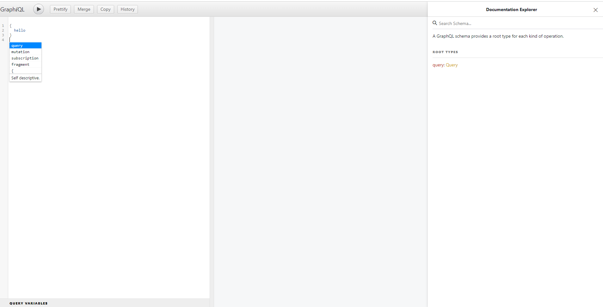

# GraphQL Study

这是用于记录 GraphQL 学习, 并包含实践的文件夹

## 认识 GraphQL

官方的讲, GraphQL 是个用于 api 查询的语言

而与我而言, 这是个能合并请求, 将请求尽可能保留在内网, 减少外网请求次数的加速节流工具

- GraphQL 的优缺点
  - 优点
  1. 快, 减少请求次数
  2. 没有过度获取和获取不足的情况
  3. 简单明了的层次结构
  4. 可信的数据格式, 服务器会返回安全可预测的形式进行数据返回
  5. 内省, 有助于开发人员快速了解 API
     ...
  - 缺点
  1. 增加项目复杂度
  2. 比 rest 更复杂的缓存机制
  3. 速率限制问题, 在 rest 中可以指定某接口一天只能访问多少次, 而 GraphQL 很难指定这种类型的语句
  4. 错误处理, rest 风格的 api, 一个接口会可以返回一个错误码, 但是整合之后原来的错误码返回方式就需要再整合, 而且为了减少受失败查询的影响, http 状态码往往为 200, 需要主动判断并抛出异常

## 环境

nodejs v18.9.1

"express": "^4.18.2",

"express-graphql": "^0.12.0",

"graphql": "^16.6.0"

# 入门

## 基础

### 快速开始

<span id="target001"/>目标 001: 创建运行一个 graph 程序

1. 安装 GraphQL

   ```bash
   npm i graphql
   ```

2. 写代码

   ```JavaScript
   // index.js
   var { graphql, buildSchema } = require('graphql');

   var schema = buildSchema(`
     type Query {
       hello: String
     }
   `);

   var rootValue = { hello: () => 'Hello world!' };

   var source = '{ hello }';

   graphql({ schema, source, rootValue }).then((response) => {
     console.log(response);
   });
   ```

3. 执行代码

   ```bash
   node index.js
   # { data: [Object: null prototype] { hello: 'Hello world!' } }
   ```

4. 理解你在做的是什么

   你先定义数据类型 : schema

   后定义了数据源(处理器) : rootValue

   然后定义查询结构, 查询了 hello 字段

   于是 GraphQL 执行数据源中的 key 为 hello 的函数, 返回了这个函数返回的数据给你

结论 : GraphQL 可以通过定义类型和类型上的字段来创建 GraphQL 服务

### 搭建 web 服务

<span id="target002"/>目标 002: 创建一个 GraphQL Web 服务

1. 安装 express 和 express-graphql

   ```bash
   pnpm install express express-graphql
   ```

2. 写代码

   ```javascript
   // index.js
   const express = require('express');
   const { graphqlHTTP } = require('express-graphql');
   const { buildSchema } = require('graphql');
   let schema = buildSchema(`
     type Query {
       name: String
       address: String
     }
   `);

   let rootValue = {
     name: () => 'lisnote',
     address: () => 'GuangDoor',
   };

   let app = express();
   app.use(
     '/graphql',
     graphqlHTTP({
       schema,
       rootValue,
       graphiql: true,
     })
   );
   app.listen(8080, () => console.log('http://localhost:8080/graphql'));
   ```

3. 启动服务器后即可访问地址

   ```bash
   node index.js
   ```

   http://localhost:8080/graphql

   这是一个简易 IDE, 可以用于查看 GraphQL 文档, 测试查询等等

   

4. 执行查询

   ```graphql
   {
     hello
     name
     age
   }
   ```

   获得此返回即为成功

   ```json
   {
     "data": {
       "hello": "Hello World!",
       "name": "lisnote",
       "age": 18
     }
   }
   ```

### GraphiQL

- 快捷键

  美化查询：Shift-Control-P

  合并查询：Shift-Control-M

  执行查询：Control-Enter

  自动完成：Control-Space

  输入提示: Control-I

### 格式化工具

安装 vscode 插件 prettier

在模板字符串前添加注释 /\* GraphQL \*/ 即可获得格式化支持

除以上方式外, 还可以通过 Apollo, graphql-tag 结合 vite, webpack 为 graphql 添加格式化支持

### 自定义类型

<span id="target003"/>目标 003: 自定义类型

```javascript
// index.js
const express = require('express');
const { graphqlHTTP } = require('express-graphql');
const { buildSchema } = require('graphql');
let schema = buildSchema(/* GraphQL */ `
  type Body {
    age: Int
    height: Int
    weight: Int
  }
  type Query {
    name: String
    address: String
    body: Body
  }
`);

let rootValue = {
  name: () => 'lisnote',
  address: () => 'GuangDoor',
  body: () => ({
    age: 18,
    height: 175,
    weight: 140,
  }),
};

let app = express();
app.use(
  '/graphql',
  graphqlHTTP({
    schema,
    rootValue,
    graphiql: true,
  })
);
app.listen(8080, () => console.log('http://localhost:8080/graphql'));
```

```graphql
{
  name
  address
  body {
    age
    height
    weight
  }
}
```

```json
{
  "data": {
    "name": "lisnote",
    "address": "GuangDoor",
    "body": {
      "age": 18,
      "height": 175,
      "weight": 140
    }
  }
}
```

### 参数

<span id="target004"/>目标 004: 带参查询

GraphQL 查询可以携带参数, 例如

```javascript
// index.js
const express = require('express');
const { graphqlHTTP } = require('express-graphql');
const { buildSchema } = require('graphql');
let schema = buildSchema(/* GraphQL */ `
  type Query {
    person(id: Int!): String
  }
`);
// 参数后加!表示为必要参数
let personList = ['lisnote', 'didongxiaoli'];
let rootValue = {
  // query参数为对象, 通常会解构获取
  person: ({ id }) => {
    return personList[id];
  },
};

let app = express();
app.use(
  '/graphql',
  graphqlHTTP({
    schema,
    rootValue,
    graphiql: true,
  })
);
app.listen(8080, () => console.log('http://localhost:8080/graphql'));
```

查询

```graphql
{
  person(id: 0)
}
```

### 客户端访问

<span id="target005"/>目标 005: 在网页中使用 GraphQL 查询

服务端

```JavaScript
// index.js
const express = require("express");
const { graphqlHTTP } = require("express-graphql");
const { buildSchema } = require("graphql");
let schema = buildSchema(/* GraphQL */ `
  type Query {
    person(id: Int!): String
  }
`);
let personList = ["lisnote", "didongxiaoli"];
let rootValue = {
  person: ({ id }) => {
    return personList[id];
  },
};

let app = express();
app.use(
  "/graphql",
  graphqlHTTP({
    schema,
    rootValue,
    graphiql: true,
  })
);
app.use(express.static(__dirname + "/web"));
app.listen(8080, () => console.log("http://localhost:8080/graphql"));
```

前端文件

```html
<!DOCTYPE html>
<!-- web/index.html -->
<html lang="en">
  <head>
    <meta charset="UTF-8" />
    <meta http-equiv="X-UA-Compatible" content="IE=edge" />
    <meta name="viewport" content="width=device-width, initial-scale=1.0" />
    <title>Document</title>
  </head>
  <body>
    <pre id="content"></pre>

    <script>
      let content = document.querySelector('#content');
      fetch('/graphql', {
        method: 'post',
        headers: {
          'Content-Type': 'application/json',
        },
        body: JSON.stringify({
          query: /* GraphQL */ `
            {
              person(id: 0)
            }
          `,
        }),
      })
        .then((resp) => resp.json())
        .then((json) => (content.innerText = JSON.stringify(json, null, 2)));
    </script>
  </body>
</html>
```

访问 http://localhost:8080 即可自动查询并显示结果

### mutations

<span id="target006"/>目标 006: 定义 mutation 及使用

**无论是否使用查询功能, schema 都必须提供 Query 根类型**

```javascript
// index.js
const express = require('express');
const { graphqlHTTP } = require('express-graphql');
const { buildSchema } = require('graphql');
let schema = buildSchema(/* GraphQL */ `
  type Query {
    persons: [String]
  }
  type Mutation {
    addPerson(name: String!): [String]
    removePerson(name: String!): [String]
    updatePerson(oldName: String!, newName: String!): [String]
  }
`);
let personList = ['lisnote', 'didongxiaoli'];
let rootValue = {
  persons: () => personList,
  addPerson({ name }) {
    if (!personList.includes(name)) {
      personList.push(name);
    }
    return personList;
  },
  removePerson({ name }) {
    let index = personList.indexOf(name);
    if (index > -1) {
      personList.splice(index, 1);
    }
    return personList;
  },
  updatePerson({ oldName, newName }) {
    let index = personList.indexOf(oldName);
    if (index > -1) {
      personList[index] = newName;
    }
    return personList;
  },
};

let app = express();
app.use(
  '/graphql',
  graphqlHTTP({
    schema,
    rootValue,
    graphiql: true,
  })
);
app.listen(8080, () => console.log('http://localhost:8080/graphql'));
```

mutation

```graphql
mutation {
  addPerson(name: "tempPerson")
  removePerson(name: "didongxiaoli")
  updatePerson(oldName: "lisnote", newName: "maskOfLisnote")
}
```

返回

```json
{
  "data": {
    "addPerson": ["lisnote", "didongxiaoli", "tempPerson"],
    "removePerson": ["lisnote", "tempPerson"],
    "updatePerson": ["maskOfLisnote", "tempPerson"]
  }
}
```

### 构造类型

使用构造方式定义 GraphQL 参数可以有效提高 GraphQL 代码的可维护性

<span id="target007"/>目标 007: 使用构造方式定义 GraphQL 服务参数

```javascript
// index.js
const express = require('express');
const { graphqlHTTP } = require('express-graphql');
const {
  GraphQLObjectType,
  GraphQLSchema,
  GraphQLNonNull,
  GraphQLInt,
  GraphQLString,
} = require('graphql');

let personList = [
  { id: 0, name: 'lisnote' },
  { id: 1, name: 'didongxiaoli' },
];
// 自定义类型 Person
let personType = new GraphQLObjectType({
  // 类型名
  name: 'Person',
  // 该类型所包含的字段
  fields: {
    // 定义 id 的类型为 Int
    id: { type: GraphQLInt },
    name: { type: GraphQLString },
  },
});
let queryType = new GraphQLObjectType({
  name: 'Query',
  fields: {
    person: {
      type: personType,
      // 定义 id 为非空参数, 且类型为 Int
      args: { id: { type: new GraphQLNonNull(GraphQLInt) } },
      resolve(_source, { id }) {
        for (let obj of personList) {
          if (obj.id == id) return obj;
        }
      },
    },
  },
});
let schema = new GraphQLSchema({ query: queryType });

let app = express();
app.use(
  '/graphql',
  graphqlHTTP({
    schema,
    graphiql: true,
  })
);
app.listen(8080, () => console.log('http://localhost:8080/graphql'));
```

查询

```json
{
  person(id: 0) {
    id
    name
  }
}
```
