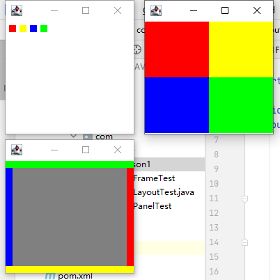
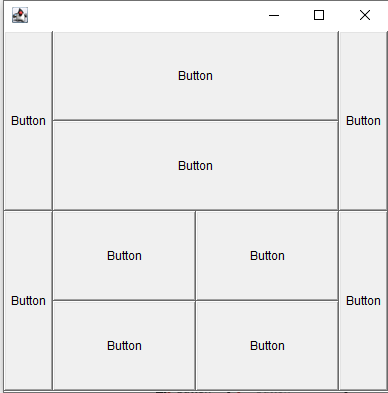
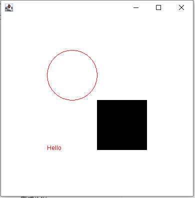
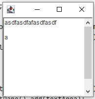
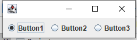
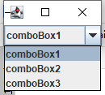
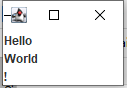
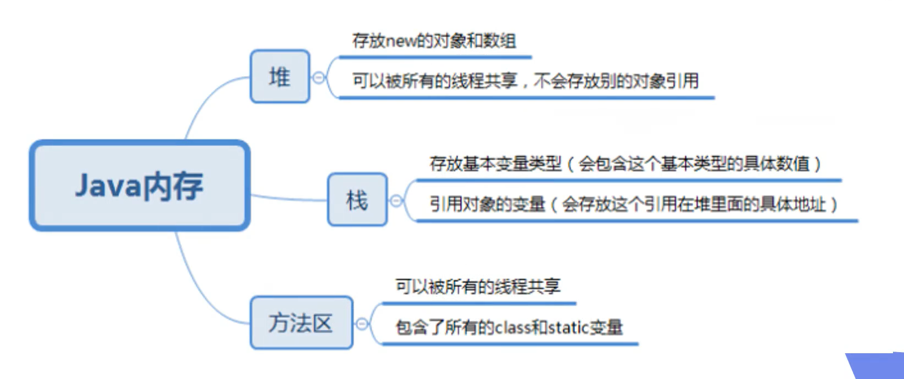

# 00前言

留有疑惑和暂时忽略的部分搜索:补课

版本特性搜索:从java

不理解搜索:有异议

本文档来源于lisnote(不知名名菜)

仅作为笔记使用,不适合本人以外的人阅读

(本笔记不记录预览特性)

# 01java入门

## java初识

### 安装JDK

设置环境变量：JAVA_HOME

```
C:\Program Files\Java\jdk-15
```

设置环境变量：Path

```
Path=%JAVA_HOME%\bin;
```

使用cmd运行命令

```cmd
java -version
```

如输出结果显示java版本则为JDK安装成功

### 第一个java程序

```java
public class Hello {
	public static void main(String[] args){
		System.out.println("Hello,world");
	}
}
```

文件名必须与类名相同，文件后缀为.java

编译源文件为字节码文件

```cmd
javac Hello.java
```

执行字节码文件

```cmd
java Hello
```

从java11开始,单文件源码可以直接运行

```cmd
java Hello.java
```

## java程序基础

### 变量和数据结构

不同的数据类型占用的字节数

| 基本数据类型 | 字节占用 | 默认值  |
| :----------- | :------- | ------- |
| byte         | 1        | 0       |
| short        | 2        | 0       |
| int          | 4        | 0       |
| long         | 8        | 0       |
| float        | 4        | 0.0     |
| double       | 8        | 0.0     |
| char         | 2        | (char)0 |
| boolean      | 不指定   | false   |

* `java`中的基本类型有`byte` `short` `int` `long` `float` `double` `boolean` `char`
* 引用类型:所有`class`和`interface`
* 基本类型不能为`null`,引用类型可以为`null`
* 除了基本类型的变量，剩下的都是引用类型，例如String字符串
* 定义变量的时候，如果加上final修饰符，这个变量就变成了常量
* 变量的范围为通常为被最近{}包围的范围


###  整数运算

| 计算方法         | java符号 |
| ---------------- | -------- |
| 加               | +        |
| 减               | -        |
| 乘               | *        |
| 除               | /        |
| 求余             | %        |
| 自增             | +=       |
| 自减             | -=       |
| 自乘             | *=       |
| 自除             | /=       |
| 加一             | ++       |
| 减一             | --       |
| 左移位           | <<       |
| 右移位           | >>       |
| 忽略符号位右移位 | >>>      |
| 位运算与         | &        |
| 位运算或         | \|       |
| 位运算非         | ~        |
| 位运算异或       | ^        |

**使用例程：**

```java
public class Main {
    public static void main(String[] args){
    	byte a = 127;
        System.out.println(a);
        a++;
        System.out.println(a);  //输出为-128，注意byte类型的范围限制
		int b = -1;
		b = b << 1;
		System.out.println(b);  //输出为-2，不改变符号位时，相当于b*2
		b = b >>> 1;	
		System.out.println(b);  //输出为2147483647，忽略符号位移位，最高位总是补零
        
    }
}
```

**从高到低的运算优先级**

- `()`
- `!` `~` `++` `--`
- `*` `/` `%`
- `+` `-`
- `<<` `>>` `>>>`
- `&`
- `|`
- `+=` `-=` `*=` `/=`


### 浮点数运算

小数强制转型时为向下取整，如需四舍五入可以`+0.5`后在强制转型

```java
public class Main {
    public static void main(String[] args) {
        double d = 2.6;
        int n = (int) (d + 0.5);
        System.out.println(n);
    }
}
```

### 布尔运算

**从高到低的运算优先级**

- `!`
- `>`，`>=`，`<`，`<=`
- `==`，`!=`
- `&&`
- `||`

**短路运算:** 布尔运算的表达式能提前确定结果，则后续的计算不再执行，直接返回结果

三元运算符：b？x：y

?	第一个表达式的结果为真，则返回第一个表达式的结果，相反则返回第二个表达式的结果

```java
public class Main {
    public static void main(String[] args){
        String i = 1>2?"对":"错";
        System.out.println(i);	//输出为"错"
    }
}
```


### 字符和字符串

**常见的转义字符包括：**

| 字符                  | java转义符 |
| --------------------- | ---------- |
| "                     | \\"        |
| '                     | \\'        |
| \|                    | \\|        |
| \\                    | \\\        |
| 换行符                | \n         |
| 回车符                | \r         |
| Tab                   | \\t        |
| 一个Unicode编码的字符 | \u####     |

**多行字符串(Text Blocks):** 从java13开始，可以使用 “”“...”“”表示多行字符串,多行字符串前面共同的空格会被去掉

```java
public class Main{
    public static void main(String[] args){
        String a = """
        	Hello,
        	World.
        	""";
        System.out.println(a);
    }
}
```

* char是一个基本类型，String是一个引用类型
* 引用类型的变量可以指向一个空值null，他表示不存在，即该变量不指向任何对象

### 数组类型

* 整数类型的数组默认值为0，浮点型是0.0，布尔型是false
* 数组的索引从0开始
* 可以用 `数组变量.length ` 获取数组大小
* 数组的实质内容是一个内存地址

```java
public class Main {
    public static void main(String[] args) {
        int[] array1 = new int[5];
        int[] array2 = new int[]{1,2,3};
        int[] array3 = {1,2,3};
        System.out.println(array3);		//输出的是一个类似[I@16b98e56的内存地址
    }
}
```

## 流程控制

### 输入和输出

**输出**


```java
public class Main{
    public static void main(String[] args){
        System.out.print("H");		//输出
		System.out.print("i");	
        System.out.println("");		//输出后换行
        System.out.println("!");
    }
}
```

**格式化输出**

```
public class Main{
	public static void main(String[] args){
		System.out.printf("%f",3.14159);
	}
}
```


| 占位符 | 说明                             |
| :----- | :------------------------------- |
| %d     | 格式化输出整数                   |
| %x     | 格式化输出十六进制整数           |
| %f     | 格式化输出浮点数                 |
| %e     | 格式化输出科学计数法表示的浮点数 |
| %s     | 格式化字符串                     |


**输入**

```java
import java.util.Scanner;

public class Main {
    public static void main(String[] args) {
        Scanner scanner = new Scanner(System.in);       //创建一个Scanner对象
        System.out.println("please input your your name:");
        String name = scanner.nextLine();   //读取输入并获取字符串
        System.out.println("please input your age.");
        int age = scanner.nextInt();    //读取输入并获取整数
        System.out.printf("Hi,%s,you are %d.",name,age);
    }
}
```

### if判断

语法案例`else if` 和 ` else`为可选 。

```java
public class Main {
    public static void main(String[] args) {
        int i = 0;
        if (i < 0) {
            System.out.println("如果n<0,文字将被输出");
        } else if (i > 0) {
            System.out.println("如过n>0,文字将被输出");
        } else {
            System.out.println("如果n不大于零,也不小于0,文字将被输出");
        }
    }
}
```

要判断引用类型的变量内容是否相等,必须使用`equals()`方法

```java
public class Main {
    public static void main(String[] args) {
        String s1 = "hello";
        String s2 = "Hello".toLowerCase();
        if (s1.equals(s2)) {
            System.out.println("s1 = s2");
        }
    }
}
```

### switch多重选择

* 常规语法

```java
public class Main {
    public static void main(String[] args) {
        switch(1+3){
            case 1:
                System.out.println(1);
                break;
            case 2:
                System.out.println(2);
                break;
            default:	//可选,当以上case都不匹配时执行
                System.out.println(">3");
                break;
        }
    }
}
```

* `switch`可以匹配引用类型String

* 当遗漏`break`时,匹配到一次条件后,后面的语句都不需匹配并且将会被执行。

**从java12开始新增无需`break`的switch语法:**

```java
public class Main {
    public static void main(String[] args) {
        switch ("he") {
            case "she" -> System.out.println("she");
            case "he" -> {
                System.out.println("he");
            }
            default -> {
                System.out.println("other");
            }
        }
    }
}
```

**新的switch语法可以返回值**

```java
public class Main {
    public static void main(String[] args) {
        String food = switch ("") {
            case "apple" -> "apple";
            case "苹果" -> "苹果";
            default -> {
                String s = "水";
                yield s;	//返回参数s
            }
        };
        System.out.println("获得食物:" + food);
    }
}
```

### while循环

**先判断后执行**

```java
public class Main {
    public static void main(String[] args) {
        int i = 1;
        while (i <= 5) {
            System.out.println(i + "<=5");
            i++;
        }
    }
}
```

### do while循环

**先执行后判断**

```java
public class Main {
    public static void main(String[] args) {
        int i = 1;
        do {
            System.out.println(i + "<=5");
            i++;
        } while (i <= 5);
    }
}
```

### for循环

* for循环语句三个参数都可省略
* for循环顺序:`初始化语句`、`判断语句`、`循环体`、`更新语句`

```java
public class Main {
    public static void main(String[] args) {
        int[] n = {1, 2, 3};
        for (int i = 0; i <= n.length; i++) {	//i只作自变量
            System.out.println(n[i]);
        }
    }
}
```

**for each**

```java
public class Main {
    public static void main(String[] args) {
        int[] n = {1, 2, 3};
        for (int i : n) {	//i返回数组指向的内容
            System.out.println(i);
        }
    }
}
```

### break和continue

**break:退出当前循环**

**continue:结束本次循环**

## 数组操作

### 历遍数组

以下两个历遍数组的代码与[for循环](#for循环)中的代码一致

```java
public class Main {
    public static void main(String[] args) {
        int[] n = {1, 2, 3};
        for (int i = 0; i <= n.length; i++) {	//i只作自变量
            System.out.println(n[i]);
        }
    }
}
```

```java
public class Main {
    public static void main(String[] args) {
        int[] n = {1, 2, 3};
        for (int i : n) {	//i返回数组指向的内容
            System.out.println(i);
        }
    }
}
```

**使用`Arrays.toString()`快速打印数组指向的内容**

```java
import java.util.Arrays;

public class Main {
    public static void main(String[] args) {
        int[] array = {1, 2, 3};
        System.out.println(Arrays.toString(array));        //输出[1,2,3]
    }
}
```

### 数组操作

**冒泡排序:** 每轮循环后最大的数被交换至末尾

```java
import java.util.Arrays;

public class Main {
    public static void main(String[] args) {
        int[] array = {1, 4, 2, 5, 2};
        System.out.println(Arrays.toString(array));
        for (int i1 = 1; i1 <= array.length - 1; i1++) {
            int temp;
            for (int i2 = 0; i2 <= array.length - 2; i2++) {
                if (array[i2] > array[i2 + 1]) {
                    temp = array[i2 + 1];
                    array[i2 + 1] = array[i2];
                    array[i2] = temp;
                }
            }
        }
        System.out.println(Arrays.toString(array));
    }
}

```

**Arrays方法**

```java
public class Main {
    public static void main(String[] args) {
        int[] array = {1, 4, 2, 5, 2};
        System.out.println(Arrays.toString(array));
        // 排序
        Arrays.sort(array);
        System.out.println(Arrays.toString(array));
        //数组比较
        System.out.println(Arrays.equals(array, new int[]{1, 2, 2, 4, 5}));
        //二分查找数组
        System.out.println(Arrays.binarySearch(array, 4));
        //填充内容
        Arrays.fill(array, 1);
        System.out.println(Arrays.toString(array));
    }
}
```

### 多维数组

* 二维数组即是数组的数组,多维数组同理
* 打印多维数组使用`Arrays.deepToString()`

```java
import java.util.Arrays;

public class Main {
    public static void main(String[] args) {
        int[][] array1 = new int[3][];
        int[][] array2 = new int[][]{
                {1, 2, 3},
                {2, 4, 3}
        };
        int[][] array3 = {
                {2, 4, 2},
                {2, 4, 2, 3, 6},
                {}
        };
        for (int i = 0; i <= array2.length - 1; i++) {
            System.out.println(Arrays.toString(array2[i]));
        }
        System.out.println(Arrays.deepToString(array3));
    }
}

```

### 命令行参数

* java的程序入口是`main`方法,而main方法可以接受一个命令行参数,它是一个`String[]`数组
* 数组参数使用空格` `分隔

1. 编写java程序


   ```java
   import java.util.Arrays;
   
   public class Main {
       public static void main(String[] args) {
           System.out.println(Arrays.toString(args));
       }
   }
   ```

2. cmd运行程序
   
   ```cmd
   java Main.java Hello,world!
   ```
   
   输出为:
   
   ```cmd
   [Hello,World!]
   ```

# 02面向对象编程

## 面向对象基础

### 方法

* 使用`private`修饰的`field(字段)`和`method(方法)`不可以被外部访问
* `this`变量始终指向当前实例
* 方法参数用于接收传递给方法的变量
* 使用可变参数`DataType...`定义,调用时可以不构造数组

```java
public class Main {
    public static void main(String[] args) {
        Player player = new Player();
        player.setName("lisnote", "FStudent");
        String[] i = player.getNames();
        for (int i1 = 0; i1 <= i.length - 1;i1++){
            System.out.println(i[i1]);
        }
    }
}

class Player {
    private String[] name;

    public void setName(String... name) {
        this.name = name;
    }

    public String[] getNames() {
        return name;
    }
}
```

### 构造方法

* 构造方法的方法名就是类名
* 构造方法没有返回值
* 调用构造方法必须用`new`操作符
* 多构造方法时,编译器会通过构造方法的参数数量,位置,类型自动区分
* 使用`this()`调用其他构造方法时,`this()`语句必须为构造器中的第一句

```java
public class Main {
    public static void main(String[] args) {
        Player player = new Player("lisnote", 21);
        System.out.println(player.getAll());
    }
}

class Player {
    private String name = "unnamed";
    private int age = 0;

    public Player(String name, int age) {
        this(name);
        setAge(age);
    }

    private Player(String name) {
        this.name = name;
    }

    public void setAge(int age) {
        this.age = age;
    }

    public String getAll() {
        return name + " is " + age + ".";
    }
}
```

### 方法重载

* 方法名相同,但各自参数不同
* 目的是功能类似的方法使用同一名字便于记忆
* 返回值类型通常是相同的

```java
public class Main {
    public static void main(String[] args) {
        Player player = new Player();
        player.setName("LisNote");
        player.printName();
        player.setName("Lis", "Note");
        player.printName();
    }
}

class Player {
    private String name = "unmaned";
    private String[] names;

    public void setName(String name) {
        this.name = name;
    }

    public void setName(String firstName, String lastName) {
        name = firstName + " " + lastName;
    }

    public void printName() {
        System.out.println(name);
    }
}
```

### 继承

* 没有写`extends`时编译器会自动加`extends Object`
* 子类无法访问`private`修饰的`field`和`method`,但可以放问`protected`修饰的字段和方法
* `final`修饰的类会阻止被继承,`final`修饰的字段初始化后会不可被修改,`final`修饰的方法会阻止被覆写
* 子类不会继承父类的构造方法
* 当父类没有默认的构造方法时,子类必须显式调用`super()`被给出参数定位到父类的构造方法

```java
public class Main {
    public static void main(String[] args) {
        Player player = new Player("lisnote", 10);
        player.print();
    }
}

class User {
    protected String name;

    public User(String name) {
        setName(name);
    }

    public void setName(String name) {
        this.name = name;
    }

    public void print() {
        System.out.println(name);
    }
}

final class Player extends User {
    private int score;

    public Player(String name, int score) {
        super(name);
        setScore(score);
    }

    public void setScore(int score) {
        this.score = score;
    }

    public void print() {
        super.print();
        System.out.println(score);
    }
}
```

* 向下转型前可以使用`instanceof`判断变量指向的实例是否为所属类型

```java
public class Main {
    public static void main(String[] args) {
        Object obj = "HELLO";
        if (obj instanceof String) {
            String s = (String) obj;
            System.out.println(s.toLowerCase());
        }
    }
}
```

### 多态

* 覆写父类方法称为`override`,重载方法称为`overload`
* 加上`Override`可让编译器检查是否正确覆写,非必要但不建议省略
* 调用方法时调用的是实例的实际类型的方法
* 子类可用`super`调用被覆写的父类方法

```java
//设计一个报税软件,包含普通税收,高收入税收,免税税收
public class Main {
    public static void main(String[] args) {
        Income[] incomes = {
                new Income(5000),
                new HighIncome(10000),
                new FreeIncome(1000)
        };

        //计算总税收
        double totalTax = 0;
        for (Income i : incomes) {
            totalTax += i.getTax();
        }
        System.out.println(totalTax);
    }
}


//普通税收
class Income {
    protected double income;

    public Income(double income) {
        this.income = income;
    }

    public double getTax() {
        return income * 0.1;
    }
}

//高收入税收
class HighIncome extends Income {
    public HighIncome(double income) {
        super(income);
    }

    public double getTax() {
        return income * 0.2;
    }
}

//免税税收
class FreeIncome extends Income {
    public FreeIncome(double income) {
        super(income);
    }

    public double getTax() {
        return 0;
    }
}
```

### 抽象类

* 如果父类方法不是先任何功能,只是定义方法签名,需要使用`abstract`声明为抽象方法
* 抽象方法所在的类必须使用`abstract`声明为抽象类
* 抽象类无法被实例化
* 尽量使用高层类型,避免使用实际子类型的方式,被称为面向抽象编程

```java
public class Main {
    public static void main(String[] args) {
        Income[] incomes = {
                new CommonIncome(5000),
                new HighIncome(10000)
        };
        double totalTax = 0;
        for (Income i : incomes) {
            totalTax += i.getTax();
        }
        System.out.println(totalTax);
    }
}

//定义规范
abstract class Income {
    protected double income;

    public Income(double income) {
        this.income = income;
    }

    public abstract double getTax();
}

//实现
class CommonIncome extends Income {
    public CommonIncome(double income) {
        super(income);
    }

    public double getTax() {
        return income * 0.1;
    }
}

class HighIncome extends Income {
    public HighIncome(double income) {
        super(income);
    }

    public double getTax() {
        return income * 0.2;
    }
}
```

### 接口

* 接口`interface`只能有`static final`字段,且所有方法都为抽象方法
* 接口可以省略`public abstract`修饰符,因为接口所有方法都是`public abstract`的
* 类`class`只能单继承,但是接口`interface`可以多继承
* 实现接口使用`implement`关键字，继承接口使用`extends`
* 当需要给接口新增方法时,使用`default`方法可以不必修改全部子类

|            | abstract class       | interface                   |
| :--------- | :------------------- | --------------------------- |
| 继承       | 只能extends一个class | 可以implements多个interface |
| 字段       | 可以定义实例字段     | 不能定义实例字段            |
| 抽象方法   | 可以定义抽象方法     | 可以定义抽象方法            |
| 非抽象方法 | 可以定义非抽象方法   | 可以定义default方法         |

```java
public class Main {
    public static void main(String[] args) {
        Person lisnote = new Player("lisnote");
        lisnote.helloName();
    }
}

interface Person {
    String getName();

    default void helloName() {
        System.out.println("Hello," + getName() + ".");
    }
}

class Player implements Person {
    private String name;

    public Player(String name) {
        this.name = name;
    }

    public String getName() {
        return name;
    }
}
```

### 静态字段和静态方法

* 使用`static`修饰的字段和方法并不属于实例`instance`,而是属于类`class`
* 静态方法使用不需要实例,也无法访问实例字段和`this`,可以访问静态字段和静态方法(有异议)

```java
//计算Person实例个数
public class Main {
    public static void main(String[] args) {
        Person lisnote = new Person("lisnote");
        Person FStudent = new Person("FStudent");
        Person.printCount();
    }
}

class Person {
    private static int count;
    private String name = "unnamed";
    
    public Person(String name) {
        this.name = name;
        count++;
    }

    public static void printCount() {
        System.out.println(count);
    }
}
```

### 包

* 包的主要作用为解决类名冲突
* 一个类总是属于某个包,完整的类名应该是`包名.类名
* 定义`class`的时候需要再第一行使用`package`声明这个`class`属于哪个包
* 使用`import`可以导入其他包的`class`,也可以使用完整类名直接导入
* 编译器会自动`import`当前`package`的其他`class`和`java.lang.*`
* 使用`import static`可以只导入静态字段和静态方法
* 位于同一个包的类可以访问包作用域的字段和方法

**编译命令**:在src文件夹将`.java`文件编译成`.class`到上级目录的`bin`文件夹下

```cmd
javac -d ../bin ming/Person.java hong/Person.java mr/jun/Arrays.java
```

### 作用域

* 定义为`public`的`class`和`interface`可以被其他任何类访问
* 定义为`public`的`field`和`method`可以被其他类访问,但需要有访问`class`的权限
* 定义为`private`的`field`和`method`无法被该类外部访问
* 定义为`protected`的`field`和`method`可以被子类访问
* 一个`class`允许访问同一个`package`的没有被`public`/`private`的类,及其没有被`public`/`private`/`protected`修饰的字段和方法
* 一个`.java`文件只能有一个`public`类

### 内部类

* `Inner Class`指被定义在一个类内部的`class`

* `Static Nested Class`使用`static`修饰,不依附外部实例,可以访问外部类的静态`field`和`method`
* `Anonymous Class`指在方法内部通过匿名类定义的`class`

```java
public class Main {
    public static void main(String[] args) {
        Hello hello = new Hello();
        hello.doSomething();
        Hello hi = new Hello() {
            public void doSomething() {
                System.out.println(("Hi"));
            }
        };
        hi.doSomething();
    }
}

class Hello {
    public void doSomething() {
        Runnable runnable = new Runnable() {
            public void run() {
                System.out.println("Hello");
            }
        };
        new Thread(runnable).start();
    }
}
```

### classpath和jar

* `classpath`旨在告诉`JVM`应该从哪里找`class`
* 不推荐在环境变量设置`class path`推荐在启动`jvm`时添加`class path`参数

**在cmd启动时添加`class path`参数**

```cmd
java -classpath F:\0STUDY\JAVA\Study\bin com.lisnote.Main
```

```cmd
java -classpath Main.jar com.lisnote.Main
```

**将src目录下的`java`文件编译到bin目录下**

```cmd
javac -d bin src/com/lisnote/Main.java src/com/lisnote/util/Arrays.java
```

**将bin文件夹下的所有文件打包到当前文件夹并添加`main-class`参数**

```cmd
jar --create --file Main.jar --main-class com.lisnote.Main -C bin .
```

**运行带有`main-class`参数的`jar`文件**

```cmd
java -jar Main.jar
```

### 模块

* 模块`module`用于解决依赖问题
* 模块增加了一个模块描述文件`module-info.java`

```java
package com.lisnote;

import javax.xml.XMLConstants;

public class Main {
    public static void main(String[] args) {
        Greeting g = new Greeting();
        System.out.println(g.hello(XMLConstants.XML_NS_PREFIX));
    }
}
```

```java
//module-info.java
module com.lisnote.Main {
	requires java.base; // 可不写，任何模块都会自动引入java.base
	requires java.xml;
}
```

* 将含有`module-info.class`的`jar`包转换成`jmod`

```cmd
jmod create --class-path Main.jar Main.jmod
```

* 打包java运行环境`JRE`至当前路径

```cmd
jLink --module-path Main.jmod --add-modules java.base,java.xml,com.lisnote.Main --output jre/
```

**有异议**:此处省略`java.xml`编译也可通过,原因是源码`java`编译成字节码`class`之后常量`XMLConstants.XML_NS_PREFIX`被替换成了`"xml"`

* 进入`jre/bin`路径运行此`JRE`

```cmd
java --module com.lisnote.Main
```

* 外部代码只允许访问`module-info.java`文件声明该模块导出的类`class`

## java核心类

### 字符串和编码

* 字符串比较使用`equals()`方法而不能用`==`
* java编译器在编译期会自动将相同字符串放入同一常量池
* `java`的`String`和`char`在内存中总是以万国码`Unicode`编码表示

```java
import java.io.UnsupportedEncodingException;
import java.util.Arrays;

public class Main {
    public static void main(String[] args) throws UnsupportedEncodingException {
        //判断是否包含字符串
        System.out.println("Hello".contains("ll"));     //true
        //获取该字符最小的索引
        System.out.println("Hello".indexOf("l"));   //2
        //获取该字符最大的索引
        System.out.println("Hello".lastIndexOf("l"));  //3
        //判断某字符是否是开始的字符
        System.out.println("Hello".startsWith("H"));    //true
        //判断某字符是否为结束的字符
        System.out.println("Hello".endsWith("o"));    //true
        //从传入的索引开始获取字符
        System.out.println("Hello".substring(2));   //llo
        //从传入的索引中间获取字符
        System.out.println("Hello".substring(2, 4));     //ll
        //去除首位空白字符(不包括全角符空格\u3000)
        System.out.println(" \t\r\n\u3000Hello".trim());    //　Hello
        //去除首位空白字符(包括全角符空格\u3000)
        System.out.println(" \t\r\n\u3000Hello".strip());   //Hello
        //判断空字符串
        System.out.println("".isEmpty());   //true
        //判断空白字符串
        System.out.println(" \t\r\n\u3000".isBlank());  //true
        //替换字符串
        System.out.println("Hello".replace("e", "a"));   //Hallo
        //使用正则表达式替换字符
        System.out.println("btn\\n!".replaceAll("[t\\\\!]", "a"));   //banana
        //分割字符串
        System.out.println(Arrays.toString("Hello".split("l")));    //{"He","","o"}
        //拼接字符串
        System.out.println(String.join("l", new String[]{"He", "", "o"}));     //Hello
        //格式化字符串
        System.out.println(String.format("Hi,%s.", "lisnote"));      //Hi,lisnote.
        //将任意基本类型或其引用类型转换为字符串
        System.out.println(new char[]{'H', 'e', 'l', 'l', 'o'});    //Hello
        //把字符串转换为boolean类型
        System.out.println(Boolean.parseBoolean("true"));   //true
        //把字符串转换为Int类型
        System.out.println(Integer.parseInt("123"));    //123
        //将字符串转换为char[]
        System.out.println(Arrays.toString("Hello".toCharArray()));     //{'H','e','l','l','o'}
        //将char[]转换为字符串
        System.out.println(new String(new char[]{'H', 'e', 'l', 'l', 'o'}));
        //获取字符编码
        System.out.println(Arrays.toString("Hello".getBytes("UTF-8")));
    }
}
```

### StringBuilder

* `StringBuilder`是可变对象,相比`String`在拼接字符串时更高效
* 链式操作需要方法返回`this`
* 对于普通的字符串`+`操作并不需要改写为`StringBuilder`,java编译器在编译期会自动优化
* `StringBuilder`对于字符拼接高效,对于`delete`和`deleteCharAt`并不高效

```java
public class Main {
    public static void main(String[] args) {
        var sb = new StringBuilder();
        sb.append("Mr ")
                .append("Bob!")
                .insert(0, "*Hello, ")
                .delete(sb.length() - 1, sb.length())
                .deleteCharAt(0);
        System.out.println(sb.toString());
    }
}
```

### StringJoiner

* `StringJoiner`仅仅是更加优雅的代码管理,处理速度并不高效

```java
import java.util.StringJoiner;

public class Main {
    public static void main(String[] args) {
        String[] names = {"lisnote", "FStudent"};

        //不指定开头结尾,建议使用String.join
        var sj = new StringJoiner(",");
        for (String name : names) {
            sj.add(name);
        }
        System.out.println(sj);

        //指定开头结尾
        sj = new StringJoiner(",", "Hello ", "!");
        for (String name : names) {
            sj.add(name);
        }
        System.out.println(sj);
    }
}
```

### 包装类型

| 基本类型 | 对应的引用类型      |
| -------- | ------------------- |
| byte     | java.lang.Byte      |
| short    | java.lang.Short     |
| int      | java.lang.Int       |
| long     | java.lang.Long      |
| float    | java.lang.Float     |
| double   | java.lang.Double    |
| boolean  | java.lang.Boolean   |
| char     | java.lang.Character |

* `Auto Boxing`:编译器可以自动在基本类型和包装类型转换

```java
public class Main {
    public static void main(String[] args) {
        //无Auto Boxing
        Integer notAutoInteger = Integer.valueOf(100);
        int notAutoInt = notAutoInteger.intValue();

        //有Auto Boxing
        Integer autoInteger = 100;   //编译器自动调用valueOf
        int autoInt = autoInteger;  //编译器自动调用intValue
    }
}
```

* 所有包装类都是不变类,创建后就不可修改(可以给变量返回新的地址)

* 能创建"新"对象的静态方法称为`静态工厂方法`,例如`Integer.valueOf()`,`静态工厂方法`尽可能的返回缓存的实例以节省内存

```java
public class Main {
    public static void main(String[] args) {
        //转换为十进制
        System.out.println(Integer.parseInt("100", 2));
        //转换为其他进制
        System.out.println(Integer.toString(100, 2));
        //最大值
        System.out.println(Integer.MAX_VALUE);
        //最小值
        System.out.println(Integer.MIN_VALUE);
        //内存占用:比特bit
        System.out.println(Integer.SIZE);
        //内存占用:字节byte
        System.out.println(Integer.BYTES);
        //所有整数型和浮点型的包装类都继承自Number
        Number num = Integer.valueOf(128);
        System.out.println(num.byteValue());
        System.out.println(num.longValue());
        System.out.println(num.floatValue());
        //转换为无符号整型
        num = -1;
        System.out.println(Byte.toUnsignedInt(num.byteValue()));
    }
}
```

### JavaBean

* `private field`通过`public method`进行读写,写方法都为`setField`,读方法除了`boolean`是`isField`以外都为`setField`的`class`被称为`JavaBean`
* `JavaBean`的`private field`可以只写,可以只读

```
import java.beans.BeanInfo;
import java.beans.Introspector;
import java.beans.PropertyDescriptor;

public class Main {
    public static void main(String[] args) throws Exception {
        //枚举一个JavaBean的所有属性
        BeanInfo beanInfo = Introspector.getBeanInfo(JavaBean.class);
        for (PropertyDescriptor pd : beanInfo.getPropertyDescriptors()) {
            System.out.println(pd.getName());
            System.out.println("    " + pd.getReadMethod());
            System.out.println("    " + pd.getWriteMethod());
        }
    }
}

//JavaBean格式的class
class JavaBean {
    public int getGetAndSet() {
        return getAndSet;
    }

    public void setGetAndSet(int getAndSet) {
        this.getAndSet = getAndSet;
    }

    public boolean isAndSet() {
        return isAndSet;
    }

    public void setAndSet(boolean andSet) {
        isAndSet = andSet;
    }

    private int getAndSet;
    private boolean isAndSet;
}
```

### 枚举类

* 枚举类使用`enum`定义
* 枚举类无法通过`new`操作符创建实例
* 枚举类的每个枚举的常量都有对应的唯一实例

```java
public class Main {
    public static void main(String[] args) {
        Colors color = Colors.RED;
        //name()获取常量名
        System.out.println(color.name());
        //toString()获取常量名,不建议使用,因为可以Override
        System.out.println(Colors.GREEN);
        //ordinal获取索引值
        System.out.println(Colors.BLUE.ordinal());
        switch (Colors.BLUE) {
            case RED -> System.out.println("red");
            case GREEN -> System.out.println("green");
            case BLUE -> System.out.println("blue");
        }
    }
}

enum Colors {
    RED(0),
    GREEN(1),
    BLUE(2);
    public int index;

    private Colors(int index) {
        this.index = index;
    }
}
```

### 记录类

* **记录类目前仍是预览功能,因此不作学习记录**

### BigInteger

* `BigInteger`可以表示任意大小的整数
* 建议使用`compareTo()`进行比较运算

```java
import java.math.BigInteger;

public class Main {
    public static void main(String[] args) {
        BigInteger max = new BigInteger("999");
        BigInteger min = new BigInteger("100");
        BigInteger[] temp;
        //BigInteger继承自Number,因此实现了整数和浮点数的基本类型转换方法
        System.out.println(max.intValue());
        //当BigInteger的大小超过浮点数能表示的大小,转换时会返回Infinity
        System.out.println(max.pow(100).floatValue());
        //确保正确的整数型转换
        System.out.println(max.longValueExact());
        System.out.println(max.intValueExact());
        System.out.println(max.shortValueExact());
        System.out.println(min.byteValueExact());
        //BigInteger比较
        System.out.println(max.compareTo(min) > 0);   //max>min
        System.out.println(max.compareTo(min) >= 0);  //max>=min
        System.out.println(max.compareTo(min) < 0);   //max<min
        System.out.println(max.compareTo(min) <= 0);  //max<=min
        System.out.println(max.compareTo(min) == 0);  //max==min
        //BigInteger运算
        System.out.println(max.add(min));   //max+min
        System.out.println(max.subtract(min));  //max-min
        System.out.println(max.multiply(BigInteger.TEN));  //max*10
        System.out.println(max.divide(min));    //max/min(无小数)
        System.out.println(max.remainder(min));    //max%min
        System.out.println(min.pow(2)); //求幂
        System.out.println(new BigInteger("-100").abs());   //绝对值
        temp = max.divideAndRemainder(min);    //求商求余,返回数组
        System.out.println("商是" + temp[0] + ",余数是" + temp[1]);
        System.out.println(max.gcd(min));   //最大公约数
    }
}
```

### BigDecimal

* `BigDecimal`可以精确表示任意大小的浮点数
* `BigDecimal`本质是`BigInteger`字段和记录小数点位置的`int`类型字段`scale`
* `BigDecimal`支持`BigInteger`的大部分方法

```java
import java.math.BigDecimal;
import java.math.RoundingMode;

public class Main {
    public static void main(String[] args) {
        BigDecimal min = new BigDecimal("100.000");
        BigDecimal max = new BigDecimal("999.999");
        BigDecimal temp;
        //获取小数位
        System.out.println(min.scale());
        //清除尾部零串,scale为负数表示小数点向右移动
        System.out.println(min.stripTrailingZeros().scale());
        //向下取整保留一位小数
        System.out.println(max.setScale(1, RoundingMode.DOWN));
        //四舍五入保留一位小数
        System.out.println(max.setScale(1, RoundingMode.HALF_UP));
        //BigDecimal的除法运算可能除不尽,因此需要设置保留小数位及进位方法
        System.out.println(min.divide(max, 10, RoundingMode.HALF_UP));
    }
}
```

**有异议:因为记录小数点位置的的`scale`是`int`类型的,所以`BigDecimal`可能只能精确表示小数点后`2147483647`位**

### 常用工具类

* `Math`类提供了大量的便于计算的静态方法

```java
public class Main {
    public static void main(String[] args) {
        //求绝对值
        System.out.println(Math.abs(-1));
        //取最大值
        System.out.println(Math.max(1, 2));
        //取最小值
        System.out.println(Math.min(1, 2));
        //计算2的3次方
        System.out.println(Math.pow(2, 3));
        //开根4
        System.out.println(Math.sqrt(4));
        //计算以e为底4的对数
        System.out.println(Math.log(4));
        //计算以10位底100的对数
        System.out.println(Math.log10(100));
        //计算以4为底30的对数(换底公式)//
        System.out.println(Math.log(30) / Math.log(4));
        //三角函数
        System.out.println(Math.asin(0));
        System.out.println(Math.acos(0));
        System.out.println(Math.tan(0));
        //常用常量e和π
        System.out.println(Math.E);
        System.out.println(Math.PI);
        //生成[0,1)的随机数
        System.out.println(Math.random());
    }
}
```

* `Random`类创建伪随机数

```java
import java.util.Random;

public class Main {
    public static void main(String[] args) {
        //不指定种子时,默认使用当前系统时间戳作为种子
        Random random = new Random();
        System.out.println(random.nextInt());
        System.out.println(random.nextLong());
        System.out.println(random.nextFloat());
        System.out.println(random.nextDouble());
        System.out.println(random.nextBoolean());
        System.out.println(random.nextGaussian());
        //指定种子时,生成固定的随机数序列
        random = new Random(0);
        for (int i = 0; i <= 5; i++) {
            System.out.print("[" + random.nextInt(5) + "] ");
        }
    }
}
```

* `SecureRandom`类创建真随机数

```java
import java.security.SecureRandom;

public class Main {
    public static void main(String[] args) {
        SecureRandom secureRandom = new SecureRandom();
        System.out.println(secureRandom.nextInt(5));
    }
}
```

# 03异常处理

## java的异常

* `Error`一般表示程序无法处理的异常,`Exception`一般表示可以被捕获并处理的异常
* `Checked Exception`必须捕获的异常:`Exception`及其子类,但不包括`RuntimeException`及其子类
* 不需要捕获的异常:`Error`及其子类,`RuntimeException`及其子类
* 抛出异常使用`throw`和`throws`,捕获异常使用`try ... catch{}`
* 当某个方法`throws`异常时,异常就会被要求抛到上层调用方法,直到遇到`try...catch`


```java
import java.io.UnsupportedEncodingException;
import java.util.Arrays;

public class Main {
    public static void main(String[] args) {
        try {
            byte[] bs = toGBK("中文");
            System.out.println(Arrays.toString(bs));
        } catch (UnsupportedEncodingException e) {
            e.printStackTrace();
        }
    }

    static byte[] toGBK(String s) throws UnsupportedEncodingException {
        return s.getBytes("UTF-8");
    }
}
```

## 捕获异常

* 多`catch`捕获异常只有一个`catch`生效
* 无论异常是否发生,`finally`都会执行
* 可以没有`catch`只有`finally`
* 不同异常处理代码方式相同时可以使用`|`合并异常处理

```java
import java.io.IOException;

public class Main {
    public static void main(String[] args) {
        try {
            process1();
            process2();
            process3();
        } catch (IOException | NumberFormatException e) { // IOException或NumberFormatException
            System.out.println("Bad input");
        } catch (Exception e) {
            System.out.println("Unknown error");
        } finally {
            System.out.println("Finally!");
        }
    }

    private static void process3() throws IOException {
    }

    private static void process2() throws NumberFormatException {
    }

    private static void process1() throws Exception {
    }
}
```

## 抛出异常

* 抛出异常:创建`Exception`的实例,使用`throw`语句抛出

```java
public class Main {
    public static void main(String[] args) {
        try {
            process1();
        } catch (Exception e) {
            e.printStackTrace();
        }
    }

    static void process1() {
        try {
            process2();
        } catch (NullPointerException e) {
            //catch后throw不同类型的异常时,传入原始异常，确保异常可追踪
            throw new IllegalArgumentException(e);
        }
    }

    //抛出异常
    static void process2() {
        throw new NullPointerException();
    }
}
```

* 异常只能抛出一次,当`catch`到一个异常后,在后面连续的`catch`将不会被执行
* 要抛出多个异常,使用`Exception`类型变量保存原始异常,在`finally`抛出

```java
public class Main {
    public static void main(String[] args) throws Exception {
        Exception exception = null;
        try {
            throw new IllegalArgumentException();
        } catch (IllegalArgumentException e) {
            exception = e;
        } finally {
            Exception e = new Exception();
            if (exception == null) {
                exception = e;
            } else {
                exception.addSuppressed(e);
            }
            throw exception;
        }
    }
}
```

## 自定义异常

* 当需要抛出异常时,尽量使用`java`中已有的异常类型

```ascii
Exception
│
├─ RuntimeException
│  │
│  ├─ NullPointerException
│  │
│  ├─ IndexOutOfBoundsException
│  │
│  ├─ SecurityException
│  │
│  └─ IllegalArgumentException
│     │
│     └─ NumberFormatException
│
├─ IOException
│  │
│  ├─ UnsupportedCharsetException
│  │
│  ├─ FileNotFoundException
│  │
│  └─ SocketException
│
├─ ParseException
│
├─ GeneralSecurityException
│
├─ SQLException
│
└─ TimeoutException
```

* 在大型项目中可以自定义新的异常类型,一般自定义一个继承自`RuntimeException`的`BaseException`作为"根异常",其它异常类型从`BaseException`继承
* 自定义异常建议提供多种构造方法

## NullPointerException

* `NullPointerException`即空指针错误,严禁使用`catch`隐藏这种编码错误
* 编写业务时用空字符串`""`或空数组`{}`比`null`更安全
* 如果一定要根据`null`判断,可以考虑返回`Optional<T>`

```java
import java.util.Optional;

public class Main {
    public static void main(String[] args) throws Exception {
        System.out.println(notNull(null));
    }

    private static Optional<String> notNull(String s) {
        return s == null ? Optional.empty() : Optional.of("Not Null");
    }
}
```

## 使用断言

* 再源码中使用`assert`语句,当结果不符合`assert`的判断时会抛出异常
* 使用断言时需要传递参数`-enableassertions`或`-ea`给虚拟机,否则断言会被忽略

```cmd
java -ea Main.java
```

```java
public class Main {
    public static void main(String[] args) throws Exception {
        int x = 1;
        assert x == 1;
        //在判断后可添加断言消息
        assert x != 1 : "x must == 0";
        System.out.println("x = 0");
    }
}
```

## 使用JDK Logging

* `JDK Logging`为日志工具,可以
  * 定义输出样式
  * 控制输出级别
  * 重定向到文件
  * ...(许多功能)

* `JDK Logging`分为七个等级,默认`info`以下不打印
  1. severe
  2. warning
  3. info
  4. config
  5. fine
  6. finer
  7. finest

```java
import java.util.logging.Logger;

public class Main {
    public static void main(String[] args) {
        Logger log = Logger.getGlobal();

        //默认info以下不打印
        log.fine("In working order.");
        log.info("Star process.");
        log.severe("Catch Exception");
        Exception e = new NullPointerException();
        e.printStackTrace();
    }
}
```

## 使用Commons Logging

* `Commons Logging`是由`Apache`软件基金会创建的第三方日志库,可挂接指定的日志系统
* `Commons Logging`会自动搜索`Log4j`(另一个流行日志系统),没有找到`Log4j`时再使用`JDK Logging`
* 使用`Commons Logging`前需要在[Apache](https://www.Apache.org)下载`commons-logging`,并在启动时传入`-cp`参数
* `Commons Logging`定义了六个日志级别,默认`info`以下不打印
  1. fatal
  2. error
  3. warning
  4. info
  5. debug
  6. trace

```java
import org.apache.commons.logging.Log;
import org.apache.commons.logging.LogFactory;

public class Main {
    public static void main(String[] args) {
        Player player = new Player();
        player.logOut();
    }

}

class User {
//    Log log = LogFactory.getLog(User.class);
//    传入参数使用getClass方法,子类可继承
//    有异议,传入User.class时,player.logOut()仍可正常打印日志
    Log log = LogFactory.getLog(getClass());

    void logOut() {
        log.trace("In working order.");
        log.info("Start process.");
        log.fatal("Catch Exception", new Exception());
    }
}

class Player extends User {
}
```

## 使用Log4j

* `Log4j`是日志框架,支持将日志同时输出到不同的目的地
  * console:输出到屏幕
  * file:输出到文件
  * socket:输出到远程计算机
  * jdbc:输出到数据库
* 使用`Log4j`前需要使用
  * log4j-api-2.x.jar
  * log4j-core-2.x.jar
  * log4j-jcl-2.x.jar

* 使用`Log4j`时需要配置文件,以`XML配置`为例,创建一个`log4j2.xml`文件,放在`classpath`下,`Log4j`就会自动读取配置文件并输出日志

  ```xml
  <!-- log4j2.xml文件案例 -->
  <?xml version="1.0" encoding="UTF-8"?>
  <Configuration>
  	<Properties>
          <!-- 定义日志格式 -->
  		<Property name="log.pattern">%d{MM-dd HH:mm:ss.SSS} [%t] %-5level %logger{36}%n%msg%n%n</Property>
          <!-- 定义文件名变量 -->
  		<Property name="file.err.filename">log/err.log</Property>
  		<Property name="file.err.pattern">log/err.%i.log.gz</Property>
  	</Properties>
      <!-- 定义Appender，即目的地 -->
  	<Appenders>
          <!-- 定义输出到屏幕 -->
  		<Console name="console" target="SYSTEM_OUT">
              <!-- 日志格式引用上面定义的log.pattern -->
  			<PatternLayout pattern="${log.pattern}" />
  		</Console>
          <!-- 定义输出到文件,文件名引用上面定义的file.err.filename -->
  		<RollingFile name="err" bufferedIO="true" fileName="${file.err.filename}" filePattern="${file.err.pattern}">
  			<PatternLayout pattern="${log.pattern}" />
  			<Policies>
                  <!-- 根据文件大小自动切割日志 -->
  				<SizeBasedTriggeringPolicy size="1 MB" />
  			</Policies>
              <!-- 保留最近10份 -->
  			<DefaultRolloverStrategy max="10" />
  		</RollingFile>
  	</Appenders>
  	<Loggers>
  		<Root level="info">
              <!-- 对info级别的日志，输出到console -->
  			<AppenderRef ref="console" level="info" />
              <!-- 对error级别的日志，输出到err，即上面定义的RollingFile -->
  			<AppenderRef ref="err" level="error" />
  		</Root>
  	</Loggers>
  </Configuration>
  ```

##  使用SLF4J和Logback

* `SLF4J`和`Logback`类似`Commons Logging`和`Log4j`,`SLF4J`负责日志`API`,`Logback`负责日志的底层实现

* `SLF4J`与`Commons Logging`相比支持占位符替换

* `SLF4J`的日志等级分为5个等级

  1. trace
  2. debug
  3. info
  4. warn
  5. error

* 需要一个`logback.xml`配置文件放在`classpath`

  ```xml
  <?xml version="1.0" encoding="UTF-8"?>
  <configuration>
  
  	<appender name="CONSOLE" class="ch.qos.logback.core.ConsoleAppender">
  		<encoder>
  			<pattern>%d{HH:mm:ss.SSS} [%thread] %-5level %logger{36} - %msg%n</pattern>
  		</encoder>
  	</appender>
  
  	<appender name="FILE" class="ch.qos.logback.core.rolling.RollingFileAppender">
  		<encoder>
  			<pattern>%d{HH:mm:ss.SSS} [%thread] %-5level %logger{36} - %msg%n</pattern>
  			<charset>utf-8</charset>
  		</encoder>
  		<file>log/output.log</file>
  		<rollingPolicy class="ch.qos.logback.core.rolling.FixedWindowRollingPolicy">
  			<fileNamePattern>log/output.log.%i</fileNamePattern>
  		</rollingPolicy>
  		<triggeringPolicy class="ch.qos.logback.core.rolling.SizeBasedTriggeringPolicy">
  			<MaxFileSize>1MB</MaxFileSize>
  		</triggeringPolicy>
  	</appender>
  
  	<root level="INFO">
  		<appender-ref ref="CONSOLE" />
  		<appender-ref ref="FILE" />
  	</root>
  </configuration>
  ```

```java
import org.slf4j.Logger;
import org.slf4j.LoggerFactory;

public class Main {
    public static void main(String[] args) {
        Logger log = LoggerFactory.getLogger(Main.class);
        String user = "lisnote";
        log.trace("Start process.");
        log.info("user login {}", user);
        log.error("Catch Exception", new Exception());
    }
}
```

# 04反射

## Class类

* `class`的本质是数据类型,无继承关系的数据类型无法赋值
* 以`String`类为例，当JVM加载`String`类时,它首先读取`String.class`文件到内存,然后,为`String`类创建一个`Class`实例并关联起来
* 不执行的`class`将不会被创造`Class`实例及加载到内存
* 通过`Class`实例获取`class`信息的方法称为`反射`
* `Class`类包含了指定`class`的所有信息
* `Class`实例在JVM中是唯一的

```java
public class Main {
    public static void main(String[] args) throws Exception {
        //定义Class的三种方式
        Class cls;
        cls = char.class;
        cls = "".getClass();
        cls = Class.forName("java.lang.String");
        //Class常用方法
        System.out.println("class name: " + cls.getName());
        System.out.println("simple class name: " + cls.getSimpleName());
        System.out.println("package name: " + cls.getPackage());
        System.out.println("type is interface: " + cls.isInterface());
        
        //JVM中Class实例唯一
        System.out.println("".getClass() == "A".getClass());    //true
        //基本数据类型也有Class
        System.out.println(int.class.getName());
        //数组类型与非数组类型不一致
        System.out.println(int[].class.getName());
        //通过Class创造String实例
        String s = (String) cls.getDeclaredConstructor(String.class).newInstance("");
    }
}
```


## 访问字段

* 通过反射读写字段
* 通过反射读写字段是非常规方法,会破坏对象的封装

```java
import java.lang.reflect.Field;
import java.lang.reflect.Modifier;
import java.util.Arrays;

public class Main {
    public static void main(String[] args) throws Exception {
        Class cls = new Student().getClass();
        //获取指定public字段(包括父类)
        System.out.println(cls.getField("name"));
        //获取所有public字段(包括父类)
        System.out.println(Arrays.toString(cls.getFields()));
        //获取指定字段(不含父类)
        System.out.println(cls.getDeclaredField("score"));
        //获取所有字段(不含父类)
        System.out.println(Arrays.toString(cls.getDeclaredFields()));

        Field field = String.class.getDeclaredField("value");
        //获取字段名
        System.out.println(field.getName());
        //获取字段类型
        System.out.println(field.getType());

        //判断字段final属性,还有public/protected/private/static
        int modifier = field.getModifiers();
        System.out.println("是否为final: " + Modifier.isFinal(modifier));

        Student student = new Student();
        field = Student.class.getDeclaredField("score");
        //解锁访问非public字段
        field.setAccessible(true);
        //获取字段值
        Object object = field.get(student);
        System.out.println(object);
        //返回值为Object类型,赋值需要强制转型
        int i = (int) field.get(student);
        System.out.println(i);
        //修改字段值
        field.set(student, 99);
        System.out.println(field.get(student));
    }
}

class Person {
    public String name = "unnamed";
}

class Student extends Person {
    private int score = 100;
}
```

## 调用方法

* 一个`Method`对象包含对应方法的所有信息
* 通过反射调用方法

```java
import java.lang.reflect.Method;
import java.lang.reflect.Modifier;
import java.util.Arrays;

public class Main {
    public static void main(String[] args) throws Exception {
        Class cls = Student.class;
        //获取指定public方法(包含父类)
        Method method = cls.getMethod("setName", String.class);
        System.out.println(cls.getMethod("setName", String.class));
        //获取所有public方法(包含父类)
        System.out.println(Arrays.toString(cls.getMethods()));
        //获取指定方法(不含父类)
        System.out.println(cls.getDeclaredMethod("setScore", int.class));
        //获取所有方法(不含父类)
        System.out.println(Arrays.toString(cls.getDeclaredMethods()));

        //获取方法信息
        System.out.println("方法名:" + method.getName());
        System.out.println("返回值类型:" + method.getReturnType());   //返回值为Class实例
        System.out.println("返回方法的参数类型:" + Arrays.toString(method.getParameterTypes()));   //返回Class数组

        //判断方法final属性,还有public/protected/private/static
        int modifier = method.getModifiers();
        System.out.println("是否为final: " + Modifier.isFinal(modifier));

        //调用方法
        Student lisnote = new Student();
        method = Student.class.getDeclaredMethod("setScore", int.class);
        //解锁访问非public方法
        method.setAccessible(true);
        method.invoke(lisnote, 100);
        System.out.println(lisnote.score);
        //调用静态方法时,因为不需要实例,所以invoke第一参数为null
        method = Student.class.getMethod("getType");
        System.out.println(method.invoke(null));
    }
}

class Person {
    String name = "unnamed";

    public void setName(String name) {
        this.name = name;
    }

    public static String getType() {
        return "Person";
    }
}


class Student extends Person {
    int score = 60;

    private void setScore(int score) {
        this.score = score;
    }

    public static String getType() {
        return "Student";
    }
}
```

## 使用构造方法

* 通过反射创建实例

```java
import java.lang.reflect.Constructor;
import java.util.Arrays;

class Main {
    public static void main(String[] args) throws Exception {
        //直接创建实例
        Person lisnote = Person.class.getConstructor(String.class).newInstance("lisnote1");
        System.out.println(lisnote.name);
        //转换创造实例
        Class cls = Person.class;
        lisnote = (Person) cls.getConstructor(String.class).newInstance("lisnote2");
        System.out.println(lisnote.name);
        //使用Constructor类创造实例
        Constructor constructor = cls.getConstructor(String.class);
        lisnote = (Person) constructor.newInstance("lisnote3");
        System.out.println(lisnote.name);

        //解锁非public方法
        constructor = Person.class.getDeclaredConstructor();
        constructor.setAccessible(true);
        lisnote = (Person) constructor.newInstance();
        System.out.println(lisnote.name);

        //获取指定public的Constructor
        System.out.println(Person.class.getConstructor(String.class));
        //获取public的Constructor数组
        System.out.println(Arrays.toString(String.class.getConstructors()));
        //获取指定Constructor
        System.out.println(Person.class.getDeclaredConstructor());
        //获取Constructor数组
        System.out.println(Arrays.toString(Person.class.getDeclaredConstructors()));
    }
}

class Person {
    String name;

    private Person() {
        name = "unnamed";
    }

    public Person(String nam) {
        this.name = name;
    }
}
```

## 获取继承关系

* `Class`类使用`isAssignableFrom`判断继承关系

```java
import java.util.Arrays;

class Main {
    public static void main(String[] args) {
        //获取父类Class
        Class son = Son.class;
        Class parent = son.getSuperclass();
        System.out.println(parent);
        //获取interface(不含父类接口)
        Class[] sonInterfaces = parent.getInterfaces();
        System.out.println(Arrays.toString(sonInterfaces));
        //获取父类interface
        Class[] parentInterface = sonInterfaces[0].getInterfaces();
        System.out.println(Arrays.toString(parentInterface));
        //Class类使用isAssignableFrom判断继承关系
        System.out.println(Son.class.isAssignableFrom(Parent.class));
        System.out.println(Parent.class.isAssignableFrom(Son.class));
    }
}

interface ParentInterface {
}

interface SonInterface extends ParentInterface {
}

class Parent implements SonInterface {
}

class Son extends Parent {
}
```

## 动态代理

* `JDK`提供的动态创建接口对象的方式,就叫动态代理
* 使用动态代理,可以在`JVM`运行期编写并创建实例

```java
import java.lang.reflect.InvocationHandler;
import java.lang.reflect.Method;
import java.lang.reflect.Proxy;

public class Main {
    public static void main(String[] args) {
        InvocationHandler handler = new InvocationHandler() {
            @Override
            public Object invoke(Object proxy, Method method, Object[] args) throws Throwable {
                if (method.getName().equals("toString")) {
                    System.out.println(Person.class.getSimpleName());
                }
                return null;
            }
        };
        Person lisnote = (Person) Proxy.newProxyInstance(
                Person.class.getClassLoader(),
                new Class[]{Person.class},
                handler
        );
        lisnote.toString();
    }
}

interface Person {
    @Override
    String toString();
}
```

**补课:动态代理**

# 05注解

## 使用注解

* 注解可分三类:
  * 编译器使用的注解,使编译器检查或忽略部分代码等
  * 工具处理`class`文件使用的注解,在加载`Class`时对`class`进行动态修改
  * 程序运行期能读取的注解,由`java`代码读取注解并实现

* 定义注解时,可以自定义配置参数,包括:
  * 基本类型
  * String,class,枚举类
* 配置参数必须为常量,可以有默认值
* 对名为`value`的配置参数赋值,可以只写常量
* 对名为`value`的配置参数数组只赋值一个元素时,可以省略数组写法

````java
public class Hello {
    @Check(min=0, max=100, value=55)
    public int n;

    @Check(value=99)
    public int p;

    @Check(99) // @Check(value=99)
    public int x;

    @Check
    public int y;
}
````

## 定义注解

* java使用`@interface`定义注解`Annotation`

* 可以修饰其他注解的注解称为元注解

* 使用元注解`@Target`可以定义`Annotation`能够被应用在源码的位置

  * 类或接口:`ElementType.TYPE`
  * 字段:`ElementType.FIELD`
  * 方法:`ElementType.METHOD`
  * 构造方法:`ElementType.CONSTRUCTOR`
  * 方法参数:`ElementType.PARAMETER`

  ```java
  //定义注解应用于字段
  @Target(ElementType.FIELD)
  //定义注解应用于字段和方法
  @Target({ElementType.FIELD,ElementType.METHOD})
  ```

* 使用元注解`@Retention`可以定义`Annotation`的生命周期(默认为`CLASS`)

  * 仅编译期:`RetentionPolicy.SOURCE`
  * 仅class文件:`RetentionPolicy.CLASS`
  * 运行期:`RetentionPolicy.RUNTIME`

  `@Retention`不存在时默认为`CLASS`

* 使用元注解`@Repeatable`可以定义`Annotation`是否可重复使用

* 使用`@Inherited`可以定义子类是否可继承父类定义的`Annotation`,`@Inherited`仅对`class`有效,对`interface`的继承无效

* 每个注解都必须设置`@Target`和`@Retention`

```java
import java.lang.annotation.*;

@Target(ElementType.TYPE)
@Retention(RetentionPolicy.RUNTIME)
public @interface Annotation {
    int value() default 0;
}
```

## 处理注解

* * `SOURCE`类型的注解由编译器使用,一般不编写
  * `CLASS`类型的注解主要由底层工具库使用,涉及`class`的加载,一般很少用
  * `RUNTIME`类型的注解经常需要编写和使用
  
* 注解本身也是一种`class`所有的注解都继承自`java.lang.annotation.Annotation`,因此,读取注解,需要使用反射API

  ```java
  package com.lisnote;
  
  import java.lang.annotation.*;
  import java.lang.reflect.Constructor;
  
  public class Main {
      public static void main(String[] args) throws Exception {
          //反射读取 class/method/field/constructor 的 Annotation
          if (Person.class.isAnnotationPresent(Student.class)) {
              Student classAnnotation = Person.class.getAnnotation(Student.class);
              System.out.println(classAnnotation.classAnnotation());
          }
  
          //反射读取方法参数的Annotation
          Constructor constructor = Person.class.getConstructor(String.class);
          //传入参数可以是数组,传入参数的Annotation也可以是数组,因此使用Annotation[][]
          Annotation[][] annotations = constructor.getParameterAnnotations();
          Annotation[] annotationOfName = constructor.getParameterAnnotations()[0];
          for (Annotation annotation : annotationOfName) {
              if (annotation instanceof Student) {
                  Student parameterAnnotation = (Student) annotation;
                  System.out.println(parameterAnnotation.parameterAnnotation());
              }
          }
      }
  }
  
  @Student
  class Person {
      String name;
  
      public Person(@Student String name) {
          this.name = name;
      }
  }
  
  @Target({ElementType.TYPE, ElementType.PARAMETER})
  @Retention(RetentionPolicy.RUNTIME)
  @interface Student {
      String classAnnotation() default "Class Annotation is present.";
  
      String parameterAnnotation() default "Parameter Annotation is present.";
  }
  ```

* 编写注解检查

  ```java
  package com.lisnote;
  
  import java.lang.annotation.*;
  import java.lang.reflect.Field;
  
  public class Main {
      public static void main(String[] args) throws Exception {
          Student lisnote = new Student("lisnote", 50);
          //调用检查方法
          check(lisnote);
      }
  
      static void check(Student student) throws IllegalAccessException {
          Field[] fields = Student.class.getFields();
          for (Field field : fields) {
              if (field.isAnnotationPresent(Range.class)) {
                  continue;
              }
              Object value = field.get(student);
              int max = field.getAnnotation(Range.class).max();
              int min = field.getAnnotation(Range.class).min();
              //String字段检查
              if (field.getType() == String.class) {
                  if (value.toString().length() > max) {
                      throw new IllegalArgumentException();
                  } else if (value.toString().length() < min) {
                      throw new IllegalArgumentException();
                  }
              }
              //int字段检查
              if (field.getType() == int.class) {
                  if ((int) value > max) {
                      throw new IllegalArgumentException();
                  } else if ((int) value < min) {
                      throw new IllegalArgumentException();
                  }
              }
          }
      }
  }
  
  class Student {
      @Range(max = 20, min = 1)
      public String name;
      @Range()
      public int score;
  
      public Student(String name, int score) {
          this.name = name;
          this.score = score;
      }
  }
  
  //一个定义字段范围的注解
  @Target({ElementType.FIELD})
  @Retention(RetentionPolicy.RUNTIME)
  @interface Range {
      int min() default 0;
  
      int max() default 100;
  }
  ```

# 06泛型

## 什么是泛型

* 参数化类型,可以使一套代码适应多种类型

* 以`ArrayList`为例

  ```java
  import java.util.ArrayList;
  
  class Main {
      public static void main(String[] args) {
          //普通类
          ArrayList array = new ArrayList();
          array.add("0");
          //返回Object类型,使用普通类需要强制转型
          String string = (String) array.get(0);
  
          //使用泛型
          ArrayList<String> stringArray = new ArrayList<>();
          //编译器检查传入参数合法性
          stringArray.add("0");
          //返回指定类型
          string = stringArray.get(0);
      }
  }
  ```

## 使用泛型

* `强类型`指定义了泛型类型的泛型,如`List<String>`
* 不同的强类型不能相互赋值

```java
import java.util.ArrayList;
import java.util.List;

class Main {
    public static void main(String[] args) {
        ArrayList<String> array = new ArrayList<>();
        array.add("0");
        String string = array.get(0);
        System.out.println(string);
        //可以转换为List<String>,但是不能转换为ArrayList<Object>
        System.out.println(((List<String>) array).get(0));
    }
}
```

## 编写泛型

* 静态方法内的泛型不是`field`中的泛型

```java
class Main {
    public static void main(String[] args) {
        Generic<String> generic = new Generic<>("");
        String string = generic.get();
        System.out.println(string);
        System.out.println(Generic.same(string, "2"));
    }
}

class Generic<T> {
    T value;

    Generic(T value) {
        this.value = value;
    }

    T get() {
        return value;
    }

    public static <A, B> Boolean same(A a, B b) {
        return a.getClass() == b.getClass();
    }
}
```

## 擦拭法

* `擦拭法`是java实现泛型的方法

* `JVM`并不认识泛型,所有的工作都是编译器所做

* 编译器把泛型视作`Object`,并根据`<T>`进行安全的类型转换

* 目前java的泛型仍有不少限制,例如
  1. 不能使用`new`操作符创建可变类
  
     可以通过反射创建
  
  2. 泛型不能是基本类型
  
     可以使用包装类
  
  3. 泛型的`Class`中,可变类都是`Object`引用
  
     可以通过字段反射获得实际类型

```java
import java.lang.reflect.Array;

class Main {
    public static void main(String[] args) {
        //使用包装类Integer
        ArrayList<Integer> stringList = new ArrayList<>();
        stringList.add(233);
        System.out.println(stringList.get(0));
    }
}

class ArrayList<T> {
    T[] array;
    int index;

    ArrayList() {
    }

    void add(T value) {
        index++;
        //通过反射获取可变类的类型，并通过反射创建可变类
        T[] temp = (T[]) Array.newInstance(value.getClass(), index);
        int index = 0;
        if (array != null) {
            for (T partOfArray : array) {
                temp[index] = partOfArray;
                index++;
            }
        }
        array = temp;
        array[index] = value;
    }

    T get(int index) {
        return array[index];
    }
}
```

**有异议:**泛型方法覆写非泛型方法会被阻止?个人测试通过编译↓

```java
public class Main {
    public static void main(String[] args) throws Exception {
    }
}
class Pair<T> {
    public boolean same(T t) {
        return true;
    }
}
```

## extends通配符

* 使用`? extends Type`可以使传入参数接受`Type`类型及其子类型

* 使用`? extends Type`获得的参数,参数内部只可读,不可写,传入`null`除外,例如该代码不可通过编译

  ```java
  public void test(Gen<? extends Number> num) {
  	num.setFirst(new Integer(first.intValue() + 100);
  }
  ```
  
  因为当传入参数为`Gen<Double>`时,`Gen<Double>`不可接受`Integer`类型的参数

* 定义泛型时使用`<T extends Type>`可以限定T类型为`Type`或其子类型

```java
public class Main {
    public static void main(String[] args) {
        Pair<Integer> p = new Pair<>(1);
        System.out.println(p.getValue());
        System.out.println(zero(p));
    }

    //限制传入参数为Number及其子类型
    static Number zero(Pair<? extends Number> p) {
        p.setValue(null);
        return p.getValue();
    }
}

//限制T类型为Number及其子类型
class Pair<T extends Number> {
    Pair(T value) {
        this.value = value;
    }

    private T value;
shi
    public void setValue(T value) {
        this.value = value;
    }

    public T getValue() {
        return value;
    }
}
```

## super通配符

* 使用`? super Type`可以使传入参数接受`Type`类型及其父类类型

* 使用`? super Type`获得的参数,参数内泛型数据不可为`object`类型以外的类型赋值,以下代码不可通过编译

  ```java
  static void test(Pair<? super Integer> p, Integer n) {
          Integer x = p.getFirst();
  }
  ```

* 比较`super`和`extends`

  `<? extends T>`允许调用读方法`T get()`获取`T`的引用，但不允许调用写方法`set(T)`传入`T`的引用（传入`null`除外）

  `<? super T>`允许调用写方法`set(T)`传入`T`的引用，但不允许调用读方法`T get()`获取`T`的引用（获取`Object`除外）

* **PECS原则**:Producer Extends Consumer Super(返回值为生产者,写入值为消费者,生产者使用extends,消费者使用super)

## 泛型和反射

* 部分反射API是泛型,例如`Class<T>`
* 创建带泛型的数组需要强制转型
* 通过`Array.newInstance(Class<T>,int)`可以创建带泛型的数组,需要强制转型

# 07集合

## java集合简介

- `List`：有序表
- `Set`：无重复元素的表
- `Map`：映射表


## 使用List

* ArrayList

  顺序存储集合

* LinkedList

  链式存储集合
  
* 常用方法

```java
在末尾添加一个元素：boolean add(E e)
在指定索引添加一个元素：boolean add(int index, E e)
删除指定索引的元素：E remove(int index)
删除某个元素：boolean remove(Object e)
获取指定索引的元素：E get(int index)
获取链表大小（包含元素的个数）：int size()
```

* 使用List

  ```java
  import java.util.ArrayList;
  import java.util.List;
  
  class Main{
      public static void main(String args[]) {
          List<String> list = new ArrayList<>();
          list.add("1");
          System.out.println(list.get(0));
          list.remove(0);
          System.out.println(list.size());
          System.out.println();
      }
  }
  ```

* 迭代器遍历List

  ```java
  import java.util.Iterator;
  import java.util.List;
  
  public class Main {
      public static void main(String[] args) {
          List<String> list = List.of("apple", "pear", "banana");
          for (Iterator<String> it = list.iterator(); it.hasNext(); ) {
              String s = it.next();
              System.out.println(s);
          }
      }
  }
  ```

* 迭代器遍历List简化

  ```java
  import java.util.List;
  public class Main {
      public static void main(String[] args) {
          List<String> list = List.of("apple", "pear", "banana");
          for (String s : list) {
              System.out.println(s);
          }
      }
  }
  ```

* List和Array转换方法1(此方法会丢失类型信息)

  ```java
  import java.util.List;
  public class Main {
      public static void main(String[] args) {
          List<String> list = List.of("apple", "pear", "banana");
          Object[] array = list.toArray();
          for (Object s : array) {
              System.out.println(s);
          }
      }
  }
  ```

* List和Array转换方法2

```java
import java.util.List;
public class Main {
    public static void main(String[] args) {
        List<Integer> list = List.of(12, 34, 56);
        //Integer[] array = list.toArray(new Integer[3]);
        //一般不采用上述方法
		//通过接口定义的方法创建传入一个刚好够大的数组
        Integer[] array = list.toArray(Integer[]::new);
        for (Integer n : array) {
            System.out.println(n);
        }
    }
}
```


## 编写equals方法

* 要正常使用List的contains(),indexOf()等方法,放入的实例必须正确覆写equals()方法(因为直接进行比较的是索引地址而不是实例字段)
* 不调用`List`的`contains()`、`indexOf()`这些方法，那么放入的元素就不需要实现`equals()`方法
* 覆写样本

```
public boolean equals(Object o) {
    if (o instanceof Person) {
        Person p = (Person) o;
        return Objects.equals(this.name, p.name) && this.age == p.age;
    }
    return false;
}
```

## 使用Map

* 使用Map通过键值查找对应的值比List高效

```java
import java.util.HashMap;

public class Main{
    public static void main(String[] args) {
        String lisnote = "lisnote";
        HashMap<String,Integer> map = new HashMap<>();
        map.put(lisnote,22);
        System.out.println(map.get("lisnote"));
    }
}
```

* 使用同样的key,不同样的value将会更新对应key值的value而不会新增映射

* Map也支持迭代器和for each循环

  遍历key的for each

  ```java
  import java.util.HashMap;
  
  public class Main {
      public static void main(String[] args) {
          HashMap<String, Integer> map = new HashMap<>();
          map.put("apple", 123);
          map.put("pear", 456);
          map.put("banana", 789);
          for (String key : map.keySet()) {
              Integer value = map.get(key);
              System.out.println(key + " = " + value);
          }
      }
  }
  ```

  遍历key和value的for each

  ```java
  import java.util.HashMap;
  import java.util.Map;
  public class Main {
      public static void main(String[] args) {
          Map<String, Integer> map = new HashMap<>();
          map.put("apple", 123);
          map.put("pear", 456);
          map.put("banana", 789);
          for (Map.Entry<String, Integer> entry : map.entrySet()) {
              String key = entry.getKey();
              Integer value = entry.getValue();
              System.out.println(key + " = " + value);
          }
      }
  }
  ```

## 编写equals和hashCode√

* 要正常使用Map对象,Map的key类型必须正确覆写equals()和hashCode()方法

* 覆写hashCode()方法举例

```java
int hashCode() {
    int h = 0;
    h = 31 * h + firstName.hashCode();
    h = 31 * h + lastName.hashCode();
    h = 31 * h + age;
    return h;
}
```

* 编写`equals()`和`hashCode()`遵循的原则：

  `equals()`用到的用于比较的每一个字段，都必须在`hashCode()`中用于计算；`equals()`中没有使用到的字段，绝不可放在`hashCode()`中计算

## 使用EnumMap

* 作为key值的对象是enum类型时,使用EnumMap将会提高效率且没有额外的空间浪费

  ```java
  import java.time.DayOfWeek;
  import java.util.*;
  public class Main {
      public static void main(String[] args) {
          Map<DayOfWeek, String> map = new EnumMap<>(DayOfWeek.class);
          map.put(DayOfWeek.MONDAY, "星期一");
          map.put(DayOfWeek.TUESDAY, "星期二");
          map.put(DayOfWeek.WEDNESDAY, "星期三");
          map.put(DayOfWeek.THURSDAY, "星期四");
          map.put(DayOfWeek.FRIDAY, "星期五");
          map.put(DayOfWeek.SATURDAY, "星期六");
          map.put(DayOfWeek.SUNDAY, "星期日");
          System.out.println(map);
          System.out.println(map.get(DayOfWeek.MONDAY));
      }
  }
  ```

* 使用`EnumMap`的时候，我们总是用`Map`接口来引用它，因此，实际上把`HashMap`和`EnumMap`互换，在客户端看来没有任何区别

## 使用TreeMap

* HashMap是无序映射,而SortMap是有序映射

* TreeMap实现了SortMap接口,是SortMap最常用的的实现

* 使用`TreeMap`时,key类必须正确实现`Comparable`接口,如果作为Key的class没有实现`Comparable`接口，那么，必须在创建`TreeMap`时同时指定一个自定义排序算法


```java
import java.util.Comparator;
import java.util.Map;
import java.util.TreeMap;

public class Main {
    public static void main(String[] args) {
        Map<Student, Integer> map = new TreeMap<>(new Comparator<Student>() {
            public int compare(Student p1, Student p2) {
                if (p1.score == p2.score) {
                    return 0;
                }
                return p1.score > p2.score ? -1 : 1;
            }
        });
        map.put(new Student("Tom", 77), 1);
        map.put(new Student("Bob", 66), 2);
        map.put(new Student("Lily", 99), 3);
        for (Student key : map.keySet()) {
            System.out.println(key);
        }
        System.out.println(map.get(new Student("Bob", 66))); // null?
    }
}

class Student {
    public String name;
    public int score;
    Student(String name, int score) {
        this.name = name;
        this.score = score;
    }
    public String toString() {
        return String.format("{%s: score=%d}", name, score);
    }
}
  
```

## 使用Properties

* Java集合库提供的`Properties`用于读写配置文件`.properties`。`.properties`文件可以使用UTF-8编码。

* 可以从文件系统、classpath或其他任何地方读取`.properties`文件。

* 读写`Properties`时，注意仅使用`getProperty()`和`setProperty()`方法，不要调用继承而来的`get()`和`put()`等方法。

* 代码案例

  ```java
  import java.io.*;
  import java.nio.charset.StandardCharsets;
  import java.util.Properties;
  
  public class Main {
      public static void main(String[] args) throws IOException {
          Properties props = new Properties();
          props.load(new FileReader("Resources/setting.properties", StandardCharsets.UTF_8));
          System.out.println(props.getProperty("time"));
          int time = Integer.parseInt(props.getProperty("time")) + 1;
          props.setProperty("time", Integer.toString(time));
          System.out.println(props.getProperty("time"));
          props.store(new FileWriter("Resources/setting.properties", StandardCharsets.UTF_8), null);
      }
  }
  ```

* /Resources/setting.properties

  ```properties
  中文测试=Yes
  time=0
  ```

## 使用Set

* 用于存放不重复的元素集合

- `HashSet`是无序的，因为它实现了`Set`接口，并没有实现`SortedSet`接口
- `TreeSet`是有序的，因为它实现了`SortedSet`接口
- 使用`TreeSet`添加的元素必须正确实现`Comparable`接口

* HashSet使用HashMap查找元素,因此要正常使用HashSet,需要正确覆写equals()和hashCode()方法

* 常用语法

  - 将元素添加进`Set<E>`：`boolean add(E e)`
  - 将元素从`Set<E>`删除：`boolean remove(Object e)`
  - 判断是否包含元素：`boolean contains(Object e)`

  ```java
  import java.util.*;
  public class Main {
      public static void main(String[] args) {
          Set<String> set = new HashSet<>();
          System.out.println(set.add("abc")); // true
          System.out.println(set.add("xyz")); // true
          System.out.println(set.add("xyz")); // false，添加失败，因为元素已存在
          System.out.println(set.contains("xyz")); // true，元素存在
          System.out.println(set.contains("XYZ")); // false，元素不存在
          System.out.println(set.remove("hello")); // false，删除失败，因为元素不存在
          System.out.println(set.size()); // 2，一共两个元素
      }
  }
  ```

## 使用Queue

* 先进先出的队列集合
  - `int size()`：获取队列长度；
  - `boolean add(E)`/`boolean offer(E)`：添加元素到队尾；
  - `E remove()`/`E poll()`：获取队首元素并从队列中删除；
  - `E element()`/`E peek()`：获取队首元素但并不从队列中删除。

|                    | throw Exception | 返回false或null    |
| :----------------- | :-------------- | ------------------ |
| 添加元素到队尾     | add(E e)        | boolean offer(E e) |
| 取队首元素并删除   | E remove()      | E poll()           |
| 取队首元素但不删除 | E element()     | E peek()           |

* `LinkedList`即实现了`List`接口，又实现了`Queue`接口，但是，在使用的时候，如果我们把它当作List，就获取List的引用，如果我们把它当作Queue，就获取Queue的引用 

```
// 这是一个List:
List<String> list = new LinkedList<>();
// 这是一个Queue:
Queue<String> queue = new LinkedList<>();
```

* 要避免把`null`添加到队列。

## 使用PriorityQueue

* 带有优先级的队列,使用需要实现`Comparable`接口或是提供一个提供一个`Comparator`对象

* `PriorityQueue`实现了一个优先队列：从队首获取元素时，总是获取优先级最高的元素。

```java
import java.util.Comparator;
import java.util.PriorityQueue;
import java.util.Queue;
public class Main {
    public static void main(String[] args) {
        Queue<User> q = new PriorityQueue<>(new UserComparator());
        // 添加3个元素到队列:
        q.offer(new User("Bob", "A1"));
        q.offer(new User("Alice", "A2"));
        q.offer(new User("Boss", "V1"));
        System.out.println(q.poll()); // Boss/V1
        System.out.println(q.poll()); // Bob/A1
        System.out.println(q.poll()); // Alice/A2
        System.out.println(q.poll()); // null,因为队列为空
    }
}

class UserComparator implements Comparator<User> {
    public int compare(User u1, User u2) {
        if (u1.number.charAt(0) == u2.number.charAt(0)) {
            // 如果两人的号都是A开头或者都是V开头,比较号的大小:
            return u1.number.compareTo(u2.number);
        }
        if (u1.number.charAt(0) == 'V') {
            // u1的号码是V开头,优先级高:
            return -1;
        } else {
            return 1;
        }
    }
}

class User {
    public final String name;
    public final String number;

    public User(String name, String number) {
        this.name = name;
        this.number = number;
    }

    public String toString() {
        return name + "/" + number;
    }
}
```

## 使用Duque

* `Deque`是一个接口，它的实现类有`ArrayDeque`和`LinkedList`

|                    | Queue                  | Deque                           |
| :----------------- | :--------------------- | ------------------------------- |
| 添加元素到队尾     | add(E e) / offer(E e)  | addLast(E e) / offerLast(E e)   |
| 取队首元素并删除   | E remove() / E poll()  | E removeFirst() / E pollFirst() |
| 取队首元素但不删除 | E element() / E peek() | E getFirst() / E peekFirst()    |
| 添加元素到队首     | 无                     | addFirst(E e) / offerFirst(E e) |
| 取队尾元素并删除   | 无                     | E removeLast() / E pollLast()   |
| 取队尾元素但不删除 | 无                     | E getLast() / E peekLast()      |

```
import java.util.Deque;
import java.util.LinkedList;

public class Main {
    public static void main(String[] args) {
        Deque<String> deque = new LinkedList<>();
        deque.offerLast("A"); // A
        deque.offerLast("B"); // A <- B
        deque.offerFirst("C"); // C <- A <- B
        System.out.println(deque.pollFirst()); // C, 剩下A <- B
        System.out.println(deque.pollLast()); // B, 剩下A
        System.out.println(deque.pollFirst()); // A
        System.out.println(deque.pollFirst()); // null
    }
}
```

## 使用Stack

* Stack是一种先进先出的数据结构
* Java 的集合类并没有单独的Stack接口,但是Deque接口实现了Stack的方法,可以使用Deque模拟栈

* 栈（Stack）是一种后进先出（LIFO）的数据结构，操作栈的元素的方法有：
  - 把元素压栈：`push(E)`
  - 把栈顶的元素“弹出”：`pop(E)`
  - 取栈顶元素但不弹出：`peek(E)`

## 使用Iterator
* 如果我们自己编写了一个集合类，想要使用for each循环，只需满足以下条件：
  * 集合类实现Iterable接口，该接口要求返回一个Iterator对象；
  * 用Iterator对象迭代集合内部数据。

```java
import java.util.*;

public class Main {
    public static void main(String[] args) {
        ReverseList<String> rlist = new ReverseList<>();
        rlist.add("Apple");
        rlist.add("Orange");
        rlist.add("Pear");
        for (String s : rlist) {
            System.out.println(s);
        }
    }
}

class ReverseList<T> implements Iterable<T> {

    private List<T> list = new ArrayList<>();

    public void add(T t) {
        list.add(t);
    }

    @Override
    public Iterator<T> iterator() {
        return new ReverseIterator(list.size());
    }

    class ReverseIterator implements Iterator<T> {
        int index;

        ReverseIterator(int index) {
            this.index = index;
        }

        @Override
        public boolean hasNext() {
            return index > 0;
        }

        @Override
        public T next() {
            index--;
            return ReverseList.this.list.get(index);
        }
    }
}
```

**补课**

## 使用Collections

* `Collections`类提供了一组工具方法来方便使用集合类：

  - 创建空集合；
  
    - 创建空List：`List<T> emptyList()`
    - 创建空Map：`Map<K, V> emptyMap()`
    - 创建空Set：`Set<T> emptySet()`
  
  - 创建单元素集合；
  
    - 创建一个元素的List：`List<T> singletonList(T o)`
    - 创建一个元素的Map：`Map<K, V> singletonMap(K key, V value)`
    - 创建一个元素的Set：`Set<T> singleton(T o)`
  
  - 封装集合为不可变集合；
  
    - 封装成不可变List：`List<T> unmodifiableList(List<? extends T> list)`
  
      如果我们希望把一个可变`List`封装成不可变`List`，那么，返回不可变`List`后，最好立刻扔掉可变`List`的引用，因为继续对原始的可变`List`进行增删是可以的，并且，会直接影响到封装后的“不可变”`List`
  
    - 封装成不可变Set：`Set<T> unmodifiableSet(Set<? extends T> set)`
  
    - 封装成不可变Map：`Map<K, V> unmodifiableMap(Map<? extends K, ? extends V> m)`
  
  - 对List进行排序和洗牌
  
    * Collections.sort(list);
    * Collections.shuffle(list);

# 08IO

* IO是指Input/Output，即输入和输出。

* IO流是一种顺序读写数据的模式，它的特点是单向流动，所以我们把它称为IO流。

  IO流以`byte`（字节）为最小单位，因此也称为*字节流*。

  `InputStream`代表输入字节流，`OuputStream`代表输出字节流

* 如果我们需要读写的是字符，并且字符不全是单字节表示的ASCII字符，那么，按照`char`来读写显然更方便，这种流称为*字符流*

  Java提供了`Reader`和`Writer`表示字符流，字符流传输的最小数据单位是`char`

* 同步和异步

  * 同步IO:读写IO时代码必须等待数据返回后才继续执行后续代码，它的优点是代码编写简单，缺点是CPU执行效率低。

    异步IO:读写IO时仅发出请求，然后立刻执行后续代码，它的优点是CPU执行效率高，缺点是代码编写复杂。

  * Java标准库的包`java.io`提供了同步IO，而`java.nio`则是异步IO。上面我们讨论的`InputStream`、`OutputStream`、`Reader`和`Writer`都是同步IO的抽象类，对应的具体实现类，以文件为例，有`FileInputStream`、`FileOutputStream`、`FileReader`和`FileWriter`

## File对象

* Java的标准库`java.io`提供了`File`对象来操作文件和目录 

```java
import java.io.File;

public class Main {
    public static void main(String[] args) {
        File file = new File("Resources/NoneFile");
        //构建File对象并不会对磁盘进行操作,因此即使路径或文件不存在,也不会报错
        System.out.println(file.getPath()); //输出相对路径
        System.out.println(file.getAbsolutePath()); //输出绝对路径
    }
}
```

* 其他方法

  * `boolean createNewFile() `:创造文件
  * `boolean delete()` :删除文件
  * `File createTempFile()`创建临时文件
  * `void deleteOnExit()`JVM退出时删除临时文件

  - `boolean canRead()`：是否可读；
  - `boolean canWrite()`：是否可写；
  - `boolean canExecute()`：是否可执行；
  - `long length()`：文件字节大小。

* 如果File对象表示一个目录,则有

  - `boolean mkdir()`：创建当前File对象表示的目录；
  - `boolean mkdirs()`：创建当前File对象表示的目录，并在必要时将不存在的父目录也创建出来；
  - `boolean delete()`：删除当前File对象表示的目录，当前目录必须为空才能删除成功。

* Java标准库还提供了一个`Path`对象,和`File`对象类似，但操作更加简单

```java
import java.io.*;
import java.nio.file.*;
public class Main {
    public static void main(String[] args) throws IOException {
        Path p1 = Paths.get(".", "project", "study"); // 构造一个Path对象
        System.out.println(p1);
        Path p2 = p1.toAbsolutePath(); // 转换为绝对路径
        System.out.println(p2);
        Path p3 = p2.normalize(); // 转换为规范路径
        System.out.println(p3);
        File f = p3.toFile(); // 转换为File对象
        System.out.println(f);
        for (Path p : Paths.get("..").toAbsolutePath()) { // 可以直接遍历Path
            System.out.println("  " + p);
        }
    }
}
```

* 当File对象表示一个目录时，可以使用`list()`和`listFiles()`列出目录下的文件和子目录名。`listFiles()`提供了一系列重载方法，可以过滤不想要的文件和目录

```java
import java.io.File;
import java.io.FilenameFilter;
import java.io.IOException;

public class Main {
    public static void main(String[] args) throws IOException {
        File f = new File("C:\\Windows");
        File[] fs1 = f.listFiles(); // 列出所有文件和子目录
        printFiles(fs1);
        File[] fs2 = f.listFiles(new FilenameFilter() { // 仅列出.exe文件
            public boolean accept(File dir, String name) {
                return name.endsWith(".exe"); // 返回true表示接受该文件
            }
        });
        printFiles(fs2);
    }

    static void printFiles(File[] files) {
        System.out.println("==========");
        if (files != null) {
            for (File f : files) {
                System.out.println(f);
            }
        }
        System.out.println("==========");
    }
}
```

## InputStream

* InputStream只是一个接口,定义了read()方法,最常用的实现类是FileInputStream,

* 用`try ... finally`来保证`InputStream`在无论是否发生IO错误的时候都能够正确地关闭

```java
// // 改进前的代码
// public void readFile() throws IOException {
//     InputStream input = null;
//     try {
//         input = new FileInputStream("src/readme.txt");
//         int n;
//         while ((n = input.read()) != -1) { // 利用while同时读取并判断
//             System.out.println(n);
//         }
//     } finally {
//         if (input != null) { input.close(); }
//     }
// }

// 改进后的代码
public void readFile() throws IOException {
    try (InputStream input = new FileInputStream("src/readme.txt")) {
        int n;
        while ((n = input.read()) != -1) {
            System.out.println(n);
        }
    } // 编译器在此自动为我们写入finally并调用close()
}
```

* 编译器并不会特别地为`InputStream`加上自动关闭。编译器只看`try(resource = ...)`中的对象是否实现了`java.lang.AutoCloseable`接口，如果实现了，就自动加上`finally`语句并调用`close()`方法。`InputStream`和`OutputStream`都实现了这个接口，因此，都可以用在`try(resource)`中

* 利用缓冲区同时读取多个字符

  `InputStream`提供了两个重载方法来支持读取多个字节：

  - `int read(byte[] b)`：读取若干字节并填充到`byte[]`数组，返回读取的字节数
  - `int read(byte[] b, int off, int len)`：指定`byte[]`数组的偏移量和最大填充数

```java
public void readFile() throws IOException {
    try (InputStream input = new FileInputStream("src/readme.txt")) {
        // 定义1000个字节大小的缓冲区:
        byte[] buffer = new byte[1000];
        int n;
        while ((n = input.read(buffer)) != -1) { // 读取到缓冲区
            System.out.println("read " + n + " bytes.");
        }
    }
}
```

* 使用`ByteArrayInputStream`可以在内存中模拟一个`InputStream`

  ```java
  import java.io.*;
  
  public class Main {
      public static void main(String[] args) throws IOException {
          try (InputStream inputStream = new ByteArrayInputStream("test".getBytes())) {
              int character;
              while ((character = inputStream.read()) != -1) {
                  System.out.print((char) character);
              }
          }
      }
  }
  ```

  

## OutputStream

* `OutputStream`是Java标准库提供的最基本的输出流,常见的实现类有`FileOutputStream`

  ```java
  import java.io.*;
  
  public class Main {
      public static void main(String[] args) throws IOException {
          try (OutputStream outputStream = new FileOutputStream("Resources/test.txt")) {
              outputStream.write('t');
              outputStream.write("est".getBytes());
          }
      }
  }
  ```

* `ByteArrayOutputStream`可以在内存中模拟一个`OutputStream`

  ```java
  import java.io.*;
  
  public class Main {
      public static void main(String[] args) throws IOException {
          try (OutputStream outputStream = new ByteArrayOutputStream()) {
              outputStream.write("test".getBytes());
              System.out.println(outputStream.toString());
          }
      }
  }
  ```

## Filter模式

* 通过一个“基础”组件再叠加各种“附加”功能组件的模式，称之为Filter模式（或者装饰器模式：Decorator）。它可以让我们通过少量的类来实现各种功能的组合：

```ascii
                 ┌─────────────┐
                 │ InputStream │
                 └─────────────┘
                       ▲ ▲
┌────────────────────┐ │ │ ┌─────────────────┐
│  FileInputStream   │─┤ └─│FilterInputStream│
└────────────────────┘ │   └─────────────────┘
┌────────────────────┐ │     ▲ ┌───────────────────┐
│ByteArrayInputStream│─┤     ├─│BufferedInputStream│
└────────────────────┘ │     │ └───────────────────┘
┌────────────────────┐ │     │ ┌───────────────────┐
│ ServletInputStream │─┘     ├─│  DataInputStream  │
└────────────────────┘       │ └───────────────────┘
                             │ ┌───────────────────┐
                             └─│CheckedInputStream │
                               └───────────────────┘
```

类似的，`OutputStream`也是以这种模式来提供各种功能：

```ascii
                  ┌─────────────┐
                  │OutputStream │
                  └─────────────┘
                        ▲ ▲
┌─────────────────────┐ │ │ ┌──────────────────┐
│  FileOutputStream   │─┤ └─│FilterOutputStream│
└─────────────────────┘ │   └──────────────────┘
┌─────────────────────┐ │     ▲ ┌────────────────────┐
│ByteArrayOutputStream│─┤     ├─│BufferedOutputStream│
└─────────────────────┘ │     │ └────────────────────┘
┌─────────────────────┐ │     │ ┌────────────────────┐
│ ServletOutputStream │─┘     ├─│  DataOutputStream  │
└─────────────────────┘       │ └────────────────────┘
                              │ ┌────────────────────┐
                              └─│CheckedOutputStream │
                                └────────────────────┘
```


## 操作Zip

* `ZipInputStream`是一种`FilterInputStream`，它可以直接读取zip包的内容 

* `JarInputStream`是从`ZipInputStream`派生，它增加的主要功能是直接读取jar文件里面的`MANIFEST.MF`文件

  ```java
  try (ZipInputStream zip = new ZipInputStream(new FileInputStream(...))) {
      ZipEntry entry = null;
      while ((entry = zip.getNextEntry()) != null) {
          String name = entry.getName();
          if (!entry.isDirectory()) {
              int n;
              while ((n = zip.read()) != -1) {
                  ...
              }
          }
      }
  }
  ```

  ```java
  try (ZipOutputStream zip = new ZipOutputStream(new FileOutputStream(...))) {
      File[] files = ...
      for (File file : files) {
          zip.putNextEntry(new ZipEntry(file.getName()));
          zip.write(getFileDataAsBytes(file));
          zip.closeEntry();
      }
  }
  ```

** 补课 ** : 廖雪峰对zip操作的教程较为精简应继续学习

## 读取classpath资源

* 在`classpath`中的资源文件，路径总是以`／`开头
* 将资源文件放到`jar`包中可以避免对文件路径的依赖

## 序列化

* `序列化`指将一个java对象变成二进制内容,本质上就是一个byte[]数组

```java
import java.io.*;
import java.util.Arrays;
public class Main {
    public static void main(String[] args) throws IOException {
        ByteArrayOutputStream buffer = new ByteArrayOutputStream();
        try (ObjectOutputStream output = new ObjectOutputStream(buffer)) {
            // 写入int:
            output.writeInt(12345);
            // 写入String:
            output.writeUTF("Hello");
            // 写入Object:
            output.writeObject(Double.valueOf(123.456));
        }
        System.out.println(Arrays.toString(buffer.toByteArray()));
    }
}
```

* `反序列化`指将一个序列化内容回复成序列化前的内容

```java
try (ObjectInputStream input = new ObjectInputStream(...)) {
    int n = input.readInt();
    String s = input.readUTF();
    Double d = (Double) input.readObject();
}
```

* Java对象要能序列化，必须实现一个特殊的`java.io.Serializable`接口

* Java本身提供的基于对象的序列化和反序列化机制既存在安全性问题，也存在兼容性问题。更好的序列化方法是通过JSON这样的通用数据结构来实现，只输出基本类型（包括String）的内容，而不存储任何与代码相关的信息

## Reader

* `InputStream`是一个字节流，即以`byte`为单位读取，而`Reader`是一个字符流，即以`char`为单位读取

  ```java
  public void readFile() throws IOException {
      try (Reader reader = new FileReader("src/readme.txt", StandardCharsets.UTF_8)) {
          char[] buffer = new char[1000];
          int n;
          while ((n = reader.read(buffer)) != -1) {
              System.out.println("read " + n + " chars.");
          }
      }
  }
  ```

* 要避免乱码问题，我们需要在创建`FileReader`时指定编码

  ```java
  Reader reader = new FileReader("src/readme.txt", StandardCharsets.UTF_8);
  ```

* `CharArrayReader`可以在内存中模拟一个`Reader`

  ```java
  try (Reader reader = new CharArrayReader("Hello".toCharArray())) {
  }
  ```

* `StringReader`可以直接把`String`作为数据源，它和`CharArrayReader`几乎一样

  ```
  try (Reader reader = new StringReader("Hello")) {
  }
  ```

* 转换`InputStream`

  ```
  try (Reader reader = new InputStreamReader(new FileInputStream("src/readme.txt"), "UTF-8")) {
  }
  ```

  

## Writer

* `Reader`是带编码转换器的`InputStream`，它把`byte`转换为`char`，而`Writer`就是带编码转换器的`OutputStream`，它把`char`转换为`byte`并输出

```java
try (Writer writer = new FileWriter("readme.txt", StandardCharsets.UTF_8)) {
    writer.write('H'); // 写入单个字符
    writer.write("Hello".toCharArray()); // 写入char[]
    writer.write("Hello"); // 写入String
}
```

* `CharArrayWriter`可以在内存中创建一个`Writer`

  ```
  try (CharArrayWriter writer = new CharArrayWriter()) {
      writer.write(65);
      writer.write(66);
      writer.write(67);
      char[] data = writer.toCharArray(); // { 'A', 'B', 'C' }
  }
  ```

* `StringWriter`也是一个基于内存的`Writer`，它和`CharArrayWriter`类似

* 转换`OutputStream`

  ```
  try (Writer writer = new OutputStreamWriter(new FileOutputStream("readme.txt"), "UTF-8")) {
      // TODO:
  }
  ```

## PrintStream和PrintWriter

* `PrintStream`是一种`FilterOutputStream`，它在`OutputStream`的接口上，额外提供了一些写入各种数据类型的方法：
  - 写入`int`：`print(int)`
  - 写入`boolean`：`print(boolean)`
  - 写入`String`：`print(String)`
  - 写入`Object`：`print(Object)`，实际上相当于`print(object.toString())`
  - ...
* `PrintStream`不会抛出`IOException`，

* `PrintStream`最终输出的总是byte数据，而`PrintWriter`则是扩展了`Writer`接口，它的`print()`/`println()`方法最终输出的是`char`数据

  ```
  import java.io.*;
  public class Main {
      public static void main(String[] args)     {
          StringWriter buffer = new StringWriter();
          try (PrintWriter pw = new PrintWriter(buffer)) {
              pw.println("Hello");
              pw.println(12345);
              pw.println(true);
          }
          System.out.println(buffer.toString());
      }
  }
  ```

## 使用Files

* `Files`和`Paths`这两个工具类，封装了很多读写文件的简单方法，例如，我们要把一个文件的全部内容读取为一个`byte[]`

  ```
  byte[] data = Files.readAllBytes(Paths.get("/path/to/file.txt"));
  ```

  把一个文件的全部内容读取为`String`：

  ```
  // 默认使用UTF-8编码读取:
  String content1 = Files.readString(Paths.get("/path/to/file.txt"));
  // 可指定编码:
  String content2 = Files.readString(Paths.get("/path/to/file.txt"), StandardCharsets.ISO_8859_1);
  // 按行读取并返回每行内容:
  List<String> lines = Files.readAllLines(Paths.get("/path/to/file.txt"));
  ```

  写入文件也非常方便：

  ```
  // 写入二进制文件:
  byte[] data = ...
  Files.write(Paths.get("/path/to/file.txt"), data);
  // 写入文本并指定编码:
  Files.writeString(Paths.get("/path/to/file.txt"), "文本内容...", StandardCharsets.ISO_8859_1);
  // 按行写入文本:
  List<String> lines = ...
  Files.write(Paths.get("/path/to/file.txt"), lines);
  ```

* `Files`提供的读写方法，受内存限制，只能读写小文件,读写大型文件仍然要使用文件流，每次只读写一部分文件内容


# 09日期与时间

## 基本概念

* 本地时间

  用于确定本地区时间

* 时区

  用于确定指定地区的时间

  以`GMT`或者`UTC`加时区偏移表示，例如：`GMT+08:00`或者`UTC+08:00`表示东八区

* 夏令时

  计算夏令时请使用标准库提供的相关类，不要试图自己计算夏令时。

* 本地化

  在计算机中，通常使用`Locale`表示一个国家或地区的日期、时间、数字、货币等格式。

  `Locale`由`语言_国家`的字母缩写构成，例如，`zh_CN`表示中文+中国，`en_US`表示英文+美国。语言使用小写，国家使用大写

## Date和Calendar

* `Epoch Time`是计算从1970年1月1日零点（格林威治时区／GMT+00:00）到现在所经历的秒数,又称为时间戳

* 在不同的编程语言中，会有几种存储方式：

  - 以秒为单位的整数：1574208900，缺点是精度只能到秒；
  - 以毫秒为单位的整数：1574208900123，最后3位表示毫秒数；
  - 以秒为单位的浮点数：1574208900.123，小数点后面表示零点几秒。

  在Java程序中，时间戳通常是用`long`表示的毫秒数

* Date

  `java.util.Date`是用于表示一个日期和时间的对象，注意与`java.sql.Date`区分

  ```
  import java.util.*;
  public class Main {
      public static void main(String[] args) {
          // 获取当前时间:
          Date date = new Date();
          System.out.println(date.getYear() + 1900); // 必须加上1900
          System.out.println(date.getMonth() + 1); // 0~11，必须加上1
          System.out.println(date.getDate()); // 1~31，不能加1
          // 转换为String:
          System.out.println(date.toString());
          // 转换为GMT时区:
          System.out.println(date.toGMTString());
          // 转换为本地时区:
          System.out.println(date.toLocaleString());
      }
  }
  ```

* 自定义的格式输出
  yyyy：年

  MM：月

  dd: 日

  HH: 小时

  mm: 分钟

  ss: 秒

  ```
  import java.text.*;
  import java.util.*;
  public class Main {
      public static void main(String[] args) {
          // 获取当前时间:
          Date date = new Date();
          var sdf = new SimpleDateFormat("yyyy-MM-dd HH:mm:ss");
          System.out.println(sdf.format(date));
      }
  }
  ```

  Java的格式化预定义了许多不同的格式。可以从[JDK文档](https://docs.oracle.com/en/java/javase/12/docs/api/java.base/java/text/SimpleDateFormat.html)查看详细的格式说明,一般来说，字母越长，输出越长。以`M`为例

  - `M`：输出`9`
  - `MM`：输出`09`
  - `MMM`：输出`Sep`
  - `MMMM`：输出`September`

* Calendar

  用于获取并设置年、月、日、时、分、秒，它和`Date`比，主要多了一个可以做简单的日期和时间运算的功能

  ```
  import java.util.*;
  public class Main {
      public static void main(String[] args) {
          // 获取当前时间:
          Calendar c = Calendar.getInstance();
          int y = c.get(Calendar.YEAR);
          int m = 1 + c.get(Calendar.MONTH);
          int d = c.get(Calendar.DAY_OF_MONTH);
          int w = c.get(Calendar.DAY_OF_WEEK);
          int hh = c.get(Calendar.HOUR_OF_DAY);
          int mm = c.get(Calendar.MINUTE);
          int ss = c.get(Calendar.SECOND);
          int ms = c.get(Calendar.MILLISECOND);
          System.out.println(y + "-" + m + "-" + d + " " + w + " " + hh + ":" + mm + ":" + ss + "." + ms);
      }
  }
  ```

  设定特定时间,并利用`Calendar.getTime()`将`Calendar`对象转换成`Date`对象

  ```
  import java.text.*;
  import java.util.*;
  public class Main {
      public static void main(String[] args) {
          // 当前时间:
          Calendar c = Calendar.getInstance();
          // 清除所有:
          c.clear();
          // 设置2019年:
          c.set(Calendar.YEAR, 2019);
          // 设置9月:注意8表示9月:
          c.set(Calendar.MONTH, 8);
          // 设置2日:
          c.set(Calendar.DATE, 2);
          // 设置时间:
          c.set(Calendar.HOUR_OF_DAY, 21);
          c.set(Calendar.MINUTE, 22);
          c.set(Calendar.SECOND, 23);
          System.out.println(new SimpleDateFormat("yyyy-MM-dd HH:mm:ss").format(c.getTime()));
          // 2019-09-02 21:22:23
      }
  }
  ```

* TimeZone

  `Calendar`和`Date`相比，它提供了时区转换的功能。时区用`TimeZone`对象表示

  ```java
  import java.util.*;
  public class Main {
      public static void main(String[] args) {
          TimeZone tzDefault = TimeZone.getDefault(); // 当前时区
          TimeZone tzGMT9 = TimeZone.getTimeZone("GMT+09:00"); // GMT+9:00时区
          TimeZone tzNY = TimeZone.getTimeZone("America/New_York"); // 纽约时区
          System.out.println(tzDefault.getID()); // Asia/Shanghai
          System.out.println(tzGMT9.getID()); // GMT+09:00
          System.out.println(tzNY.getID().getClass()); // America/New_York
      }
  }
  ```

  要列出系统支持的所有ID，请使用`TimeZone.getAvailableIDs()`

* 利用`Calendar`进行时区转换的步骤是：

  1. 清除所有字段；
  2. 设定指定时区；
  3. 设定日期和时间；
  4. 创建`SimpleDateFormat`并设定目标时区；
  5. 格式化获取的`Date`对象（注意`Date`对象无时区信息，时区信息存储在`SimpleDateFormat`中）。

## LocalDateTime

* 从Java 8开始，`java.time`包提供了新的日期和时间API，主要涉及的类型有：
  - 本地日期和时间：`LocalDateTime`，`LocalDate`，`LocalTime`；
  - 带时区的日期和时间：`ZonedDateTime`；
  - 时刻：`Instant`；
  - 时区：`ZoneId`，`ZoneOffset`；
  - 时间间隔：`Duration`
  - 用于取代`SimpleDateFormat`的格式化类型`DateTimeFormatter`。
  
* LocalDateTime

  ```
  import java.time.*;
  public class Main {
      public static void main(String[] args) {
          LocalDate d = LocalDate.now(); // 当前日期
          LocalTime t = LocalTime.now(); // 当前时间
          LocalDateTime dt = LocalDateTime.now(); // 当前日期和时间
          System.out.println(d); // 严格按照ISO 8601格式打印
          System.out.println(t); // 严格按照ISO 8601格式打印
          System.out.println(dt); // 严格按照ISO 8601格式打印
      }
  }
  ```
  
  由于执行一行代码总会消耗一点时间，因此，3个类型的日期和时间很可能对不上,可以改写如下
  
  ```
  LocalDateTime dt = LocalDateTime.now(); // 当前日期和时间
  LocalDate d = dt.toLocalDate(); // 转换到当前日期
  LocalTime t = dt.toLocalTime(); // 转换到当前时间
  ```
  
  指定时间日期
  
  ```
  LocalDateTime dt = LocalDateTime.parse("2019-11-19T15:16:17");
  LocalDate d = LocalDate.parse("2019-11-19");
  LocalTime t = LocalTime.parse("15:16:17");
  ```

* DateTimeFormatter

  自定义格式输出和输入(解析)

  ```
  import java.time.*;
  import java.time.format.*;
  public class Main {
      public static void main(String[] args) {
          // 自定义格式化:
          DateTimeFormatter dtf = DateTimeFormatter.ofPattern("yyyy/MM/dd HH:mm:ss");
          System.out.println(dtf.format(LocalDateTime.now()));
  
          // 用自定义格式解析:
          LocalDateTime dt2 = LocalDateTime.parse("2019/11/30 15:16:17", dtf);
          System.out.println(dt2);
      }
  }
  ```

* `LocalDateTime`提供了对日期和时间进行加减的非常简单的链式调用

  ```
  import java.time.*;
  public class Main {
      public static void main(String[] args) {
          LocalDateTime dt = LocalDateTime.of(2019, 10, 26, 20, 30, 59);
          System.out.println(dt);
          // 加5天减3小时:
          LocalDateTime dt2 = dt.plusDays(5).minusHours(3);
          System.out.println(dt2); // 2019-10-31T17:30:59
          // 减1月:
          LocalDateTime dt3 = dt2.minusMonths(1);
          System.out.println(dt3); // 2019-09-30T17:30:59
      }
  }
  ```

  月份加减会自动调整日期，例如从`2019-10-31`减去1个月得到的结果是`2019-09-30`，因为9月没有31日

  对日期和时间进行调整则使用`withXxx()`方法，例如：`withHour(15)`会把`10:11:12`变为`15:11:12`：

  - 调整年：withYear()
  - 调整月：withMonth()
  - 调整日：withDayOfMonth()
  - 调整时：withHour()
  - 调整分：withMinute()
  - 调整秒：withSecond()

  `LocalDateTime`还有一个通用的`with()`方法允许我们做更复杂的运算

  ```
  import java.time.*;
  import java.time.temporal.*;
  public class Main {
      public static void main(String[] args) {
          // 本月第一天0:00时刻:
          LocalDateTime firstDay = LocalDate.now().withDayOfMonth(1).atStartOfDay();
          System.out.println(firstDay);
  
          // 本月最后1天:
          LocalDate lastDay = LocalDate.now().with(TemporalAdjusters.lastDayOfMonth());
          System.out.println(lastDay);
  
          // 下月第1天:
          LocalDate nextMonthFirstDay = LocalDate.now().with(TemporalAdjusters.firstDayOfNextMonth());
          System.out.println(nextMonthFirstDay);
  
          // 本月第1个周一:
          LocalDate firstWeekday = LocalDate.now().with(TemporalAdjusters.firstInMonth(DayOfWeek.MONDAY));
          System.out.println(firstWeekday);
      }
  }
  ```

* 判断两个`LocalDateTime`的先后，可以使用`isBefore()`、`isAfter()`方法，对于`LocalDate`和`LocalTime`类似
  
  ```
  import java.time.*;
  public class Main {
      public static void main(String[] args) {
          LocalDateTime now = LocalDateTime.now();
          LocalDateTime target = LocalDateTime.of(2019, 11, 19, 8, 15, 0);
          System.out.println(now.isBefore(target));
          System.out.println(LocalDate.now().isBefore(LocalDate.of(2019, 11, 19)));
          System.out.println(LocalTime.now().isAfter(LocalTime.parse("08:15:00")));
      }
  }
  ```
  
* `Duration`表示两个时刻之间的时间间隔。另一个类似的`Period`表示两个日期之间的天数
  
  ```
  import java.time.*;
  public class Main {
      public static void main(String[] args) {
          LocalDateTime start = LocalDateTime.of(2019, 11, 19, 8, 15, 0);
          LocalDateTime end = LocalDateTime.of(2020, 1, 9, 19, 25, 30);
          Duration d = Duration.between(start, end);
          System.out.println(d); // PT1235H10M30S
  
          Period p = LocalDate.of(2019, 11, 19).until(LocalDate.of(2020, 1, 9));
          System.out.println(p); // P1M21D
      }
  }
  ```
  
  利用`ofXxx()`或者`parse()`方法也可以直接创建`Duration`：
  
  ```
  Duration d1 = Duration.ofHours(10); // 10 hours
  Duration d2 = Duration.parse("P1DT2H3M"); // 1 day, 2 hours, 3 minutes
  ```
  
  

## ZonedDateTime

* 创建一个`ZonedDateTime`对象，有以下几种方法

  一种是通过`now()`方法返回当前时间 
  
  ```
  import java.time.*;
  public class Main {
      public static void main(String[] args) {
          ZonedDateTime zbj = ZonedDateTime.now(); // 默认时区
          ZonedDateTime zny = ZonedDateTime.now(ZoneId.of("America/New_York")); // 用指定时区获取当前时间
          System.out.println(zbj);
          System.out.println(zny);
      }
  }
  ```
  
  另一种方式是通过给一个`LocalDateTime`附加一个`ZoneId`
  
  ```
  import java.time.*;
  public class Main {
      public static void main(String[] args) {
          LocalDateTime ldt = LocalDateTime.of(2019, 9, 15, 15, 16, 17);
          ZonedDateTime zbj = ldt.atZone(ZoneId.systemDefault());
          ZonedDateTime zny = ldt.atZone(ZoneId.of("America/New_York"));
          System.out.println(zbj);
          System.out.println(zny);
      }
  }
  ```
  
  打印的两个`ZonedDateTime`，发现它们时区不同，但表示的时间都是同一时刻
  
* 时区转换

  通过`ZonedDateTime`对象使用`withZoneSameInstant()`方法转换时区,日期和时间也会相应调整

  ```
  import java.time.*;
  public class Main {
      public static void main(String[] args) {
          // 以中国时区获取当前时间:
          ZonedDateTime zbj = ZonedDateTime.now(ZoneId.of("Asia/Shanghai"));
          // 转换为纽约时间:
          ZonedDateTime zny = zbj.withZoneSameInstant(ZoneId.of("America/New_York"));
          System.out.println(zbj);
          System.out.println(zny);
      }
  }
  ```

  由于夏令时的存在，不同的日期转换的结果很可能是不同的

* `ZonedDateTime`仍然提供了`plusDays()`等加减操作

## DateTimeFormatter

* 使用旧的`Date`对象时,我们使用`SimpleDateFormat`进行格式化显示

  使用新的`LocalDateTime`或`ZonedLocalDateTime`时，我们要进行格式化显示，就要使用`DateTimeFormatter`

* 创建`DateTimeFormatter`对象

  ```
  DateTimeFormatter formatter = DateTimeFormatter.ofPattern("yyyy-MM-dd HH:mm");
  ```

  指定地区创建`DateTimeFormatter`对象

  ```
  DateTimeFormatter formatter = DateTimeFormatter.ofPattern("E, yyyy-MMMM-dd HH:mm", Locale.US);
  ```
  
* 实际案例

  ```
  import java.time.*;
  import java.time.format.*;
  import java.util.Locale;
  public class Main {
      public static void main(String[] args) {
          ZonedDateTime zdt = ZonedDateTime.now();
          var formatter = DateTimeFormatter.ofPattern("yyyy-MM-dd'T'HH:mm ZZZZ");
          System.out.println(formatter.format(zdt));
  
          var zhFormatter = DateTimeFormatter.ofPattern("yyyy MMM dd EE HH:mm", Locale.CHINA);
          System.out.println(zhFormatter.format(zdt));
  
          var usFormatter = DateTimeFormatter.ofPattern("E, MMMM/dd/yyyy HH:mm", Locale.US);
          System.out.println(usFormatter.format(zdt));
      }
  }
  ```

* 当我们直接调用`System.out.println()`对一个`ZonedDateTime`或者`LocalDateTime`实例进行打印的时候，实际上，调用的是它们的`toString()`方法，默认的`toString()`方法显示的字符串就是按照`ISO 8601`格式显示的，我们可以通过`DateTimeFormatter`预定义的几个静态变量来引用：

  ```
  var ldt = LocalDateTime.now();
  System.out.println(DateTimeFormatter.ISO_DATE.format(ldt));
  System.out.println(DateTimeFormatter.ISO_DATE_TIME.format(ldt));
  ```

## Instant

* java中的时间戳以`Instant`表示

* `Instant`就是时间戳，那么，给它附加上一个时区，就可以创建出`ZonedDateTime`

  ```
  // 以指定时间戳创建Instant:
  Instant ins = Instant.ofEpochSecond(1568568760);
  ZonedDateTime zdt = ins.atZone(ZoneId.systemDefault());
  System.out.println(zdt); // 2019-09-16T01:32:40+08:00[Asia/Shanghai]
  ```

* `LocalDateTime`，`ZoneId`，`Instant`，`ZonedDateTime`和`long`都可以互相转换

## 最佳实践

* 旧API转新API

  通过`toInstant()`方法转换为`Instant`对象，再继续转换为`ZonedDateTime`

  ```
  // Date -> Instant:
  Instant ins1 = new Date().toInstant();
  
  // Calendar -> Instant -> ZonedDateTime:
  Calendar calendar = Calendar.getInstance();
  Instant ins2 = calendar.toInstant();
  ZonedDateTime zdt = ins2.atZone(calendar.getTimeZone().toZoneId());
  ```

* 新API转旧API

  借助`long`型时间戳进行转换

  ```
  // ZonedDateTime -> long:
  ZonedDateTime zdt = ZonedDateTime.now();
  long ts = zdt.toEpochSecond() * 1000;
  
  // long -> Date:
  Date date = new Date(ts);
  
  // long -> Calendar:
  Calendar calendar = Calendar.getInstance();
  calendar.clear();
  calendar.setTimeZone(TimeZone.getTimeZone(zdt.getZone().getId()));
  calendar.setTimeInMillis(zdt.toEpochSecond() * 1000);
  ```

* 在数据库中存储时间和日期

  在数据库中，也存在几种日期和时间类型：

  - `DATETIME`：表示日期和时间；
  - `DATE`：仅表示日期；
  - `TIME`：仅表示时间；
  - `TIMESTAMP`：和`DATETIME`类似，但是数据库会在创建或者更新记录的时候同时修改`TIMESTAMP`。

  在使用Java程序操作数据库时，我们需要把数据库类型与Java类型映射起来。下表是数据库类型与Java新旧API的映射关系：

  | 数据库    | 对应Java类（旧）   | 对应Java类（新） |
  | :-------- | :----------------- | :--------------- |
  | DATETIME  | java.util.Date     | LocalDateTime    |
  | DATE      | java.sql.Date      | LocalDate        |
  | TIME      | java.sql.Time      | LocalTime        |
  | TIMESTAMP | java.sql.Timestamp | LocalDateTime    |

  实际上，在数据库中，我们需要存储的最常用的是时刻`Instant`,因为有了时刻信息，就可以根据用户自己选择的时区，显示出正确的本地时间。所以，最好的方法是直接用长整数`long`表示，在数据库中存储为`BIGINT`类型

  通过存储`long`型时间戳，我们可以编写一个`timestampToString()`的方法，为不同用户显示不同的本地时间

  ```
  import java.time.*;
  import java.time.format.*;
  import java.util.Locale;
  public class Main {
      public static void main(String[] args) {
          long ts = 1574208900000L;
          System.out.println(timestampToString(ts, Locale.CHINA, "Asia/Shanghai"));
          System.out.println(timestampToString(ts, Locale.US, "America/New_York"));
      }
  
      static String timestampToString(long epochMilli, Locale lo, String zoneId) {
          Instant ins = Instant.ofEpochMilli(epochMilli);
          DateTimeFormatter f = DateTimeFormatter.ofLocalizedDateTime(FormatStyle.MEDIUM, FormatStyle.SHORT);
          return f.withLocale(lo).format(ZonedDateTime.ofInstant(ins, ZoneId.of(zoneId)));
      }
  }
  ```

# 10单元测试

* 此处介绍的为java平台最常用的JUnit框架

## 编写JUnit测试

* 几乎所有的IDE工具都集成了JUnit,我们可以直接在IDE中编写并运行JUnit测试
* 以Eclipse为例，当我们已经编写了一个`Factorial.java`文件后，我们想对其进行测试，需要编写一个对应的`FactorialTest.java`文件，以`Test`为后缀是一个惯例，并分别将其放入`src`和`test`目录中。最后，在`Project` - `Properties` - `Java Build Path` - `Libraries`中添加`JUnit 5`的库

**补课** 


## 使用Fixture


## 异常测试


## 条件测试


## 参数化测试


# 11加密安全

## 编码算法

* ASCII编码

  对照表翻译

* URL编码

  如果字符是`A`~`Z`，`a`~`z`，`0`~`9`以及`-`、`_`、`.`、`*`，则保持不变

  - 如果是其他字符，先转换为UTF-8编码，然后对每个字节以`%XX`表示。
  - 例如：字符`中`的UTF-8编码是`0xe4b8ad`，因此，它的URL编码是`%E4%B8%AD`。URL编码总是大写

* Base64编码

  Base64编码是对二进制数据进行编码，表示成文本格式

  这样在很多文本中就可以处理二进制数据。

  例如，电子邮件协议就是文本协议，如果要在电子邮件中添加一个二进制文件，就可以用Base64编码，然后以文本的形式传送

  Base64编码的缺点是传输效率会降低，因为它把原始数据的长度增加了1/3

## 哈希算法

* 哈希算法的特点

  相同的输入一定得到相同的输出；

  不同的输入大概率得到不同的输出。

* 相同的输入永远会计算出相同的`hashCode`

* 哈希碰撞 : 两个不同的输入得到了相同的输出

  ```
  "AaAaAa".hashCode(); // 0x7460e8c0
  "BBAaBB".hashCode(); // 0x7460e8c0
  ```

* 哈希算法应该满足

  - 碰撞概率低；
  - 不能猜测输出。

* 常用的哈希算法有：

  | 算法       | 输出长度（位） | 输出长度（字节） |
  | :--------- | :------------- | :--------------- |
  | MD5        | 128 bits       | 16 bytes         |
  | SHA-1      | 160 bits       | 20 bytes         |
  | RipeMD-160 | 160 bits       | 20 bytes         |
  | SHA-256    | 256 bits       | 32 bytes         |
  | SHA-512    | 512 bits       | 64 bytes         |

* Java标准库提供了常用的哈希算法

  ```
  import java.math.BigInteger;
  import java.security.MessageDigest;
  public class Main {
      public static void main(String[] args) throws Exception {
          // 创建一个MessageDigest实例:
          MessageDigest md = MessageDigest.getInstance("MD5");
          // 反复调用update输入数据:
          md.update("Hello".getBytes("UTF-8"));
          md.update("World".getBytes("UTF-8"));
          byte[] result = md.digest(); // 16 bytes: 68e109f0f40ca72a15e05cc22786f8e6
          System.out.println(new BigInteger(1, result).toString(16));
      }
  }
  ```

* 哈希算法的用途

  * 验证文件
  * 存储用户口令:为防止彩虹表攻击可能加盐

## BouncyCastle

* BouncyCastle是一个提供了很多哈希算法和加密算法的第三方库

* java.security提供了允许第三方提供商无缝接入的机制

* 示例当我们需要使用BouncyCastle的PipeMD160算法时

  ```
  public class Main {
      public static void main(String[] args) throws Exception {
          // 注册BouncyCastle:
          Security.addProvider(new BouncyCastleProvider());
          // 按名称正常调用:
          MessageDigest md = MessageDigest.getInstance("RipeMD160");
          md.update("HelloWorld".getBytes("UTF-8"));
          byte[] result = md.digest();
          System.out.println(new BigInteger(1, result).toString(16));
      }
  }
  ```

## HMac算法

* HmacMD5可以看作带有一个安全的key的MD5,总是和某种哈希算法配合起来用

* 加密

  ```
  import java.math.BigInteger;
  import javax.crypto.*;
  public class Main {
      public static void main(String[] args) throws Exception {
          KeyGenerator keyGen = KeyGenerator.getInstance("HmacMD5");
          SecretKey key = keyGen.generateKey();
          // 打印随机生成的key:
          byte[] skey = key.getEncoded();
          System.out.println(new BigInteger(1, skey).toString(16));
          Mac mac = Mac.getInstance("HmacMD5");
          mac.init(key);
          mac.update("HelloWorld".getBytes("UTF-8"));
          byte[] result = mac.doFinal();
          System.out.println(new BigInteger(1, result).toString(16));
      }
  }
  ```

* 解密

  ```
  import java.util.Arrays;
  import javax.crypto.*;
  import javax.crypto.spec.*;
  public class Main {
      public static void main(String[] args) throws Exception {
          byte[] hkey = new byte[] { 106, 70, -110, 125, 39, -20, 52, 56, 85, 9, -19, -72, 52, -53, 52, -45, -6, 119, -63,
                  30, 20, -83, -28, 77, 98, 109, -32, -76, 121, -106, 0, -74, -107, -114, -45, 104, -104, -8, 2, 121, 6,
                  97, -18, -13, -63, -30, -125, -103, -80, -46, 113, -14, 68, 32, -46, 101, -116, -104, -81, -108, 122,
                  89, -106, -109 };
  
          SecretKey key = new SecretKeySpec(hkey, "HmacMD5");
          Mac mac = Mac.getInstance("HmacMD5");
          mac.init(key);
          mac.update("HelloWorld".getBytes("UTF-8"));
          byte[] result = mac.doFinal();
          System.out.println(Arrays.toString(result));
          // [126, 59, 37, 63, 73, 90, 111, -96, -77, 15, 82, -74, 122, -55, -67, 54]
      }
  }
  ```

## 对称加密算法

* 对称加密是加密密钥能够从解密密钥中推算出来，同时解密密钥也可以从加密密钥中推算出来的算法
* 对称加密算法的秘钥直接决定加密强度

* 常用对称加密算法

  | 算法 | 密钥长度    | 工作模式             | 填充模式                                |
  | :--- | :---------- | :------------------- | :-------------------------------------- |
  | DES  | 56/64       | ECB/CBC/PCBC/CTR/... | NoPadding/PKCS5Padding/...              |
  | AES  | 128/192/256 | ECB/CBC/PCBC/CTR/... | NoPadding/PKCS5Padding/PKCS7Padding/... |
  | IDEA | 128         | ECB                  | PKCS5Padding/PKCS7Padding/...           |

  * DES加密算法秘钥过短目前可在短时间破解
  * ECB模式相同的明文加密会得到相同的密文
  * CBC模式将明文分组,每组明文都会与上一组明文或是初始向量进行异或运算后再加密,相比ECB模式更加安全

* 使用AES加密

  ```
  import java.security.*;
  import java.util.Base64;
  
  import javax.crypto.*;
  import javax.crypto.spec.*;
  
  public class Main {
      public static void main(String[] args) throws Exception {
          // 原文:
          String message = "Hello, world!";
          System.out.println("Message: " + message);
          // 128位密钥 = 16 bytes Key:
          byte[] key = "1234567890abcdef".getBytes("UTF-8");
          // 加密:
          byte[] data = message.getBytes("UTF-8");
          byte[] encrypted = encrypt(key, data);
          System.out.println("Encrypted: " + Base64.getEncoder().encodeToString(encrypted));
          // 解密:
          byte[] decrypted = decrypt(key, encrypted);
          System.out.println("Decrypted: " + new String(decrypted, "UTF-8"));
      }
  
      // 加密:
      public static byte[] encrypt(byte[] key, byte[] input) throws GeneralSecurityException {
          Cipher cipher = Cipher.getInstance("AES/ECB/PKCS5Padding");
          SecretKey keySpec = new SecretKeySpec(key, "AES");
          cipher.init(Cipher.ENCRYPT_MODE, keySpec);
          return cipher.doFinal(input);
      }
  
      // 解密:
      public static byte[] decrypt(byte[] key, byte[] input) throws GeneralSecurityException {
          Cipher cipher = Cipher.getInstance("AES/ECB/PKCS5Padding");
          SecretKey keySpec = new SecretKeySpec(key, "AES");
          cipher.init(Cipher.DECRYPT_MODE, keySpec);
          return cipher.doFinal(input);
      }
  }
  ```

  ```
  import java.security.*;
  import java.util.Base64;
  import javax.crypto.*;
  import javax.crypto.spec.*;
  public class Main {
      public static void main(String[] args) throws Exception {
          // 原文:
          String message = "Hello, world!";
          System.out.println("Message: " + message);
          // 256位密钥 = 32 bytes Key:
          byte[] key = "1234567890abcdef1234567890abcdef".getBytes("UTF-8");
          // 加密:
          byte[] data = message.getBytes("UTF-8");
          byte[] encrypted = encrypt(key, data);
          System.out.println("Encrypted: " + Base64.getEncoder().encodeToString(encrypted));
          // 解密:
          byte[] decrypted = decrypt(key, encrypted);
          System.out.println("Decrypted: " + new String(decrypted, "UTF-8"));
      }
  
      // 加密:
      public static byte[] encrypt(byte[] key, byte[] input) throws GeneralSecurityException {
          Cipher cipher = Cipher.getInstance("AES/CBC/PKCS5Padding");
          SecretKeySpec keySpec = new SecretKeySpec(key, "AES");
          // CBC模式需要生成一个16 bytes的initialization vector:
          SecureRandom sr = SecureRandom.getInstanceStrong();
          byte[] iv = sr.generateSeed(16);
          IvParameterSpec ivps = new IvParameterSpec(iv);
          cipher.init(Cipher.ENCRYPT_MODE, keySpec, ivps);
          byte[] data = cipher.doFinal(input);
          // IV不需要保密，把IV和密文一起返回:
          return join(iv, data);
      }
  
      // 解密:
      public static byte[] decrypt(byte[] key, byte[] input) throws GeneralSecurityException {
          // 把input分割成IV和密文:
          byte[] iv = new byte[16];
          byte[] data = new byte[input.length - 16];
          System.arraycopy(input, 0, iv, 0, 16);
          System.arraycopy(input, 16, data, 0, data.length);
          // 解密:
          Cipher cipher = Cipher.getInstance("AES/CBC/PKCS5Padding");
          SecretKeySpec keySpec = new SecretKeySpec(key, "AES");
          IvParameterSpec ivps = new IvParameterSpec(iv);
          cipher.init(Cipher.DECRYPT_MODE, keySpec, ivps);
          return cipher.doFinal(data);
      }
  
      public static byte[] join(byte[] bs1, byte[] bs2) {
          byte[] r = new byte[bs1.length + bs2.length];
          System.arraycopy(bs1, 0, r, 0, bs1.length);
          System.arraycopy(bs2, 0, r, bs1.length, bs2.length);
          return r;
      }
  }
  ```

## 口令加密算法

* 由于用户输入的口令一般都存在规律或是不符合加密算法的输入需求,因此往往使用PBE(Password base Encryption)

```
public class Main {
    public static void main(String[] args) throws Exception {
        // 把BouncyCastle作为Provider添加到java.security:
        Security.addProvider(new BouncyCastleProvider());
        // 原文:
        String message = "Hello, world!";
        // 加密口令:
        String password = "hello12345";
        // 16 bytes随机Salt:
        byte[] salt = SecureRandom.getInstanceStrong().generateSeed(16);
        System.out.printf("salt: %032x\n", new BigInteger(1, salt));
        // 加密:
        byte[] data = message.getBytes("UTF-8");
        byte[] encrypted = encrypt(password, salt, data);
        System.out.println("encrypted: " + Base64.getEncoder().encodeToString(encrypted));
        // 解密:
        byte[] decrypted = decrypt(password, salt, encrypted);
        System.out.println("decrypted: " + new String(decrypted, "UTF-8"));
    }

    // 加密:
    public static byte[] encrypt(String password, byte[] salt, byte[] input) throws GeneralSecurityException {
        PBEKeySpec keySpec = new PBEKeySpec(password.toCharArray());
        SecretKeyFactory skeyFactory = SecretKeyFactory.getInstance("PBEwithSHA1and128bitAES-CBC-BC");
        SecretKey skey = skeyFactory.generateSecret(keySpec);
        PBEParameterSpec pbeps = new PBEParameterSpec(salt, 1000);
        Cipher cipher = Cipher.getInstance("PBEwithSHA1and128bitAES-CBC-BC");
        cipher.init(Cipher.ENCRYPT_MODE, skey, pbeps);
        return cipher.doFinal(input);
    }

    // 解密:
    public static byte[] decrypt(String password, byte[] salt, byte[] input) throws GeneralSecurityException {
        PBEKeySpec keySpec = new PBEKeySpec(password.toCharArray());
        SecretKeyFactory skeyFactory = SecretKeyFactory.getInstance("PBEwithSHA1and128bitAES-CBC-BC");
        SecretKey skey = skeyFactory.generateSecret(keySpec);
        PBEParameterSpec pbeps = new PBEParameterSpec(salt, 1000);
        Cipher cipher = Cipher.getInstance("PBEwithSHA1and128bitAES-CBC-BC");
        cipher.init(Cipher.DECRYPT_MODE, skey, pbeps);
        return cipher.doFinal(input);
    }
}
```

## 秘钥交换算法

* 简要 : 通过数学方法交换信息,不需要传输秘钥就可以获取秘钥

  1. 甲首选选择一个素数`p`，例如509，底数`g`，任选，例如5，随机数`a`，例如123，然后计算`A=g^a mod p`，结果是215，然后，甲发送`p＝509`，`g=5`，`A=215`给乙；
  2. 乙方收到后，也选择一个随机数`b`，例如，456，然后计算`B=g^b mod p`，结果是181，乙再同时计算`s=A^b mod p`，结果是121；
  3. 乙把计算的`B=181`发给甲，甲计算`s＝B^a mod p`的余数，计算结果与乙算出的结果一样，都是121。

* DH算法不能解决中间人攻击

  ```
  import java.math.BigInteger;
  import java.security.*;
  import java.security.spec.*;
  
  import javax.crypto.KeyAgreement;
  public class Main {
      public static void main(String[] args) {
          // Bob和Alice:
          Person bob = new Person("Bob");
          Person alice = new Person("Alice");
  
          // 各自生成KeyPair:
          bob.generateKeyPair();
          alice.generateKeyPair();
  
          // 双方交换各自的PublicKey:
          // Bob根据Alice的PublicKey生成自己的本地密钥:
          bob.generateSecretKey(alice.publicKey.getEncoded());
          // Alice根据Bob的PublicKey生成自己的本地密钥:
          alice.generateSecretKey(bob.publicKey.getEncoded());
  
          // 检查双方的本地密钥是否相同:
          bob.printKeys();
          alice.printKeys();
          // 双方的SecretKey相同，后续通信将使用SecretKey作为密钥进行AES加解密...
      }
  }
  
  class Person {
      public final String name;
  
      public PublicKey publicKey;
      private PrivateKey privateKey;
      private byte[] secretKey;
  
      public Person(String name) {
          this.name = name;
      }
  
      // 生成本地KeyPair:
      public void generateKeyPair() {
          try {
              KeyPairGenerator kpGen = KeyPairGenerator.getInstance("DH");
              kpGen.initialize(512);
              KeyPair kp = kpGen.generateKeyPair();
              this.privateKey = kp.getPrivate();
              this.publicKey = kp.getPublic();
          } catch (GeneralSecurityException e) {
              throw new RuntimeException(e);
          }
      }
  
      public void generateSecretKey(byte[] receivedPubKeyBytes) {
          try {
              // 从byte[]恢复PublicKey:
              X509EncodedKeySpec keySpec = new X509EncodedKeySpec(receivedPubKeyBytes);
              KeyFactory kf = KeyFactory.getInstance("DH");
              PublicKey receivedPublicKey = kf.generatePublic(keySpec);
              // 生成本地密钥:
              KeyAgreement keyAgreement = KeyAgreement.getInstance("DH");
              keyAgreement.init(this.privateKey); // 自己的PrivateKey
              keyAgreement.doPhase(receivedPublicKey, true); // 对方的PublicKey
              // 生成SecretKey密钥:
              this.secretKey = keyAgreement.generateSecret();
          } catch (GeneralSecurityException e) {
              throw new RuntimeException(e);
          }
      }
  
      public void printKeys() {
          System.out.printf("Name: %s\n", this.name);
          System.out.printf("Private key: %x\n", new BigInteger(1, this.privateKey.getEncoded()));
          System.out.printf("Public key: %x\n", new BigInteger(1, this.publicKey.getEncoded()));
          System.out.printf("Secret key: %x\n", new BigInteger(1, this.secretKey));
      }
  }
  ```

## 非对称加密算法

* RSA老朋友了不做介绍

* 只使用非对称加密算法不能放置中间人攻击

  ```
  import java.math.BigInteger;
  import java.security.*;
  import javax.crypto.Cipher;
  public class Main {
      public static void main(String[] args) throws Exception {
          // 明文:
          byte[] plain = "Hello, encrypt use RSA".getBytes("UTF-8");
          // 创建公钥／私钥对:
          Person alice = new Person("Alice");
          // 用Alice的公钥加密:
          byte[] pk = alice.getPublicKey();
          System.out.println(String.format("public key: %x", new BigInteger(1, pk)));
          byte[] encrypted = alice.encrypt(plain);
          System.out.println(String.format("encrypted: %x", new BigInteger(1, encrypted)));
          // 用Alice的私钥解密:
          byte[] sk = alice.getPrivateKey();
          System.out.println(String.format("private key: %x", new BigInteger(1, sk)));
          byte[] decrypted = alice.decrypt(encrypted);
          System.out.println(new String(decrypted, "UTF-8"));
      }
  }
  
  class Person {
      String name;
      // 私钥:
      PrivateKey sk;
      // 公钥:
      PublicKey pk;
  
      public Person(String name) throws GeneralSecurityException {
          this.name = name;
          // 生成公钥／私钥对:
          KeyPairGenerator kpGen = KeyPairGenerator.getInstance("RSA");
          kpGen.initialize(1024);
          KeyPair kp = kpGen.generateKeyPair();
          this.sk = kp.getPrivate();
          this.pk = kp.getPublic();
      }
  
      // 把私钥导出为字节
      public byte[] getPrivateKey() {
          return this.sk.getEncoded();
      }
  
      // 把公钥导出为字节
      public byte[] getPublicKey() {
          return this.pk.getEncoded();
      }
  
      // 用公钥加密:
      public byte[] encrypt(byte[] message) throws GeneralSecurityException {
          Cipher cipher = Cipher.getInstance("RSA");
          cipher.init(Cipher.ENCRYPT_MODE, this.pk);
          return cipher.doFinal(message);
      }
  
      // 用私钥解密:
      public byte[] decrypt(byte[] input) throws GeneralSecurityException {
          Cipher cipher = Cipher.getInstance("RSA");
          cipher.init(Cipher.DECRYPT_MODE, this.sk);
          return cipher.doFinal(input);
      }
  }
  ```

* RSA的公钥和私钥都可以通过`getEncoded()`方法获得以`byte[]`表示的二进制数据，并根据需要保存到文件中。要从`byte[]`数组恢复公钥或私钥，可以这么写

  ```
  byte[] pkData = ...
  byte[] skData = ...
  KeyFactory kf = KeyFactory.getInstance("RSA");
  // 恢复公钥:
  X509EncodedKeySpec pkSpec = new X509EncodedKeySpec(pkData);
  PublicKey pk = kf.generatePublic(pkSpec);
  // 恢复私钥:
  PKCS8EncodedKeySpec skSpec = new PKCS8EncodedKeySpec(skData);
  PrivateKey sk = kf.generatePrivate(skSpec);
  ```

## 签名算法

* 数字签名用于：
  - 防止伪造；
  - 防止抵赖；
  - 检测篡改。

* 私钥加密,公钥解密,实际应用的时候,针对原始哈希进行签名

  ```
  signature = encrypt(privateKey, sha256(message))
  ```

* 对签名验证就是使用公钥解密

  ```
  hash = decrypt(publicKey, signature)
  ```

* 常用数字签名算法有：

  - MD5withRSA
  - SHA1withRSA
  - SHA256withRSA

  ```
  import java.math.BigInteger;
  import java.nio.charset.StandardCharsets;
  import java.security.*;
  public class Main {
      public static void main(String[] args) throws GeneralSecurityException {
          // 生成RSA公钥/私钥:
          KeyPairGenerator kpGen = KeyPairGenerator.getInstance("RSA");
          kpGen.initialize(1024);
          KeyPair kp = kpGen.generateKeyPair();
          PrivateKey sk = kp.getPrivate();
          PublicKey pk = kp.getPublic();
  
          // 待签名的消息:
          byte[] message = "Hello, I am Bob!".getBytes(StandardCharsets.UTF_8);
  
          // 用私钥签名:
          Signature s = Signature.getInstance("SHA1withRSA");
          s.initSign(sk);
          s.update(message);
          byte[] signed = s.sign();
          System.out.println(String.format("signature: %x", new BigInteger(1, signed)));
  
          // 用公钥验证:
          Signature v = Signature.getInstance("SHA1withRSA");
          v.initVerify(pk);
          v.update(message);
          boolean valid = v.verify(signed);
          System.out.println("valid? " + valid);
      }
  }
  ```

* 除了RSA可以签名外，还可以使用DSA算法进行签名。DSA是Digital Signature Algorithm的缩写，它使用ElGamal数字签名算法。和RSA数字签名相比，DSA的优点是更快

* DSA只能配合SHA使用，常用的算法有：

  - SHA1withDSA
  - SHA256withDSA
  - SHA512withDSA

* ECDSA签名

  **补课**

## 数字证书

* 摘要算法用来确保数据没有被篡改，非对称加密算法可以对数据进行加解密，签名算法可以确保数据完整性和抗否认性，把这些算法集合到一起，并搞一套完善的标准，这就是数字证书

* 数字证书可以防止中间人攻击，因为它采用链式签名认证，即通过根证书（Root CA）去签名下一级证书，这样层层签名，直到最终的用户证书。而Root CA证书内置于操作系统中，所以，任何经过CA认证的数字证书都可以对其本身进行校验，确保证书本身不是伪造的。

* java实现

  ```
  keytool -storepass 123456 -genkeypair -keyalg RSA -keysize 1024 -sigalg SHA1withRSA -validity 3650 -alias mycert -keystore my.keystore -dname "CN=www.sample.com, OU=sample, O=sample, L=BJ, ST=BJ, C=CN"
  ```

  - keyalg：指定RSA加密算法；
  - sigalg：指定SHA1withRSA签名算法；
  - validity：指定证书有效期3650天；
  - alias：指定证书在程序中引用的名称；
  - dname：最重要的`CN=www.sample.com`指定了`Common Name`，如果证书用在HTTPS中，这个名称必须与域名完全一致。

  执行上述命令，JDK会在当前目录创建一个`my.keystore`文件，并存储创建成功的一个私钥和一个证书，它的别名是`mycert`。

  有了key store存储的证书，我们就可以通过数字证书进行加解密和签名：

* 通过数字证书进行加解密和签名

  ```
  import java.io.InputStream;
  import java.math.BigInteger;
  import java.security.*;
  import java.security.cert.*;
  import javax.crypto.Cipher;
  
  public class Main {
      public static void main(String[] args) throws Exception {
          byte[] message = "Hello, use X.509 cert!".getBytes("UTF-8");
          // 读取KeyStore:
          KeyStore ks = loadKeyStore("/my.keystore", "123456");
          // 读取私钥:
          PrivateKey privateKey = (PrivateKey) ks.getKey("mycert", "123456".toCharArray());
          // 读取证书:
          X509Certificate certificate = (X509Certificate) ks.getCertificate("mycert");
          // 加密:
          byte[] encrypted = encrypt(certificate, message);
          System.out.println(String.format("encrypted: %x", new BigInteger(1, encrypted)));
          // 解密:
          byte[] decrypted = decrypt(privateKey, encrypted);
          System.out.println("decrypted: " + new String(decrypted, "UTF-8"));
          // 签名:
          byte[] sign = sign(privateKey, certificate, message);
          System.out.println(String.format("signature: %x", new BigInteger(1, sign)));
          // 验证签名:
          boolean verified = verify(certificate, message, sign);
          System.out.println("verify: " + verified);
      }
  
      static KeyStore loadKeyStore(String keyStoreFile, String password) {
          try (InputStream input = Main.class.getResourceAsStream(keyStoreFile)) {
              if (input == null) {
                  throw new RuntimeException("file not found in classpath: " + keyStoreFile);
              }
              KeyStore ks = KeyStore.getInstance(KeyStore.getDefaultType());
              ks.load(input, password.toCharArray());
              return ks;
          } catch (Exception e) {
              throw new RuntimeException(e);
          }
      }
  
      static byte[] encrypt(X509Certificate certificate, byte[] message) throws GeneralSecurityException {
          Cipher cipher = Cipher.getInstance(certificate.getPublicKey().getAlgorithm());
          cipher.init(Cipher.ENCRYPT_MODE, certificate.getPublicKey());
          return cipher.doFinal(message);
      }
  
      static byte[] decrypt(PrivateKey privateKey, byte[] data) throws GeneralSecurityException {
          Cipher cipher = Cipher.getInstance(privateKey.getAlgorithm());
          cipher.init(Cipher.DECRYPT_MODE, privateKey);
          return cipher.doFinal(data);
      }
  
      static byte[] sign(PrivateKey privateKey, X509Certificate certificate, byte[] message)
              throws GeneralSecurityException {
          Signature signature = Signature.getInstance(certificate.getSigAlgName());
          signature.initSign(privateKey);
          signature.update(message);
          return signature.sign();
      }
  
      static boolean verify(X509Certificate certificate, byte[] message, byte[] sig) throws GeneralSecurityException {
          Signature signature = Signature.getInstance(certificate.getSigAlgName());
          signature.initVerify(certificate);
          signature.update(message);
          return signature.verify(sig);
      }
  }
  ```

# 12多线程

* 本章加入了比较多的个人理解,不能保证是正确的观点

## 多线程基础

* 一个jvm就是一个进程,jvm自带多线程

* 和多线程相比，多进程的缺点在于：

  - 创建进程比创建线程开销大，尤其是在Windows系统上；
  - 进程间通信比线程间通信要慢，因为线程间通信就是读写同一个变量，速度很快。

  而多进程的优点在于：

  * 多进程稳定性比多线程高，因为在多进程的情况下，一个进程崩溃不会影响其他进程，而在多线程的情况下，任何一个线程崩溃会直接导致整个进程崩溃。

## 创建新线程

* java内置的多线程支持:通过Thread类实现了Runnable接口定义的run()方法并运行该方法作为新线程,因此简单而言,有一下三种写法

  * 派生Thread子类

    ```
    public class Main {
        public static void main(String[] args) {
            Thread t = new MyThread();
            t.start(); // 启动新线程
        }
    }
    
    class MyThread extends Thread {
        @Override
        public void run() {
            System.out.println("start new thread!");
        }
    }
    ```

  * 传入Runnable实现类

    ```
    public class Main {
        public static void main(String[] args) {
            Thread t = new Thread(new MyRunnable());
            t.start(); // 启动新线程
        }
    }
    
    class MyRunnable implements Runnable {
        @Override
        public void run() {
            System.out.println("start new thread!");
        }
    }
    ```

    可以用后面学的lambda语法简写为

    ```
    public class Main {
        public static void main(String[] args) {
            Thread t = new Thread(() -> System.out.println("Hello"));
            t.start();
        }
    }
    ```

  * 覆写run方法(其实和派生Thread差不多)

    ```
    public class Main {
        public static void main(String[] args) {
            Thread t = new Thread() {
                public void run() {
                    System.out.println("Hello");
                }
            };
            t.start();
        }
    }
    ```

* 基本方法

  * start() 开始运行线程
  * sleep(long millis) 强迫线程暂停
  * setPriority(int newPriority) 线程优先级,默认为5
  * currentThread() 获取当前线程名

## 线程的状态

* 进程有六种状态
  - New：新创建的线程，尚未执行；
  - Runnable：运行中的线程，正在执行`run()`方法的Java代码；
  - Blocked：运行中的线程，因为某些操作被阻塞而挂起；
  - Waiting：运行中的线程，因为某些操作在等待中；
  - Timed Waiting：运行中的线程，因为执行`sleep()`方法正在计时等待；
  - Terminated：线程已终止，因为`run()`方法执行完毕。

* 基本方法
  * start() 开始运行线程
  * sleep(long millis) 强迫线程暂停
  * setPriority(int newPriority) 线程优先级,默认为5,优先级越高,可能分配的处理器资源越多
  * stop()强制终止
  * join()调用方的线程等待被调用方结束运行后再运行

## 中断线程

* 在其他线程调用目标线程的`interrupt()`方法,目标线程检测到自身是否是interrupt状态,如果是,则目标线程结束运行

* interrupt()仅仅是发出中断请求,目标线程能否响应需要看具体代码

* 当线程处于waiting状态时,对该线程使用interrupt()方法会抛出错误,而blocked状态不会检测interrupt,因此也不会立即结束该线程

* 通过interrupt()关闭线程

  ```
  public class Main {
      public static void main(String[] args) throws InterruptedException {
          Thread thread = new Thread() {
              @Override
              public void run() {
                  while (!isInterrupted()) {
                      System.out.println("Running");
                  }
              }
          };
          thread.start();
          Thread.sleep(100);
          thread.interrupt();
      }
  }
  ```

  设置标志位关闭线程

  ```
  public class Main {
      public static void main(String[] args) throws InterruptedException {
          MarkThread thread = new MarkThread();
          thread.start();
          Thread.sleep(100);
          thread.running = false;
      }
  }
  
  class MarkThread extends Thread {
      public volatile boolean running = true;
  
      @Override
      public void run() {
          while (running) System.out.println("Running");
      }
  }
  ```

* `volatile`关键字:每次访问变量时,总是获取主内存的最新值,每次改变变量时,立刻写会主内存,确保程序更快响应状态切换(只能提高响应速度,并不保证同步)

## 守护线程

* 正常关闭JVM需要正确关闭普通线程,而守护线程在其他线程关闭后会自动关闭

* 守护线程不能持有任何需要关闭的资源，例如打开文件等，因为虚拟机退出时，守护线程没有任何机会来关闭文件，这会导致数据丢失

* 设置守护线程的方法时使用setDaemon(true)

  ```
  public class Main {
      public static void main(String[] args) throws InterruptedException {
          Thread x = new Thread(() -> {
              while (true) System.out.println("Running");
          });
          x.setDaemon(true);
          x.start();
          Thread.sleep(100);
      }
  }
  ```

## 线程同步

* 因为线程每次读取变量都是从主内存中取出到线程的工作内存,如果修改了变量,再在某个时刻再写回主内存

  那么,当一个线程在修改变量后未及时写入主内存时,其他线程也在读取并修改该变量,就容易出现数据不一致的问题

  ```
  public class Main {
      static int number = 0;
      
      public static void main(String[] args) throws InterruptedException {
          Thread add = new Thread(() -> {
              for (int i = 0; i < 10000; i++) Main.number++;
          });
          Thread sub = new Thread(() -> {
              for (int i = 0; i < 10000; i++) Main.number--;
          });
          add.start();
          sub.start();
          add.join();
          sub.join();
          //输出不确定
          System.out.println(number);
      }
  }
  ```

* 关键字`synchronized`可以保证同一时间,只能有一个线程可以读写,使用`synchronized`修改上方程序为

  ```
  public class Main {
      static final Object lock = new Object();
      static int number = 0;
  
      public static void main(String[] args) throws InterruptedException {
          Thread add = new Thread(() -> {
              for (int i = 0; i < 10000; i++) {
                  synchronized (lock) {
                      number++;
                  }
              }
          });
          Thread sub = new Thread(() -> {
              for (int i = 0; i < 10000; i++) {
                  synchronized (lock) {
                      number--;
                  }
              }
          });
          add.start();
          sub.start();
          add.join();
          sub.join();
          System.out.println(Main.number);
      }
  }
  ```

  概括一下如何使用`synchronized`：

  1. 找出修改共享变量的线程代码块；
  2. 选择一个共享实例作为锁；
  3. 使用`synchronized(lockObject) { ... }`

* synchronized会在代码块结束后自动解锁

* synchronized代码块无法并发执行,加锁和解锁都会消耗时间,因此synchronized会降低效率

* 对多变量可以使用不同的共享实例锁,每个变量分别处理以增加并发效率

* 原子操作:不需要`synchronized`也是线程安全的操作

  * 基本类型赋值(long和double除外)
  * 引用类型赋值:例如数组,String等

* 单条原子操作是线程安全的,并且也可以通过一些操作将非原子操作转换为原子操作

  例如

  ```
  public void setXY(int x, int y) {
      synchronized (lock) {
          this.x = x;
          this.y = y;
      }
  }
  ```

  可以转变为

  ```
  int[] xy;
  public void setXY(int x, int y) {
      xy = new int[]{x, y};
  }
  ```

  以上两个方法都是线程安全的

## 同步方法

* 自己选择对象锁容易造成逻辑混乱,因此我们可以把`synchronized`逻辑封装起来

  ```
  class Counter {
      public int count = 0;
  
      public int add() {
          synchronized (this) {
              return ++count;
          }
      }
  
      public int sub() {
          synchronized (this) {
              return --count;
          }
      }
  }
  ```

  这样写的好处是`synchronized`锁住的是this,也就是实例,我们可以对多实例进行并发操作而不会相互影响

  synchronized还可以修饰方法,上方代码等价于:

  ```
  class Counter {
      public int count = 0;
  
      public synchronized int add() {
          return ++count;
      }
  
      public synchronized int sub() {
          return --count;
      }
  }
  ```

  如果使用synchronized修饰静态方法,该方法所属的类的Class实例将会被锁住(注意Class实例不是class及其实例)

* 当一个类被设计为可以被多线程正确读写,这个类就是线程安全类,java中的类默认都不是线程安全的

* 线程安全类包括但不限于:

  * 不变类:例如String,Integer,LocalDate,他们的字段都是final,只能读不能写所以是线程安全的
  * 被设计为线程安全的类,例如StringBuffer

## 使用wait和notify

* synchronized解决了线程同步,却没有解决线程协调问题

  ```
  class TaskQueue {
      Queue<String> queue = new LinkedList<>();
  
      public synchronized void addTask(String s) {
          this.queue.add(s);
      }
  
      public synchronized String getTask() {
          while (queue.isEmpty()) {
          }	//此处死循环,形成死锁
          return queue.remove();
      }
  }
  ```

  因此需要使用wait和notify

  wait方法会解锁同步锁以让其他线程处理数据,但是被唤醒后会尝试重新获得锁

  ```
  public synchronized String getTask() {
      while (queue.isEmpty()) {
          this.wait();
      }
      return queue.remove();
  }
  ```

  线程进入wait之后需要唤醒, 使用`notifyAll()`将唤醒所有当前正在`this`锁等待的线程，而`notify()`只会唤醒其中一个(具体哪个依赖操作系统)

  如果当前有一个以上的wait线程,那么当其中一个获得this锁之后,其他线程将继续等待,因此不应该使用if启动wait,而是要用循环结构启动wait

## 使用ReentrantLock

* 可重入锁允许一个线程反复获取同一个锁,并且获取次数等同解锁次数,才算解锁

* `ReentrantLock`和`synchronized`都是可重入锁,但是ReentrantLock提供了等待机制,可以在一定时间没有响应时,做一些额外的处理

  ```
  public class Counter {
      private final Lock lock = new ReentrantLock();
      private int count;
  
      public void add(int n) {
          lock.lock();
          try {
              count += n;
          } finally {
              lock.unlock();
          }
      }
  }
  ```

  必须先获取到锁，再进入`try {...}`代码块，最后使用`finally`保证释放锁

* ReentrantLock可以尝试获取锁

```
if (lock.tryLock(1, TimeUnit.SECONDS)) {
    try {
        ...
    } finally {
        lock.unlock();
    }
}
```

## 死锁

* 死锁 : 不可解锁

  ```
  import java.util.concurrent.locks.ReentrantLock;
  
  public class Main {
      public static void main(String[] args) throws InterruptedException {
          Thread thread = new Thread(() -> new ReentrantLock().lock());
          thread.start();
          thread.join();
      }
  }
  ```

  死锁一旦形成,只能强制结束,因此要尽量避免

## 使用Condition

使用`Condition`配合`ReentrantLock`可以代替`synchronized`的`wait`和`notify`功能

```
class TaskQueue {
    private final Lock lock = new ReentrantLock();
    private final Condition condition = lock.newCondition();
    private Queue<String> queue = new LinkedList<>();

    public void addTask(String s) {
        lock.lock();
        try {
            queue.add(s);
            condition.signalAll();
        } finally {
            lock.unlock();
        }
    }

    public String getTask() {
        lock.lock();
        try {
            while (queue.isEmpty()) {
                condition.await();
            }
            return queue.remove();
        } finally {
            lock.unlock();
        }
    }
}
```

* Condition实例需要从ReentrantLock实例中获取

* 常用方法

  - `await()`会释放当前锁，进入等待状态；

    可以选择等待时间

  - `signal()`会唤醒某个等待线程；

  - `signalAll()`会唤醒所有等待线程；

## 使用ReadWriteLock

* `synchronized`和`ReentrantLock`都只允许一个线程在读或者写

* `ReadWriteLock`只允许一个线程在写入,且允许多个线程在没有写入时同时读取

  ```
  public class Counter {
      private final ReadWriteLock rwlock = new ReentrantReadWriteLock();
      private final Lock rlock = rwlock.readLock();
      private final Lock wlock = rwlock.writeLock();
      private int[] counts = new int[10];
  
      public void inc(int index) {
          wlock.lock(); // 加写锁
          try {
              counts[index] += 1;
          } finally {
              wlock.unlock(); // 释放写锁
          }
      }
  
      public int[] get() {
          rlock.lock(); // 加读锁
          try {
              return Arrays.copyOf(counts, counts.length);
          } finally {
              rlock.unlock(); // 释放读锁
          }
      }
  }
  ```

## 使用StampedLock

* `StampedLock`是不可重入锁

* `StampedLock`主要有三个对锁对象:

  * 写锁`writeLock` : 获取时不允许其他线程获取写锁和悲观读锁(可以获取乐观读锁)
  * 乐观读锁`tryOptimisticRead` : 不论何时都可以获取乐观读锁(对任何锁获取都无影响)
  * 悲观读锁`readLock` : 获取时不允许其他线程获取写锁(可以获取乐观和悲观读锁)

  ```
  public class Point {
      private final StampedLock stampedLock = new StampedLock();
  
      private double x;
      private double y;
  
      public void move(double deltaX, double deltaY) {
          long stamp = stampedLock.writeLock(); // 获取写锁
          try {
              x += deltaX;
              y += deltaY;
          } finally {
              stampedLock.unlockWrite(stamp); // 释放写锁
          }
      }
  
      public double distanceFromOrigin() {
          long stamp = stampedLock.tryOptimisticRead(); // 获得一个乐观读锁
          // 注意下面两行代码不是原子操作
          // 假设x,y = (100,200)
          double currentX = x;
          // 此处已读取到x=100，但x,y可能被写线程修改为(300,400)
          double currentY = y;
          // 此处已读取到y，如果没有写入，读取是正确的(100,200)
          // 如果有写入，读取是错误的(100,400)
          if (!stampedLock.validate(stamp)) { // 检查乐观读锁后是否有其他写锁发生
              stamp = stampedLock.readLock(); // 获取一个悲观读锁
              try {
                  currentX = x;
                  currentY = y;
              } finally {
                  stampedLock.unlockRead(stamp); // 释放悲观读锁
              }
          }
          return Math.sqrt(currentX * currentX + currentY * currentY);
      }
  }
  ```

## 使用Concurrent集合

* `Concurrent`就是线程安全的集合类

  | interface | non-thread-safe         | thread-safe                              |
  | :-------- | :---------------------- | :--------------------------------------- |
  | List      | ArrayList               | CopyOnWriteArrayList                     |
  | Map       | HashMap                 | ConcurrentHashMap                        |
  | Set       | HashSet / TreeSet       | CopyOnWriteArraySet                      |
  | Queue     | ArrayDeque / LinkedList | ArrayBlockingQueue / LinkedBlockingQueue |
  | Deque     | ArrayDeque / LinkedList | LinkedBlockingDeque                      |

## 使用Atomic

* 除了线程安全的集合,java还提供了一些原子操作的封装类,他们位于java.util.concurrent.atomic包
* 以AtomicInteger为例,他提供了以下线程安全的操作
  - 增加值并返回新值：`int addAndGet(int delta)`
  - 加1后返回新值：`int incrementAndGet()`
  - 获取当前值：`int get()`
  - 用CAS方式设置：`int compareAndSet(int expect, int update)`

* Atomic类是通过无锁的方式实现的线程安全(原子操作以及CAS操作)

* 所谓CAS,即是Compare And Set,如果我们自己编写,就是这样

  ```
  public int incrementAndGet(AtomicInteger var) {
      int prev, next;
      do {
          prev = var.get();
          next = prev + 1;
      } while ( ! var.compareAndSet(prev, next));
      return next;
  }
  ```

* atomic包中还提供了LongAdder和LongAccumulator等对象,可以根据需要进行选择

* 使用atomic提供的原子操作可以简化多线程编程

* **有异议**CAS操作只能用于可用原子操作的对象,类似double等非原子操作的对象,不可以或是需要经过特殊操作后才可以使用CAS操作

  * 目前尚未验证

  * 发现java.util.concurrent.atomic包中没有AtomicDouble对象

  * java.util.concurrent.atomic.DoubleAccumulator以及

    源码中并没有CAS操作,而是使用不变类将double转换为引用

## 使用线程池

* 频繁创建和关闭线程需要消耗更多的时间,因此我们可以创建一个线程池,当有任务时可以加入线程池而无序创建新的线程;

* ExecutorService只是接口,常见实现有

  - FixedThreadPool：线程数固定的线程池；
  - CachedThreadPool：线程数根据任务动态调整的线程池；
  - SingleThreadExecutor：仅单线程执行的线程池。

  ```
  import java.util.concurrent.ExecutorService;
  import java.util.concurrent.Executors;
  
  class Main {
      public static void main(String[] args) {
          // 创建一个大小为2的线程池
          ExecutorService executor = Executors.newFixedThreadPool(2);
          for (int i = 0; i < 5; i++) executor.submit(new Task(i));
          System.out.println("投入任务的过程并不需要等待");
          executor.shutdown();
      }
  }
  
  class Task implements Runnable {
      int task;
  
      public Task(int task) {
          this.task = task;
      }
  
      @Override
      public void run() {
          System.out.println("任务" + task + "Start");
          try {
              Thread.sleep(200);
          } catch (InterruptedException e) {
              e.printStackTrace();
          }
          System.out.println("任务" + task + "End");
      }
  }
  ```

  因为线程池只有两个线程,因此需要等待线程池中有线程空闲时,后投入的任务才可以运行

  投入任务并不需要等待线程结束,线程会在空闲时自动运行已经投入的任务

* CatchedThreadPool可以不设定参数,也可以设定线程池大小范围,具体查看其重载方法

  ```
  public static ExecutorService newCachedThreadPool() {
      return new ThreadPoolExecutor(0, Integer.MAX_VALUE,
                                      60L, TimeUnit.SECONDS,
                                      new SynchronousQueue<Runnable>());
  }
  ```

* ScheduleThreadPool是一种可以定期,反复执行的线程池,并且可以根据需要调动多个定时任务

  创建一个`ScheduledThreadPool`仍然是通过`Executors`类：

  ```
  ScheduledExecutorService ses = Executors.newScheduledThreadPool(4);
  ```

  我们可以提交一次性任务，它会在指定延迟后只执行一次：

  ```
  // 1秒后执行一次性任务:
  ses.schedule(new Task("one-time"), 1, TimeUnit.SECONDS);
  ```

  如果任务以固定的每3秒执行，我们可以这样写：

  ```
  // 2秒后开始执行定时任务，每3秒执行:
  ses.scheduleAtFixedRate(new Task("fixed-rate"), 2, 3, TimeUnit.SECONDS);
  ```

  如果任务以固定的3秒为间隔执行，我们可以这样写：

  ```
  // 2秒后开始执行定时任务，以3秒为间隔执行:
  ses.scheduleWithFixedDelay(new Task("fixed-delay"), 2, 3, TimeUnit.SECONDS);
  ```

  注意FixedRate和FixedDelay的区别。FixedRate是指任务总是以固定时间间隔触发，不管任务执行多长时间

## 使用Future

* Runnable没有返回值,因此java标准库提供了Callable接口
* Callable是一个泛型接口,他返回了一个Future类型,Future类型的实例代表一个未来能获取到结果的对象

```
import java.util.concurrent.*;

class Main {
    public static void main(String[] args) throws Exception {
        ExecutorService executor = Executors.newFixedThreadPool(2);
        Future<String> future = executor.submit(new Task(1));
        System.out.println(future.get());
        //因为future.get()堵塞,需要等待返回值后线程Main才可以继续运行
        executor.submit(new Task(2));
        executor.shutdown();
    }
}

class Task implements Callable<String> {
    int task;

    public Task(int task) {
        this.task = task;
    }

    @Override
    public String call() {
        System.out.println("任务" + task + "Start");
        try {
            Thread.sleep(3000);
        } catch (InterruptedException e) {
            e.printStackTrace();
        }
        System.out.println("任务" + task + "End");
        return "任务" + task + "正确完成";
    }
}
```

* Future常用方法
  - `get()`：获取结果（可能会等待）
  - `get(long timeout, TimeUnit unit)`：获取结果，但只等待指定的时间；
  - `cancel(boolean mayInterruptIfRunning)`：取消当前任务；
  - `isDone()`：判断任务是否已完成。

## 使用CompletableFuture

* 使用`Future`获得异步执行结果时，要么调用阻塞方法`get()`，要么轮询看`isDone()`是否为`true`，这两种方法都不是很好，因为主线程也会被迫等待

* CompletableFuture可以传入回调对象,当异步任务完成或发生异常时,自动调用回调对象的回调方法

  ```
  public class Main {
      public static void main(String[] args) throws Exception {
          // 创建异步执行任务:
          CompletableFuture<Double> cf = CompletableFuture.supplyAsync(Main::fetchPrice);
          // 如果执行成功:
          cf.thenAccept((result) -> {
              System.out.println("price: " + result);
          });
          // 如果执行异常:
          cf.exceptionally((e) -> {
              e.printStackTrace();
              return null;
          });
          // 主线程不要立刻结束，否则CompletableFuture默认使用的线程池会立刻关闭:
          Thread.sleep(200);
      }
  
      static Double fetchPrice() {
          try {
              Thread.sleep(100);
          } catch (InterruptedException e) {
          }
          if (Math.random() < 0.3) {
              throw new RuntimeException("fetch price failed!");
          }
          return 5 + Math.random() * 20;
      }
  }
  ```

* `CompletableFuture`的优点是：

  * 异步任务结束时，会自动回调某个对象的方法；

  * 异步任务出错时，会自动回调某个对象的方法；

  * 主线程设置好回调后，不再关心异步任务的执行。

* CompletableFuture串行操作

  ```
  public class Main {
      public static void main(String[] args) throws Exception {
          // 第一个任务:
          CompletableFuture<String> cfQuery = CompletableFuture.supplyAsync(() -> {
              return queryCode("中国石油");
          });
          // cfQuery成功后继续执行下一个任务:
          CompletableFuture<Double> cfFetch = cfQuery.thenApplyAsync((code) -> {
              return fetchPrice(code);
          });
          // cfFetch成功后打印结果:
          cfFetch.thenAccept((result) -> {
              System.out.println("price: " + result);
          });
          // 主线程不要立刻结束，否则CompletableFuture默认使用的线程池会立刻关闭:
          Thread.sleep(2000);
      }
  
      static String queryCode(String name) {
          try {
              Thread.sleep(100);
          } catch (InterruptedException e) {
          }
          return "601857";
      }
  
      static Double fetchPrice(String code) {
          try {
              Thread.sleep(100);
          } catch (InterruptedException e) {
          }
          return 5 + Math.random() * 20;
      }
  }
  ```

* CompletableFuture并行操作

  ```
  // CompletableFuture
  import java.util.concurrent.CompletableFuture;
  public class Main {
      public static void main(String[] args) throws Exception {
          // 两个CompletableFuture执行异步查询:
          CompletableFuture<String> cfQueryFromSina = CompletableFuture.supplyAsync(() -> {
              return queryCode("中国石油", "https://finance.sina.com.cn/code/");
          });
          CompletableFuture<String> cfQueryFrom163 = CompletableFuture.supplyAsync(() -> {
              return queryCode("中国石油", "https://money.163.com/code/");
          });
  
          // 用anyOf合并为一个新的CompletableFuture:
          CompletableFuture<Object> cfQuery = CompletableFuture.anyOf(cfQueryFromSina, cfQueryFrom163);
  
          // 两个CompletableFuture执行异步查询:
          CompletableFuture<Double> cfFetchFromSina = cfQuery.thenApplyAsync((code) -> {
              return fetchPrice((String) code, "https://finance.sina.com.cn/price/");
          });
          CompletableFuture<Double> cfFetchFrom163 = cfQuery.thenApplyAsync((code) -> {
              return fetchPrice((String) code, "https://money.163.com/price/");
          });
  
          // 用anyOf合并为一个新的CompletableFuture:
          CompletableFuture<Object> cfFetch = CompletableFuture.anyOf(cfFetchFromSina, cfFetchFrom163);
  
          // 最终结果:
          cfFetch.thenAccept((result) -> {
              System.out.println("price: " + result);
          });
          // 主线程不要立刻结束，否则CompletableFuture默认使用的线程池会立刻关闭:
          Thread.sleep(200);
      }
  
      static String queryCode(String name, String url) {
          System.out.println("query code from " + url + "...");
          try {
              Thread.sleep((long) (Math.random() * 100));
          } catch (InterruptedException e) {
          }
          return "601857";
      }
  
      static Double fetchPrice(String code, String url) {
          System.out.println("query price from " + url + "...");
          try {
              Thread.sleep((long) (Math.random() * 100));
          } catch (InterruptedException e) {
          }
          return 5 + Math.random() * 20;
      }
  }
  ```

  * `anyOf()`可以实现“任意个`CompletableFuture`只要一个成功”，`allOf()`可以实现“所有`CompletableFuture`都必须成功

  - `xxx()`：表示该方法将继续在已有的线程中执行；
  - `xxxAsync()`：表示将异步在线程池中执行。

## 使用ForkJoin

* ForkJoin可以将大任务拆分成小任务进行执行

  ```
  public class Main {
      public static void main(String[] args) throws Exception {
          // 创建2000个随机数组成的数组:
          long[] array = new long[2000];
          long expectedSum = 0;
          for (int i = 0; i < array.length; i++) {
              array[i] = random();
              expectedSum += array[i];
          }
          System.out.println("Expected sum: " + expectedSum);
          // fork/join:
          ForkJoinTask<Long> task = new SumTask(array, 0, array.length);
          long startTime = System.currentTimeMillis();
          Long result = ForkJoinPool.commonPool().invoke(task);
          long endTime = System.currentTimeMillis();
          System.out.println("Fork/join sum: " + result + " in " + (endTime - startTime) + " ms.");
      }
  
      static Random random = new Random(0);
  
      static long random() {
          return random.nextInt(10000);
      }
  }
  
  class SumTask extends RecursiveTask<Long> {
      static final int THRESHOLD = 500;
      long[] array;
      int start;
      int end;
  
      SumTask(long[] array, int start, int end) {
          this.array = array;
          this.start = start;
          this.end = end;
      }
  
      @Override
      protected Long compute() {
          if (end - start <= THRESHOLD) {
              // 如果任务足够小,直接计算:
              long sum = 0;
              for (int i = start; i < end; i++) {
                  sum += this.array[i];
                  // 故意放慢计算速度:
                  try {
                      Thread.sleep(1);
                  } catch (InterruptedException e) {
                  }
              }
              return sum;
          }
          // 任务太大,一分为二:
          int middle = (end + start) / 2;
          System.out.println(String.format("split %d~%d ==> %d~%d, %d~%d", start, end, start, middle, middle, end));
          SumTask subtask1 = new SumTask(this.array, start, middle);
          SumTask subtask2 = new SumTask(this.array, middle, end);
          invokeAll(subtask1, subtask2);
          Long subresult1 = subtask1.join();
          Long subresult2 = subtask2.join();
          Long result = subresult1 + subresult2;
          System.out.println("result = " + subresult1 + " + " + subresult2 + " ==> " + result);
          return result;
      }
  }
  ```

* 核心代码`SumTask`继承自`RecursiveTask`，在`compute()`方法中，关键是如何“分裂”出子任务并且提交子任务

  ```
  class SumTask extends RecursiveTask<Long> {
      protected Long compute() {
          // “分裂”子任务:
          SumTask subtask1 = new SumTask(...);
          SumTask subtask2 = new SumTask(...);
          // invokeAll会并行运行两个子任务:
          invokeAll(subtask1, subtask2);
          // 获得子任务的结果:
          Long subresult1 = subtask1.join();
          Long subresult2 = subtask2.join();
          // 汇总结果:
          return subresult1 + subresult2;
      }
  }
  ```

## 使用ThreadLocal

* ThreadLocal相当于给每个线程都开辟了一个专属变量空间
* 在一个线程中,横跨若干方法调用,需要传递的对象,我们称之为上下文(Context),例如用户身份,任务信息等

```
void processUser(user) {
    try {
        threadLocalUser.set(user);
        step1();
        step2();
    } finally {
        threadLocalUser.remove();
    }
}
```

* 线程使用完ThreadLocal后必须及时关闭,否则下一次运行可能仍热在使用上一次的状态信息

  可以通过`AutoCloseable`接口配合`try (resource) {...}`结构，让编译器自动为我们关闭

  ```
  public class UserContext implements AutoCloseable {
  
      static final ThreadLocal<String> ctx = new ThreadLocal<>();
  
      public UserContext(String user) {
          ctx.set(user);
      }
  
      public static String currentUser() {
          return ctx.get();
      }
  
      @Override
      public void close() {
          ctx.remove();
      }
  }
  ```

  使用的时候，我们借助`try (resource) {...}`即可自动清除ThreadLocal

  ```
  try (var ctx = new UserContext("Bob")) {
      // 可任意调用UserContext.currentUser():
      String currentUser = UserContext.currentUser();
  } // 在此自动调用UserContext.close()方法释放ThreadLocal关联对象
  ```

# 13GUI开发

## AWT组件与属性

* 窗体 : java.awt.Frame
  * 设置可见 : setVisible(true);
  * 设置尺寸 : setSize(500, 300);
  * 设置背景 : setBackground(new Color(15, 143, 227));
  * 固定大小 : frame.setResizable(false);
  * 设置边距及宽高 : frame.setBounds(100, 100, 500, 500);
* 区域 : java.awt.Panel
  * 设置尺寸 : setSize(500, 300);
  * 设置背景 : setBackground(new Color(15, 143, 227));
  * 固定大小 : frame.setResizable(false);
  * 设置边距及宽高 : frame.setBounds(100, 100, 500, 500);
* 按钮 : java.awt.Button
* 文本框 : java.awt.TextField
  * 设置文本 : setText("");
  * 输入显示为星号 : setEchoChar('*');
* 标签 : java.awt.Label

## 布局Layout



```
import java.awt.*;

public class LayoutTest {
    public static void main(String[] args) {
        Frame frame1 = new Frame();
        frame1.setVisible(true);
        frame1.setSize(200, 200);
        frame1.setLayout(new FlowLayout(FlowLayout.LEFT));
        for (int i = 0; i < 4; i++) {
            frame1.add(new ColourfulPanel());
        }

        Frame frame2 = new Frame();
        frame2.setVisible(true);
        frame2.setBounds(0,200,200,200);
        frame2.add(new ColourfulPanel(), BorderLayout.EAST);
        frame2.add(new ColourfulPanel(), BorderLayout.SOUTH);
        frame2.add(new ColourfulPanel(), BorderLayout.WEST);
        frame2.add(new ColourfulPanel(), BorderLayout.NORTH);
        frame2.add(new ColourfulPanel(), BorderLayout.CENTER);

        Frame frame3 = new Frame();
        frame3.setVisible(true);
        frame3.setBounds(200,0,200,200);
        frame3.setLayout(new GridLayout(2,2));
        frame3.add(new ColourfulPanel());
        frame3.add(new ColourfulPanel());
        frame3.add(new ColourfulPanel());
        frame3.add(new ColourfulPanel());
    }
}
class ColourfulPanel extends Panel {
    public ColourfulPanel(){
        setBackground(new Color(randomInt(),randomInt(),randomInt()));
    }
    private int randomInt(){
        return (int)(Math.random()*255);
    }
}
```



```
import java.awt.*;

public class LayoutExercise {
    public static void main(String[] args) {
        //窗口
        Frame frame = new Frame();
        frame.setVisible(true);
        frame.setBounds(2000,200,400,400);
        frame.setLayout(new GridLayout(2,1));

        //上面板
        Panel panel1 = new Panel(new BorderLayout());
        Panel panel2 = new Panel(new GridLayout(2,1));
        frame.add(panel1);
        panel1.add(new Button("Button"),BorderLayout.EAST);
        panel1.add(new Button("Button"),BorderLayout.WEST);
        panel2.add(new Button("Button"));
        panel2.add(new Button("Button"));
        panel1.add(panel2,BorderLayout.CENTER);

        //下面板
        Panel panel3 = new Panel(new BorderLayout());
        Panel panel4 = new Panel(new GridLayout(2,2));
        frame.add(panel3);
        panel3.add(new Button("Button"),BorderLayout.WEST);
        panel3.add(new Button("Button"),BorderLayout.EAST);
        panel4.add(new Button("Button"));
        panel4.add(new Button("Button"));
        panel4.add(new Button("Button"));
        panel4.add(new Button("Button"));
        panel3.add(panel4);
    }
}
```

## 监听事件

### 组件监听

```
import java.awt.*;
import java.awt.event.WindowAdapter;
import java.awt.event.WindowEvent;

public class Listener {
    public static void main(String[] args) {
        Frame frame = new Frame();
        frame.setVisible(true);
        frame.setSize(200,200);
        frame.addWindowListener(new WindowAdapter() {
            @Override
            public void windowClosing(WindowEvent e) {
                super.windowClosing(e);
                System.exit(0);
            }
        });
        Button button = new Button("Button");
        button.addActionListener((event)->{
            System.out.println("the button is clicked");
        });
        frame.add(button);
    }
}
```

### 鼠标监听

```
import com.lisnote.BaseFrame;

import java.awt.*;
import java.awt.event.MouseAdapter;
import java.awt.event.MouseEvent;

public class MouseListenerTest {
    public static void main(String[] args) {
        new MouseFrame();
    }
}

class MouseFrame extends BaseFrame {
    Point point = new Point();

    MouseFrame() {
        super("MouseFrame");
        addMouseListener(new MouseAdapter() {
            @Override
            public void mousePressed(MouseEvent e) {
                point = e.getPoint();
                repaint();
            }
        });
    }

    @Override
    public void paint(Graphics g) {
        g.fillOval(point.x, point.y, 10, 10);
    }
}
```

### 键盘监听

```
import com.lisnote.BaseFrame;

import java.awt.event.KeyAdapter;
import java.awt.event.KeyEvent;

public class KeyboardListenerTest {
    public static void main(String[] args) {
        new MyFrame();
    }
}

class MyFrame extends BaseFrame {
    public MyFrame() {
        super("Keyboard Listener");
        addKeyListener(new KeyAdapter() {
            @Override
            public void keyTyped(KeyEvent e) {
                setTitle("" + e.getKeyChar());
            }
        });
    }
}
```

### 定时器

```
import javax.swing.*;
import java.awt.*;
import java.awt.event.ActionEvent;
import java.awt.event.ActionListener;
import java.util.Date;

public class TimerTest extends Frame implements ActionListener {
    Timer timer = new Timer(100, this);
    public static void main(String[] args) {
        new TimerTest().timer.start();
    }

    @Override
    public void actionPerformed(ActionEvent e) {
        System.out.println(new Date());
        timer.start();
    }
}
```

## 画板



```
public class PaintTest {
    public static void main(String[] args) {
        Frame frame = new PaintFrame();

    }
}

class PaintFrame extends BaseFrame {
    @Override
    public void paint(Graphics g) {
        g.fillRect(200,200,100,100);
        g.setColor(Color.red);
        g.drawOval(100, 100, 100, 100);
        g.drawString("Hello",100,300);
    }
}
```

## Swing组件

* 窗体 JFrame
* 标签 JLabel
* 弹窗 JDialog

### Swing使用

* 窗体

  ```
  public class SwingBase {
      public static void main(String[] args) {
          Frame frame = new JFrameBase();
      }
  }
  
  class JFrameBase extends JFrame {
      JFrameBase() {
          setVisible(true);
          setSize(200, 200);
          setDefaultCloseOperation(EXIT_ON_CLOSE);
          Container content = this.getContentPane();
          content.setBackground(Color.red);
      }
  }
  ```

  

* 弹窗

  ```
  import javax.swing.*;
  import java.awt.*;
  
  public class JDialogTest {
      public static void main(String[] args) {
          Frame frame = new JFrameBase();
          Button button = new Button("button");
          button.addActionListener(e -> new DialogTest());
          frame.add(button);
      }
  }
  
  
  class DialogTest extends JDialog {
      DialogTest() {
          setVisible(true);
          setSize(100,100);
      }
  }
  ```

* 图像

  

  ```
  import com.lisnote.BaseJFrame;
  
  import javax.swing.*;
  
  public class ImageIconTest extends BaseJFrame {
      public static void main(String[] args) {
          new ImageIconTest();
      }
  
      ImageIconTest() {
          super();
          JLabel label = new JLabel();
          ImageIcon imageIcon = new ImageIcon("src/main/resources/Image.jpg");
          label.setIcon(imageIcon);
          getContentPane().add(label);
          pack();
      }
  }
  ```

* JScroll面板

  

  ```
  import com.lisnote.BaseJFrame;
  
  import java.awt.*;
  
  public class JScrollTest extends BaseJFrame {
      public static void main(String[] args) {
          new JScrollTest();
      }
  
      JScrollTest() {
          TextArea textArea = new TextArea();
          getContentPane().add(textArea);
      }
  }
  ```

* 单选框

  

  ```
  import com.lisnote.BaseJFrame;
  
  import javax.swing.*;
  import java.awt.*;
  
  public class JRadioButtonTest extends BaseJFrame {
      public static void main(String[] args) {
          new JRadioButtonTest();
      }
  
      JRadioButtonTest() {
          setLayout(new FlowLayout());
          JRadioButton button1 = new JRadioButton("Button1");
          JRadioButton button2 = new JRadioButton("Button2");
          JRadioButton button3 = new JRadioButton("Button3");
          ButtonGroup buttonGroup = new ButtonGroup();
          buttonGroup.add(button1);
          buttonGroup.add(button2);
          buttonGroup.add(button3);
          add(button1);
          add(button2);
          add(button3);
          pack();
      }
  }
  ```

* 多选框

  

  ```
  import com.lisnote.BaseJFrame;
  
  import javax.swing.*;
  
  public class JComboBoxTest extends BaseJFrame {
      public static void main(String[] args) {
          new JComboBoxTest();
      }
      JComboBoxTest(){
          JComboBox comboBox = new JComboBox();
          comboBox.addItem("comboBox1");
          comboBox.addItem("comboBox2");
          comboBox.addItem("comboBox3");
          getContentPane().add(comboBox);
          pack();
      }
  }
  ```

* 列表

  

  ```
  import com.lisnote.BaseJFrame;
  
  import javax.swing.*;
  import java.util.Vector;
  
  public class JListTest extends BaseJFrame {
      public static void main(String[] args) {
          new JListTest();
      }
      JListTest(){
          Vector<String> vector = new Vector<>();
          JList<String> jList = new JList<>(vector);
          vector.add("Hello");
          vector.add("World");
          vector.add("!");
          getContentPane().add(jList);
          pack();
      }
  }
  ```

* 文本框  JTextField

* 密码框  JPasswordField

* 文本域  JTextArea


# 14正则表达式

## 正则表达式简介

* 正则表达式可以用字符串来描述规则，并用来匹配字符串。例如，判断手机号，我们用正则表达式`\d{11}`

  ```
  boolean isValidMobileNumber(String s) {
      return s.matches("\\d{11}");
  }
  ```

* 使用正则表达式，不必编写复杂的代码来判断，只需给出一个字符串表达的正则规则即可

* Java标准库`java.util.regex`内建了正则表达式引擎

## 匹配规则

* 正则表达式在Java代码中也是一个字符串,特殊字符遵循java转义规则

* 如果想匹配非ASCII字符，例如中文，那就用`\u####`的十六进制表示，例如：`a\u548cc`匹配字符串`"a和c"`，中文字符`和`的Unicode编码是`548c`

* 特定字符可以匹配特定字符,例如`abc`可以匹配`abc`

* `.`可以匹配任意`一个字符`

* `\d`可以匹配任意`一个数字`

* `\w`可以匹配一个字母/数字/下划线

* `\s`可以匹配任意一个`空格字符`(`space`和`tab`)

* `\大写字符`可以匹配`\小写字符`不可匹配的字符,例如

  `\D`可以匹配非数字

  `\s`可以匹配非空格字符

  `\w`可以匹配一个非字母/非数字/非下划线

* `*`表示重复匹配任意个`*`前的字符

* `+`表示重复匹配至少一个的任意个`+`前的字符

* `?`表示匹配0个或1一个`?`前的字符

* `{n}`可以匹配n个`{n}`前的字符

  `{n,}`可以匹配n个或以上的`{n,}`前的字符

  `{n,m}`可以匹配n到m个`{n,m}`前的字符

```
public class Main {
    public static void main(String[] args) {
        System.out.println(" ".matches("\\s"));
        System.out.println("\t".matches("\\s"));
    }
}
```

| 正则表达式 | 规则                     | 可以匹配                       |
| :--------- | :----------------------- | :----------------------------- |
| `A`        | 指定字符                 | `A`                            |
| `\u548c`   | 指定Unicode字符          | `和`                           |
| `.`        | 任意字符                 | `a`，`b`，`&`，`0`             |
| `\d`       | 数字0~9                  | `0`~`9`                        |
| `\w`       | 大小写字母，数字和下划线 | `a`~`z`，`A`~`Z`，`0`~`9`，`_` |
| `\s`       | 空格、Tab键              | 空格，Tab                      |
| `\D`       | 非数字                   | `a`，`A`，`&`，`_`，……         |
| `\W`       | 非\w                     | `&`，`@`，`中`，……             |
| `\S`       | 非\s                     | `a`，`A`，`&`，`_`，……         |

多个字符的匹配规则如下：

| 正则表达式 | 规则             | 可以匹配                 |
| :--------- | :--------------- | :----------------------- |
| `A*`       | 任意个数字符     | 空，`A`，`AA`，`AAA`，…… |
| `A+`       | 至少1个字符      | `A`，`AA`，`AAA`，……     |
| `A?`       | 0个或1个字符     | 空，`A`                  |
| `A{3}`     | 指定个数字符     | `AAA`                    |
| `A{2,3}`   | 指定范围个数字符 | `AA`，`AAA`              |
| `A{2,}`    | 至少n个字符      | `AA`，`AAA`，`AAAA`，……  |
| `A{0,3}`   | 最多n个字符      | 空，`A`，`AA`，`AAA`     |

## 复杂匹配规则

* 匹配开头结尾

  用`^`表示开头，`$`表示结尾

  例如，`^A\d{3}$`，可以匹配`"A001"`、`"A380"`

* 匹配指定范围

  `[...]`表示匹配范围内的一个字符

  例如，`[1-9]`可以匹配`1`~`9`内的一个字符

  `[1-9]`等价于`[123456789]`

  - `0-9`：字符`0`~`9`；
  - `a-f`：字符`a`~`f`；
  - `A-F`：字符`A`~`F`

* 排除匹配范围

  `[^...]`可以排除指定范围内`...`匹配到的字符

  例如,`[^1-9]{2}`可以匹配`A0`不可以匹配`A1`

* 或匹配

  `n|m`表示匹配`n`规则或`m`规则

  例如,`java|php`可以匹配一个`java`或`php`

* 正则范围

  使用`()`可以限制正则运算的运算范围

  例如,`(java|php) test`可以匹配`java test`和`php test`

| 正则表达式 | 规则                 | 可以匹配                             |
| :--------- | :------------------- | :----------------------------------- |
| ^          | 开头                 | 字符串开头                           |
| $          | 结尾                 | 字符串结束                           |
| [ABC]      | […]内任意字符        | A，B，C                              |
| [A-F0-9xy] | 指定范围的字符       | `A`，……，`F`，`0`，……，`9`，`x`，`y` |
| [^A-F]     | 指定范围外的任意字符 | 非`A`~`F`                            |
| AB\|CD\|EF | AB或CD或EF           | `AB`，`CD`，`EF`                     |

## 分组匹配

* `(...)`除了限制正则运算的运算范围之外,还有一个很重要的功能 : 分组匹配

  例如当我们需要匹配`区号-电话号码`并且分别获取区号和电话号码的时候,使用`\d{3,4}\-\d{6,8}`无法很好地划分成分,正确的做法是使用`java.util.regex`包，用`Pattern`对象匹配，匹配后获得一个`Matcher`对象，如果匹配成功，就可以直接从`Matcher.group(index)`返回子串

```
import java.util.regex.*;
public class Main {
    public static void main(String[] args) {
        Pattern p = Pattern.compile("(\\d{3,4})\\-(\\d{7,8})");
        Matcher m = p.matcher("010-12345678");
        if (m.matches()) {
            System.out.println(m.group(1));
            System.out.println(m.group(2));
        } else {
            System.out.println("匹配失败!");
        }
    }
}
```

* 使用`Matcher`时，必须首先调用`matches()`判断是否匹配成功，匹配成功后，才能调用`group()`提取子串

## 非贪婪匹配

* 正则表达式匹配默认使用贪婪匹配，可以使用`?`表示对某一规则进行非贪婪匹配

## 搜索和替换

* 分割字符串

  ```
  System.out.println(Arrays.toString("a b  c\td".split("\\s+")));     //[a, b, c, d]
  ```

* 搜索字符串

  使用`Matcher.find`方法

  ```
  import java.util.regex.*;
  
  public class Main {
      public static void main(String[] args) {
          String s = "the quick brown fox jumps over the lazy dog.";
          Pattern p = Pattern.compile("\\wo\\w");
          Matcher m = p.matcher(s);
          while (m.find()) {
              String sub = s.substring(m.start(), m.end());
              System.out.println(sub);
          }
      }
  }
  ```

* 替换字符串

  ```
  System.out.println("a b  c\td".replaceAll("\\s+",""));     //abcd
  ```

* 反向引用

  ```
  System.out.println(" a b c d ".replaceAll(" (\\w) (\\w)","<$1>($2)"));     //<a>(b)<c>(d)
  ```

# 15函数式编程

## Lambda基础


## 方法引用


## 使用Stream

### 创建Stream


### 使用map


### 使用filter


### 使用reduce


### 输出集合


### 其他操作


# 16网络编程


## 网络编程基础

* tcp是面向连接的协议
* udp是一个非连接的协议

* socket 套接字 , 是对其他协议的封装(端口号),不是协议


## TCP编程


## UDP编程


## 发送Email

邮件客户端一般称为MUA : Mail User Agent,负责最终查看邮件

邮件服务端一般称为MTA : Mail Transfer Agent, 负责将邮件转发到MUA

MUA到MTA发送邮件的协议是SMTP(Simple Mail Transport Protocol)

服务端口为25, 或是加密端口465或587

当我们要使用自己的邮件地址`me@example.com`发送右键给服务器`xiaoming@other.com`,我们在发送前,需要知道服务器地址和端口号,通常服务器地址是smtp.example.com,端口号由右键服务商决定是25/465/587

常见的邮件服务商SMTP信息

QQ邮箱 : smtp.qq.com:465/587

163邮箱 : smtp.163.com:465

Gmail邮箱 : smtp.gmail.com:465/587

有了smtp服务器,还需要smtp服务器登录信息

通常是使用自己的右键地址作为用户名, 登录口令是用户口令或独立设置SMTP口令

**java实现**

1. 引入依赖

   ```xml
   <dependency>
       <groupId>javax.mail</groupId>
       <artifactId>javax.mail-api</artifactId>
       <version>1.6.2</version>
   </dependency>
   <dependency>
       <groupId>com.sun.mail</groupId>
       <artifactId>javax.mail</artifactId>
       <version>1.6.2</version>
   </dependency>
   ```

2. 发送邮件

   以QQ邮箱为例, 发送邮件需要在这里申请授权码 : [传送门](http://service.mail.qq.com/cgi-bin/help?subtype=1&&id=28&&no=1001256)

   ```java
   package com.lisnote;
   
   import javax.mail.*;
   import javax.mail.internet.InternetAddress;
   import javax.mail.internet.MimeMessage;
   import java.util.Properties;
   
   public class Mail {
       public static void main(String[] args) throws MessagingException {
           // 服务器地址:
           String smtp = "smtp.qq.com";
   // 登录用户名:
           String username = "##你的QQ号##";
   // 登录口令:
           String password = "##邮箱登录口令(需要申请)##";
   // 连接到SMTP服务器587端口:
           Properties props = new Properties();
           props.put("mail.smtp.host", smtp); // SMTP主机名
           props.put("mail.smtp.port", "587"); // 主机端口号
           props.put("mail.smtp.auth", "true"); // 是否需要用户认证
           props.put("mail.smtp.starttls.enable", "true"); // 启用TLS加密
   // 获取Session实例:
           Session session = Session.getInstance(props, new Authenticator() {
               protected PasswordAuthentication getPasswordAuthentication() {
                   return new PasswordAuthentication(username, password);
               }
           });
           // 设置debug模式便于调试:
           session.setDebug(true);
   
           MimeMessage message = new MimeMessage(session);
           // 设置发送方地址:
           message.setFrom(new InternetAddress("##你的QQ号##@qq.com"));
           // 设置接收方地址:
           message.setRecipient(Message.RecipientType.TO, new InternetAddress("##对方的邮箱##"));
           // 设置邮件主题:
           message.setSubject("Hello", "UTF-8");
           // 设置邮件正文:
           message.setText("Hi Xiaoming...", "UTF-8");
           // 发送:
           Transport.send(message);
       }
   }
   ```

* 如果需要发送HTML邮件,作以下更改

  ```java
  // message.setText(body, "UTF-8");
  message.setText(body, "UTF-8", "html");
  ```

  然后传入的body类似\<h1\>你好\<h1\>这样的即可

* 发送附件

  发送附件需要构造一个Multipart对象

  一个Multipart对象可以添加多个BodyPart

  BodyPort由setContent()决定添加内容格式

  文本类型 : setContent("...", "text/plain;charset=utf-8")

  HTML类型 : setContent("...", "text/html;charset=utf-8")

  添加附件需要设置文件名,附件名不一定和文件名一致

  传入文件MIME类型, 二进制文件用application/octet-stream ,word文档application/msword

  ```java
  Multipart multipart = new MimeMultipart();
  // 添加text:
  BodyPart textpart = new MimeBodyPart();
  textpart.setContent(body, "text/html;charset=utf-8");
  multipart.addBodyPart(textpart);
  // 添加image:
  BodyPart imagepart = new MimeBodyPart();
  imagepart.setFileName(fileName);
  imagepart.setDataHandler(new DataHandler(new ByteArrayDataSource(input, "application/octet-stream")));
  multipart.addBodyPart(imagepart);
  // 设置邮件内容为multipart:
  message.setContent(multipart);
  ```

  

* HTML内嵌图片

  HTML直接使用src连接图片会被过滤并提示邮件不安全

  实际上内嵌图片也是附件

  ```java
  Multipart multipart = new MimeMultipart();
  // 添加text:
  BodyPart textpart = new MimeBodyPart();
  textpart.setContent("<h1>Hello</h1><p></p>", "text/html;charset=utf-8");
  multipart.addBodyPart(textpart);
  // 添加image:
  BodyPart imagepart = new MimeBodyPart();
  imagepart.setFileName(fileName);
  imagepart.setDataHandler(new DataHandler(new ByteArrayDataSource(input, "image/jpeg")));
  // 与HTML的关联:
  imagepart.setHeader("Content-ID", "<img01>");
  multipart.addBodyPart(imagepart);
  ```

  

  


## 接收Email


## HTTP编程


## RMI远程调用


# 图像处理


# Maven基础

## Maven介绍

* 项目的根目录`a-maven-project`是项目名，它有一个项目描述文件`pom.xml`，存放Java源码的目录是`src/main/java`，存放资源文件的目录是`src/main/resources`，存放测试源码的目录是`src/test/java`，存放测试资源的目录是`src/test/resources`，最后，所有编译、打包生成的文件都放在`target`目录里。这些就是一个Maven项目的标准目录结构。

```ascii
a-maven-project
├── pom.xml
├── src
│   ├── main
│   │   ├── java
│   │   └── resources
│   └── test
│       ├── java
│       └── resources
└── target
```

* 在pom.xml中

  `groupId`类似于Java的包名，通常是公司或组织名称，`artifactId`类似于Java的类名，通常是项目名称，再加上`version`，一个Maven工程就是由`groupId`，`artifactId`和`version`作为唯一标识

## 依赖管理√

* 当在pom.xml中声明了对某个包的依赖时,如果该包还对其他包存在依赖,那么maven会将该包以及该包的依赖一并导入

* Maven定义了几种依赖关系，分别是`compile`、`test`、`runtime`和`provided`：

  | scope    | 说明                                          | 示例            |
  | :------- | :-------------------------------------------- | :-------------- |
  | compile  | 编译时需要用到该jar包（默认）                 | commons-logging |
  | test     | 编译Test时需要用到该jar包                     | junit           |
  | runtime  | 编译时不需要，但运行时需要用到                | mysql           |
  | provided | 编译时需要用到，但运行时由JDK或某个服务器提供 | servlet-api     |

* Maven维护了一个中央仓库（[repo1.maven.org](https://repo1.maven.org/)），所有第三方库将自身的jar以及相关信息上传至中央仓库，Maven就可以从中央仓库把所需依赖下载到本地

* 以`-SNAPSHOT`结尾的版本号会被Maven视为开发版本，开发版本每次都会重复下载，这种SNAPSHOT版本只能用于内部私有的Maven repo，公开发布的版本不允许出现SNAPSHOT

* Maven的镜像仓库

  使用Maven镜像仓库需要一个配置，在用户主目录下进入`.m2`目录，创建一个`settings.xml`配置文件，内容如下：

  ```
  <settings>
      <mirrors>
          <mirror>
              <id>aliyun</id>
              <name>aliyun</name>
              <mirrorOf>central</mirrorOf>
              <!-- 国内推荐阿里云的Maven镜像 -->
              <url>https://maven.aliyun.com/repository/central</url>
          </mirror>
      </mirrors>
  </settings>
  ```

* 搜索第三方组件可以通过[search.maven.org](https://search.maven.org/)搜索关键字，找到对应的组件

* 命令行编译

  命令中，进入到`pom.xml`所在目录，输入以下命令：

  ```
  $ mvn clean package
  ```

  即可在target目录下获得编译后自动打包的jar


## 构建流程√


## 使用插件√


## 模块管理


## 使用mvnw


## 发布Artifact


# XML与JSON

## XML简介


## 使用DOM


## 使用SAX


## 使用Jackson


## 使用JSON√


# JDBC编程

## JDBC简介

* JDBC : Java DataBase Connectivity
* java数据库连接,一个统一的接口
* jdbc驱动 : 实际上就是一个第三方jar包
* mysql驱动 : mysql-connector-java
* 使用JDBC的好处是：
    * 各数据库厂商使用相同的接口，Java代码不需要针对不同数据库分别开发
    * Java程序编译期仅依赖java.sql包，不依赖具体数据库的jar包
    * 可随时替换底层数据库，访问数据库的Java代码基本不变


## JDBC查询

```
import java.sql.Connection;
import java.sql.DriverManager;
import java.sql.ResultSet;
import java.sql.Statement;

public class Main {
    public static void main(String[] args) throws Exception {
        //1.加载驱动
        //驱动程序通过SPI自动注册，手动加载驱动程序类通常是不必要的

        //2.用户信息和url
        //userUnicode=TRUE表示使用Unicode
        //characterEncoding=utf8表示编码格式为utf8
        //useSSL=TRUE"表示使用SSL加密传输
        String url = "jdbc:mysql://localhost:3306/jdbc?useUnicode=TRUE&characterEncoding=utf8&useSSL=TRUE";
        String username = "root";
        String password = "Password";

        //3.获取数据库对象 Connection
        Connection connection = DriverManager.getConnection(url, username, password);

        //4.获取执行sql的对象 Statement
        Statement statement = connection.createStatement();

        //5.执行sql,可能存在结果,查看返回结果
        String sql = "select * from `test`";
        ResultSet resultSet = statement.executeQuery(sql);

        while (resultSet.next()) {
            System.out.println("id : " + resultSet.getObject("id"));
            System.out.println("name : " + resultSet.getObject("name"));
        }

        //6.关闭连接
        resultSet.close();
        statement.close();
        connection.close();
    }
}
```


## JDBC更新


## JDBC事务


## JDBC Batch


## JDBC连接池


# 设计模式

## 创建型模式

### 工厂方法


### 抽象工厂


### 生成器


### 原型


### 单例


## 结构型模式

### 适配器


### 桥接


### 组合


### 装饰器


### 外观


### 享元


### 代理


## 行为型模式

### 责任链


### 命令


### 解释器


### 迭代器


### 中介


### 备忘录


### 观察者


### 状态


### 策略


### 模板方法


### 访问者


# JVM




* 获取类加载器

  ```
  class Main {
      public static void main(String[] args) {
          //获取系统类的加载器
          ClassLoader classLoader = ClassLoader.getSystemClassLoader();
          System.out.println(classLoader);
          //获取拓展类的加载器
          classLoader = classLoader.getParent();
          System.out.println(classLoader);
          //获取根加载器
          classLoader = classLoader.getParent();
          System.out.println(classLoader);
          // 获取某个类的加载器
          classLoader = Main.class.getClassLoader();
          System.out.println(classLoader);
      }
  }
  ```

* 双亲委派机制

  无法定义重复的完整类名


# 错题笔记

```java
public class Main{
    public static void main(String[] args){
        int a = 72;
        int b = 105;
        int c = 65281;
        //错误做法
        String s = (char)a + (char)b + (char)c;
        //解析：char转换后仍然是char类型，只能保存单个字符
        //正确做法
        //String s = "" + (char)a + (char)b + (char)c;
        System.out.println(s);
    }
}
```


```java
public class Main{
    public static void main(String[] args){
        int a = 72;
        int b = 105;
        int c = 65281;
        String s = "" + (char)a + (char)b + (char)c;
        System.out.println(s);
    }
}
```


# 有疑问


# 未记录预览功能

* java14 `instanceof`可在判断为`true`后可直型为指定变量
* java15 `permits`限制继承
* java15  `final`修饰的类允许被`permits`列表的类继承


