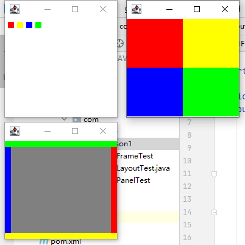
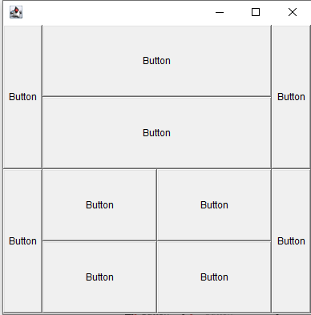
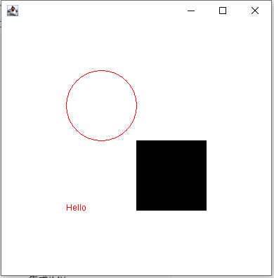
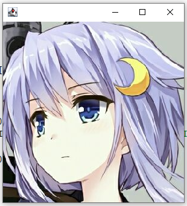
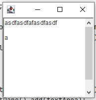
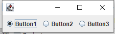
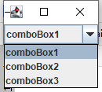
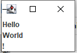

# 13GUI开发

## AWT组件与属性

* 窗体 : java.awt.Frame
  * 设置可见 : setVisible(true);
  * 设置尺寸 : setSize(500, 300);
  * 设置背景 : setBackground(new Color(15, 143, 227));
  * 固定大小 : frame.setResizable(false);
  * 设置边距及宽高 : frame.setBounds(100, 100, 500, 500);
* 区域 : java.awt.Panel
  * 设置尺寸 : setSize(500, 300);
  * 设置背景 : setBackground(new Color(15, 143, 227));
  * 固定大小 : frame.setResizable(false);
  * 设置边距及宽高 : frame.setBounds(100, 100, 500, 500);
* 按钮 : java.awt.Button
* 文本框 : java.awt.TextField
  * 设置文本 : setText("");
  * 输入显示为星号 : setEchoChar('*');
* 标签 : java.awt.Label

## 布局Layout



```
import java.awt.*;

public class LayoutTest {
    public static void main(String[] args) {
        Frame frame1 = new Frame();
        frame1.setVisible(true);
        frame1.setSize(200, 200);
        frame1.setLayout(new FlowLayout(FlowLayout.LEFT));
        for (int i = 0; i < 4; i++) {
            frame1.add(new ColourfulPanel());
        }

        Frame frame2 = new Frame();
        frame2.setVisible(true);
        frame2.setBounds(0,200,200,200);
        frame2.add(new ColourfulPanel(), BorderLayout.EAST);
        frame2.add(new ColourfulPanel(), BorderLayout.SOUTH);
        frame2.add(new ColourfulPanel(), BorderLayout.WEST);
        frame2.add(new ColourfulPanel(), BorderLayout.NORTH);
        frame2.add(new ColourfulPanel(), BorderLayout.CENTER);

        Frame frame3 = new Frame();
        frame3.setVisible(true);
        frame3.setBounds(200,0,200,200);
        frame3.setLayout(new GridLayout(2,2));
        frame3.add(new ColourfulPanel());
        frame3.add(new ColourfulPanel());
        frame3.add(new ColourfulPanel());
        frame3.add(new ColourfulPanel());
    }
}
class ColourfulPanel extends Panel {
    public ColourfulPanel(){
        setBackground(new Color(randomInt(),randomInt(),randomInt()));
    }
    private int randomInt(){
        return (int)(Math.random()*255);
    }
}
```



```
import java.awt.*;

public class LayoutExercise {
    public static void main(String[] args) {
        //窗口
        Frame frame = new Frame();
        frame.setVisible(true);
        frame.setBounds(2000,200,400,400);
        frame.setLayout(new GridLayout(2,1));

        //上面板
        Panel panel1 = new Panel(new BorderLayout());
        Panel panel2 = new Panel(new GridLayout(2,1));
        frame.add(panel1);
        panel1.add(new Button("Button"),BorderLayout.EAST);
        panel1.add(new Button("Button"),BorderLayout.WEST);
        panel2.add(new Button("Button"));
        panel2.add(new Button("Button"));
        panel1.add(panel2,BorderLayout.CENTER);

        //下面板
        Panel panel3 = new Panel(new BorderLayout());
        Panel panel4 = new Panel(new GridLayout(2,2));
        frame.add(panel3);
        panel3.add(new Button("Button"),BorderLayout.WEST);
        panel3.add(new Button("Button"),BorderLayout.EAST);
        panel4.add(new Button("Button"));
        panel4.add(new Button("Button"));
        panel4.add(new Button("Button"));
        panel4.add(new Button("Button"));
        panel3.add(panel4);
    }
}
```

## 监听事件

### 组件监听

```
import java.awt.*;
import java.awt.event.WindowAdapter;
import java.awt.event.WindowEvent;

public class Listener {
    public static void main(String[] args) {
        Frame frame = new Frame();
        frame.setVisible(true);
        frame.setSize(200,200);
        frame.addWindowListener(new WindowAdapter() {
            @Override
            public void windowClosing(WindowEvent e) {
                super.windowClosing(e);
                System.exit(0);
            }
        });
        Button button = new Button("Button");
        button.addActionListener((event)->{
            System.out.println("the button is clicked");
        });
        frame.add(button);
    }
}
```

### 鼠标监听

```
import com.lisnote.BaseFrame;

import java.awt.*;
import java.awt.event.MouseAdapter;
import java.awt.event.MouseEvent;

public class MouseListenerTest {
    public static void main(String[] args) {
        new MouseFrame();
    }
}

class MouseFrame extends BaseFrame {
    Point point = new Point();

    MouseFrame() {
        super("MouseFrame");
        addMouseListener(new MouseAdapter() {
            @Override
            public void mousePressed(MouseEvent e) {
                point = e.getPoint();
                repaint();
            }
        });
    }

    @Override
    public void paint(Graphics g) {
        g.fillOval(point.x, point.y, 10, 10);
    }
}
```

### 键盘监听

```
import com.lisnote.BaseFrame;

import java.awt.event.KeyAdapter;
import java.awt.event.KeyEvent;

public class KeyboardListenerTest {
    public static void main(String[] args) {
        new MyFrame();
    }
}

class MyFrame extends BaseFrame {
    public MyFrame() {
        super("Keyboard Listener");
        addKeyListener(new KeyAdapter() {
            @Override
            public void keyTyped(KeyEvent e) {
                setTitle("" + e.getKeyChar());
            }
        });
    }
}
```

### 定时器

```
import javax.swing.*;
import java.awt.*;
import java.awt.event.ActionEvent;
import java.awt.event.ActionListener;
import java.util.Date;

public class TimerTest extends Frame implements ActionListener {
    Timer timer = new Timer(100, this);
    public static void main(String[] args) {
        new TimerTest().timer.start();
    }

    @Override
    public void actionPerformed(ActionEvent e) {
        System.out.println(new Date());
        timer.start();
    }
}
```

## 画板



```
public class PaintTest {
    public static void main(String[] args) {
        Frame frame = new PaintFrame();

    }
}

class PaintFrame extends BaseFrame {
    @Override
    public void paint(Graphics g) {
        g.fillRect(200,200,100,100);
        g.setColor(Color.red);
        g.drawOval(100, 100, 100, 100);
        g.drawString("Hello",100,300);
    }
}
```

## Swing组件

* 窗体 JFrame
* 标签 JLabel
* 弹窗 JDialog

### Swing使用

* 窗体

  ```
  public class SwingBase {
      public static void main(String[] args) {
          Frame frame = new JFrameBase();
      }
  }
  
  class JFrameBase extends JFrame {
      JFrameBase() {
          setVisible(true);
          setSize(200, 200);
          setDefaultCloseOperation(EXIT_ON_CLOSE);
          Container content = this.getContentPane();
          content.setBackground(Color.red);
      }
  }
  ```

  

* 弹窗

  ```
  import javax.swing.*;
  import java.awt.*;
  
  public class JDialogTest {
      public static void main(String[] args) {
          Frame frame = new JFrameBase();
          Button button = new Button("button");
          button.addActionListener(e -> new DialogTest());
          frame.add(button);
      }
  }
  
  
  class DialogTest extends JDialog {
      DialogTest() {
          setVisible(true);
          setSize(100,100);
      }
  }
  ```

* 图像

  

  ```
  import com.lisnote.BaseJFrame;
  
  import javax.swing.*;
  
  public class ImageIconTest extends BaseJFrame {
      public static void main(String[] args) {
          new ImageIconTest();
      }
  
      ImageIconTest() {
          super();
          JLabel label = new JLabel();
          ImageIcon imageIcon = new ImageIcon("src/main/resources/Image.jpg");
          label.setIcon(imageIcon);
          getContentPane().add(label);
          pack();
      }
  }
  ```

* JScroll面板

  

  ```
  import com.lisnote.BaseJFrame;
  
  import java.awt.*;
  
  public class JScrollTest extends BaseJFrame {
      public static void main(String[] args) {
          new JScrollTest();
      }
  
      JScrollTest() {
          TextArea textArea = new TextArea();
          getContentPane().add(textArea);
      }
  }
  ```

* 单选框

  

  ```
  import com.lisnote.BaseJFrame;
  
  import javax.swing.*;
  import java.awt.*;
  
  public class JRadioButtonTest extends BaseJFrame {
      public static void main(String[] args) {
          new JRadioButtonTest();
      }
  
      JRadioButtonTest() {
          setLayout(new FlowLayout());
          JRadioButton button1 = new JRadioButton("Button1");
          JRadioButton button2 = new JRadioButton("Button2");
          JRadioButton button3 = new JRadioButton("Button3");
          ButtonGroup buttonGroup = new ButtonGroup();
          buttonGroup.add(button1);
          buttonGroup.add(button2);
          buttonGroup.add(button3);
          add(button1);
          add(button2);
          add(button3);
          pack();
      }
  }
  ```

* 多选框

  

  ```
  import com.lisnote.BaseJFrame;
  
  import javax.swing.*;
  
  public class JComboBoxTest extends BaseJFrame {
      public static void main(String[] args) {
          new JComboBoxTest();
      }
      JComboBoxTest(){
          JComboBox comboBox = new JComboBox();
          comboBox.addItem("comboBox1");
          comboBox.addItem("comboBox2");
          comboBox.addItem("comboBox3");
          getContentPane().add(comboBox);
          pack();
      }
  }
  ```

* 列表

  

  ```
  import com.lisnote.BaseJFrame;
  
  import javax.swing.*;
  import java.util.Vector;
  
  public class JListTest extends BaseJFrame {
      public static void main(String[] args) {
          new JListTest();
      }
      JListTest(){
          Vector<String> vector = new Vector<>();
          JList<String> jList = new JList<>(vector);
          vector.add("Hello");
          vector.add("World");
          vector.add("!");
          getContentPane().add(jList);
          pack();
      }
  }
  ```

* 文本框  JTextField

* 密码框  JPasswordField

* 文本域  JTextArea

