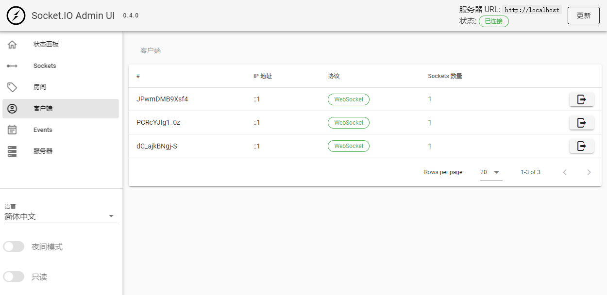

**此处以node作为后端实践**

[官方文档](https://socket.io/docs/v4/)

# Socket.io

十分好用的一个websocket库,为使用websocket进行交流提供了极大便利

## 基本用例

1. 安装socket.io和express

   ```bash
   npm i socket.io express
   ```

2. 编写服务`index.js`

   ```javascript
   const express = require('express');
   const http = require('http');
   const { Server } = require("socket.io");
   
   const app = express();
   const server = http.createServer(app);
   const io = new Server(server);
   
   app.use(express.static("./"))
   
   io.on('connection', (socket) => {
     socket.on("message", msg => {
       console.log(msg)
       io.emit("message", msg)
     })
   });
   
   server.listen(80, () => {
     console.log('server running at http://localhost/');
   });
   ```

3. 编写前端页面`index.html`

   ```html
   <!DOCTYPE html>
   <html>
     <head>
       <title>socket.io</title>
       <script src="https://cdn.socket.io/4.5.1/socket.io.min.js"></script>
       <style>
         #messages {
           display: flex;
           flex-direction: column-reverse;
         }
       </style>
     </head>
     <body>
       <input id="input" autocomplete="off" />
       <ul id="messages"></ul>
   
       <script>
         let input = document.getElementById('input');
         let messages = document.getElementById('messages');
   
         let socket = io();
         socket.on('message', (msg) => {
           let element = document.createElement('p');
           element.innerText = msg;
           messages.appendChild(element);
         });
         input.focus();
         input.addEventListener('keydown', function (e) {
           if (e.key != 'Enter') return;
           socket.emit('message', input.value);
           input.value = '';
         });
       </script>
     </body>
   </html>
   ```

4. 启动

   ```bash
   node index.js
   ```

5. 访问http://localhost

# 常用API

**socket.io中有较多的重复逻辑的API不会重复说明, 比如emit方法,其实server和socket都可用, 且用法相同只是作用不同.此处也不再指明类似方法**

## 事件

### on

作用 : 监听事件

参数 : eventName,  callback

```javascript
// 当message事件触发时候执行函数
socket.on("message", msg=>console.log(msg));
```

### emit

作用 : 触发远端监听事件

参数 : eventName, ...args

```javascript
// 触发远端message事件
socket.emit("message", "hello~")
```

### onAny

作用 : 监听所有事件

参数 : callback

描述 : 运行顺序的优先级高于on

```javascript
socket.onAny((event, message)=>{
    io.emit(event,message);
});
```

### send

等价于emit("message", ...args)

### 内置事件表

| 事件       | 触发时机           | 所属上下文     |
| ---------- | ------------------ | -------------- |
| connection |                    | server         |
| disconnect |                    | socket         |
| message    | 远端使用send()方法 | server, socket |

## 集合操作

### of

指定命名空间

### nsp

获取所在命名空间

### in/to

指定房间

### join

进入房间

### leave

退出房间

## 中间件

在接入时运行的函数, 常用于

* 鉴权
* 速率限制

```javascript
io.use((socket, next) => {
  next();
});

io.use((socket, next) => {
  next(new Error("thou shall not pass"));
});

io.use((socket, next) => {
  // not executed, since the previous middleware has returned an error
  next();
});
```

# 技术相关

## 跨域访问

**常规的websocket并不需要处理跨域问题**

socket.io有用http轮询机制实现了模拟的websocket(polling transport), 且默认使用http协议进行握手, 因此在跨域访问时将会导致cors错误

有两种解决方案

1. 在客户端解决

   仅使用websocket

   ```javascript
   let socket = io(`ws://${location.host}`, {
       transports: ["websocket"],
   });
   ```

2. 在服务端解决

   添加cors配置

   ```javascript
   const io = new Server(httpServer, {
     cors: {
       origin: "*",
       // origin: "https://my-frontend.com",
       credentials: true
     }
   });
   ```

## 后台界面

[socket.io-admin-ui](https://github.com/socketio/socket.io-admin-ui/)

非常好看并且便利的东西,而且还有官方汉化



### 使用步骤

1. 安装

   ```bash
   npm i @socket.io/admin-ui
   ```

2. 修改代码

   ```javascript
   const { instrument } = require("@socket.io/admin-ui");
   const io = new Server(server,{
     cors: {
       origin: ["https://admin.socket.io"],
       credentials: true
     }
   });
   instrument(io, {
     auth: false
   });
   ```

3. 访问https://admin.socket.io/

### 鉴权

将instrument部分修改为以下即可

```javascript
instrument(io, {
  auth: {
    type: "basic",
    username: "lisnote",
    // 密码为使用Bcrypt加密后的结果
    password: "$2a$10$hj4hdlqfFApjGMHQEkASB.bNHeBhfV04wGogJXqukcMfFAa5Es2cS",
  },
});
```

### 自定义前端

访问https://github.com/socketio/socket.io-admin-ui/tree/main/ui/dist

修改并部署即可


# 随笔

获取连接数量

```javascript
io.eio.clientsCount
```


