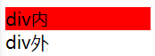

留有疑问和暂时忽略的部分搜索:补课

不理解搜索:有异议

文章所记主要为Vue2到Vue3的变化

有些技术Vue2已经存在,但是之前没注意过也会在此记录

# 快速开始

重新安装项目框架

```bash
npm create vite
```

更换开发工具集

Vue.js devtools  => **Vue.js devtools beta(router and vuex is not yet supported**

vscode+vetur(plugin) => **vscode + volar(plugin,better then vetur when work in Vue3&TS)**


# 变化

## 重点变化

* 节省内存,提高效率
* 数据驱动的方式增加Proxy
* Composition API
* 更好的支持TypeScript
* 重写虚拟DOM实现和Tree-Shaking算法

## 其他变化

* 全局API转移

  Vue2中有许多全局API,使用`Vue.`进行调用

  Vue3中这些全局API部分被移除,部分被移动到根组件中

* data选项应始终为函数

* 动画过渡类名更改

  | Vue3          | Vue2     |
  | ------------- | -------- |
  | .v-enter-from | .v-enter |
  | .v-leave-from | .v-leave |
  | ...           | ...      |

* 移除事件绑定的keycode修饰符,不再支持`@keyup.13`这样的keycode作为按键修饰

* 移除事件绑定的native修饰符

  默认为native事件,自定义事件需要在子组件中声明

  ```javascript
  emits:['close']
  ```

* 移除过滤器

* **......**


# API一览

## Composition API

组合式 API,对应Vue2的Option API,组合式的api进一步降低耦合度

在Vue2中,对一个业务的配置需要分离到data,computed,watch..., 

而使用Composition API, 可以将相同业务放到同一区域中,让相关功能的代码更加有序的组织在一起

### setup

Vue3的一个新配置项,组件中所用到的数据,方法等均要在配置在setup中

* 常规写法

```vue
<script>
export default {
  name: 'App',
  setup() {
    let name = '张三';
    function sayHello() {
      alert(`My name is ${name}`);
    }
    return {
      name,
      sayHello,
    };
  },
};
</script>
<template>
  <button @click="sayHello">{{ name }}</button>
</template>

```

* 简写写法

```vue
<script setup>
let name = '张三';
function sayHi() {
  alert(`Hi~, My name is ${name}`);
}
</script>
<template>
  <button @click="sayHi">{{ name }}</button>
</template>
```

setup尽量不要与Vue2的data,methods,computed配置混用

setup中this为undefined,使用箭头函数进行配置定义并无异常

#### 传入参数

setup可接收两个传入参数

1. props : 对象,包含数组外部传递过来,且组件内部声明接收的属性
2. context : 上下文对象,包含
   * attrs : 相当于vue2的this.$attrs
   * slots : 相当于vue2的this.$slots
   * emit : 相当于vue2的this.$emit

#### 执行时机

生命周期beforeCreate之前


### ref函数

新的数据劫持方式,用于定义响应式数据

用例

```vue
<script setup>
import { ref } from 'vue';
let name = ref('lisnote');
function sayHello() {
  alert(`My name is ${name.value}`);
}
</script>

<template>
  <button @click="sayHello">{{ name }}</button>
</template>
```

ref传入基本类型,返回RefImpl对象

ref传入对象类型,返回包含Proxy的RefImpl对象

vue3的响应式数据,支持Object.NewProperty的方式增加新属性

### reactive函数

新的数据劫持方式,用于定义响应式数据

reactive仅支持传入对象和数组

```javascript
let person = reactive({
  name: 'lisnote',
});
```


### computed

```vue
<script setup>
import { reactive, computed } from 'vue';
let person = reactive({
  name: 'lisnote',
});
let sayHi = computed({
  get() {
    return 'Hi~' + person.name;
  },
  set(name) {
    person.name = name.replace('Hi~', '');
  },
});
let sayHello = computed(() => {
  return 'Hello~' + person.name;
});
</script>
<template>
  <div>{{ sayHi }}</div>
  <div>{{ sayHello }}</div>
</template>
```

### watch

* ref

```javascript
// 监视单个ref返回的数据
watch(name, (newValue, oldValue) => {
  console.log('ref>name被修改', oldValue, '>', newValue);
});
name.value = 'didongxiaoli';
// output : ref>name被修改 lisnote > didongxiaoli

// 监视多个ref返回的数据
watch([name, age], (newValue, oldValue) => {
  console.log('ref>name/age被修改', oldValue[1], '>', newValue[1]);
});
age.value = 19;
// output : ref>name/age被修改 18 > 19
```

* reactive,**reactive逻辑上大病较多,请仔细阅读代码及注释**

```javascript
// 监视reactive返回的数据
watch(person, (newValue, oldValue) => {
  console.log('reactive>person被修改', oldValue.name, '>', newValue.name);
});
person.name = 'didongxiaoli';
// reactive>person被修改 didongxiaoli > didongxiaoli
// 可见,vue3中监视reactive返回的数据并不能正确获取oldValue

// 监视reactive返回的数据中的某个属性
watch(
  () => person.name,
  (newValue, oldValue) => {
    console.log('reactive>person.name被修改', oldValue, '>', newValue);
  }
);
person.name = 'didongxiaoli';
// output : reactive person.name被修改 lisnote > didongxiaoli
// 单个属性oldValue获取正常

// 监视reactive返回的数据中的某些属性
watch([() => person.name, () => person.age], (newValue, oldValue) => {
  console.log('reactive>person.name/person.age被修改', oldValue[0], '>', newValue[0]);
});
person.name = "didongxiaoli";
// output : reactive>person.name/person.age被修改 lisnote > didongxiaoli
// 监视多个属性oldValue获取正常

// 深度监视reactive返回的数据中的对象属性
watch(
  () => person.hobby,
  (newValue, oldValue) => {
    console.log('reactive person.hobby被修改', oldValue.sing.fee, '>', newValue.sing.fee);
  },
  { deep: true }
);
person.hobby.sing.fee = 10;
// output : reactive person.hobby被修改 10 > 10
// 第一个传入参数为函数形式的返回对象时,深度监视配置有效,但是不能正确获取oldValue
```

### watchEffect

初次渲染和函数中用到的响应式数据被修改时,回调函数被调用

```javascript
watchEffect(() => {
  person.name;
  age.value;
  console.log('watchEffect回调函数中用到的变量被改了');
});
age.value = 1;
person.name = 'didongxiaoli';
// watchEffect回调函数中用到的变量被改了
// watchEffect回调函数中用到的变量被改了
// watchEffect回调函数中用到的变量被改了
```

### Vue3生命周期

Vue2中的beforeDestroy和destroyed被更名为beforeUnmount和unmounted

| Option API    | Composition  API  |
| ------------- | ----------------- |
| beforeCreate  | setup()           |
| created       | setup()           |
| beforeMount   | onBeforeMount()   |
| mounted       | onMounted()       |
| beforeUpdate  | onBeforeUpdate()  |
| updated       | onBeforeUpdated() |
| beforeUnmount | onBeforeUnmount() |
| unmounted     | onUnmount()       |

### 自定义hook函数

本质是一个函数,把setup中的Composition API进行封装

类似于mixin

一般hook函数文件都放在hooks文件夹中,且文件命名格式为useXXX.js

步骤 : 

1. 在hooks文件夹下新建useXXX.js文件
2. 写原本在setup中的的javascript
3. 导出模块(ES6方式)
4. 在要使用hook函数的组件中import

### toRef & toRefs

用此方法获得的返回对象被修改时,原响应对象也会被修改并有响应

```vue
<script>
import { reactive, toRef, toRefs } from 'vue';

export default {
  setup() {
    let person = reactive({
      name: 'lisnote',
      age: 18,
      hobby: {
        sing: {
          time: 100,
          fee: 1000,
        },
      },
    });
    return {
      ...toRefs(person),
      fee: toRef(person.hobby.sing, 'fee'),
    };
  },
};
</script>
<template>
  {{ name }},
  {{ fee }}
</template>
```

### readonly

接收一个响应式对象,并返回一个只读对象

**有异议:**为什么不用const?避免冗余变量吗?还是只是为了截取警报?

### shallow函数

浅层函数,有`shallowRef()`,`shallowReactive()`,`shallowReadonly()`

作用 : 提高效率

应用场景举例 : 

1. 当ref接收的是一个对象时,且不需要对传入对象进行更改时进行响应,仅对对象替换时进行响应,应使用shallowReactive

2. 当对象中包含一个较深层次库的引用,但是该库不需要响应式时,使用普通函数变为响应式会大量消耗资源,应使用shallowReactive

3. 当对象中只需保持浅层只读,而不需要将深层次的内容也变为只读时,应使用shallowReadonly

### toRaw

toRaw : 获取被Proxy代理的真实对象

```javascript
import { reactive, toRaw } from 'vue';
let person = reactive({
  name: 'lisnote',
});
let raw = toRaw(person);
raw.name = 'didongxiaoli';
console.log(person, raw);
```

**补课:**我用obj.__v_raw获取被代理的真实对象会有什么坏影响吗?

### markRaw

markRaw : 将属性标记为非相应对象,比shallow函数更精准的控制非响应属性

```vue
<script setup>
import { reactive, markRaw } from 'vue';
let person = reactive({
  name: 'lisnote',
  hobby: markRaw([]),
});
function addHobby() {
  person.hobby.push('sing');
  console.log(person);
}
</script>
<template>
  {{ person }}
  <button @click="addHobby()">addHobby</button>
</template>
```

点击按钮更改hobby,界面并无响应

### customRef

* 案例 : 实现防抖效果

```vue
<template>
  <input type="text" v-model="keyword" />
  <h3>{{ keyword }}</h3>
</template>

<script setup>
import { ref, customRef } from 'vue';

// let keyword = ref('hello') //使用Vue准备好的内置ref
//自定义一个myRef
function myRef(value, delay) {
  let timer;
  //通过customRef去实现自定义
  return customRef((track, trigger) => {
    return {
      get() {
        track(); //告诉Vue这个value值是需要被“追踪”的
        return value;
      },
      set(newValue) {
        clearTimeout(timer);
        timer = setTimeout(() => {
          value = newValue;
          trigger(); //告诉Vue去更新界面
        }, delay);
      },
    };
  });
}
let keyword = myRef('hello', 500); //使用程序员自定义的ref
</script>
```

### provide & inject

父组件中用provide()传入的数据,后代组件中可以用inject()来使用数据

* 父组件中

```javascript
let car = reactive({name:'奔驰',price:'40万'});
provide('car',car);
```

* 子组件中

```javascript
const car = inject('car');
console.log(car);
```


### 响应式数据的判断

isRef:检查一个值是否为一个ref创建的响应式数据

isReactive : 检查一个对象是否是由reactive创建的响应式数据

isReadonly : 检查一个对象是否是由 readonly 创建的只读数据

isProxy : 检查一个对象是否由 reactive 或者 readonly 创建的代理

**注意:**isProxy并不是检查对象是否为Proxy,而是是否为vue创建的Proxy,代码测试 : 

```javascript
import { reactive, isProxy } from 'vue';
let person = reactive({ name: 'lisnote' });
let human = new Proxy({ name: 'didongxiaoli' }, {});
console.log(
  isProxy(person),
  isProxy(human)
);
// output : true false
```


## 组件

### 异步引入

一般状态下,组件是完全引入后进行渲染的

使用异步引入,可以使组件根据在不完全引入时,对已经加载了的组件进行渲染

* 使用异步引入组件

```vue
<script setup>
import { defineAsyncComponent } from 'vue';
const AsyncComponent = defineAsyncComponent(() =>
  import('./components/AsyncComponent.vue')
);
</script>
<template>
  App<br />
  <AsyncComponent />
</template>
```

* 被异步引入的组件

```javascript
<template>AsyncComponent</template>
```

当使用异步引入时,setup配置项可以是异步函数,此时返回值可以为一个Promise,resolve或reject时,组件才被加载

## 标签

### Fragment

在Vue3中,组件可以有多个根标签,多个根标签时,这些根标签会被包含在一个虚拟标签Fragment中

### Teleport

在保持组件关系的前提下

将组件元素移动到指定html结构的技术(减少嵌套)

* 代码

```vue
<template>
  <div>
    div内
    <teleport to="body">div外</teleport>
  </div>
</template>

<style>
div {
  background-color: red;
}
</style>
```

* 效果 : 



### Suspense

使用异步组件时,定义已加载和未加载的显示模板

```vue
<script setup>
import { defineAsyncComponent } from 'vue';
const AsyncComponent = defineAsyncComponent(() =>
  import('./components/AsyncComponent.vue')
);
</script>
<template>
  App<br />
  <suspense>
    <template v-slot:default>
      <AsyncComponent />
    </template>
    <template v-slot:fallback> 加载中... </template>
  </suspense>
</template>
```

# 原理探索

## 数据劫持实现

* Proxy

共十三种情况此处仅以get,set为例

```javascript
let person = {
  gender: 0,
  age: 22,
};
let personProxy = new Proxy(person, {
  get(target, prop, proxy) {
    console.log(target, '对象的', prop, '属性被读取.', '代理对象是', proxy);
    return prop == 'age' ? 18 : target[prop];
  },
  set(target, prop, value, proxy) {
    console.log(target, '对象的', prop, '属性被写入', '值为.', '代理对象是', value, proxy)
;
  },
});
personProxy.name = 'lisnote';
console.log(personProxy.age);
console.log(person);
// {gender: 0, age: 22} '对象的' 'name' '属性被写入' '值为.' '代理对象是' 'lisnote' Proxy {gender: 0, age: 22}
// {gender: 0, age: 22} '对象的' 'age' '属性被读取.' '代理对象是' Proxy {gender: 0, age: 22}
// 18
// {gender: 0, age: 22}
```

* Reflect

  Reflect支持很多原本在Object中的方法,例如defineProperty,get,set,deleteProperty等

  Reflect.defineProperty与Object.defineProperty相比,存在返回值

* Object.defineProperty

  Vue3依旧在大量使用这个Vue2中的数据劫持方式

## toRaw实现

正当我绞尽脑汁怎么获取被Proxy对象代理的真实对象时,得知vue的toRaw()方法

看看源码,是在使用obj['\_\_v_raw']来获取被代理的真实对象,vue都这样了,估计JavaScript确实是没有内置的类似于\_\_proto\_\_那样的属性可以访问到被Proxy对象代理的真实对象了吧,然后又有了新的疑问

印象中的reactive()返回输出并没有看到这个property,那\_\_v\_raw藏在了哪?

```javascript
import { reactive } from 'vue';
let human = reactive({ age: 18 });
console.log("__v_raw" in human);
// output : false
```

我又想到了另一个可能

```JavaScript
function reactive(target) {
  return new Proxy(target, {
    get(target, key) {
      if (key === '__v_raw') return target;
      return target[key];
    },
  });
}
function toRaw(target) {
  return target.__v_raw;
}

let person = reactive({ name: 'lisnote' });
console.log(toRaw(person));
```

看起来或许有点憨憨,翻看源码进行验证,没想到逻辑上还真是如此,但是Vue的对各种情况的处理更加完善


