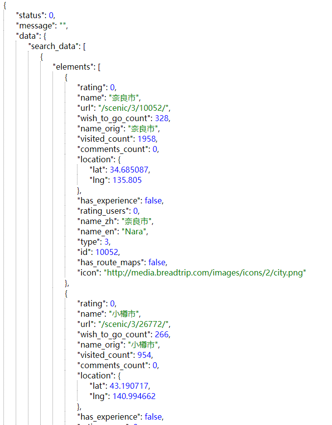

### JSON解析组件

效果预览:

<div style="background:gray;display:flex;justify-content:center;padding:10px;"></div>

案例环境:

1. 使用vue3
2. 全局注册LisJSON组件

组件代码:

```vue
<script lang="ts" setup name="LisJSON">
import { computed } from 'vue';
const props = defineProps({
  data: [Object, String, Number, Boolean],
  dot: Boolean,
});
// dataType: props.data的数据格式
let dataType = computed(() => props.data?.constructor.name ?? 'Null');
// showWay: 决定展示方式
let showWay = computed(
  () =>
    ({
      Null: 'origin',
      String: 'origin',
      Number: 'origin',
      Boolean: 'origin',
      Object: 'object',
      Array: 'array',
    }[dataType.value]),
);
// showData: 用于展示的数据, 在此环节处理一些展示时使用起来不够直接的数据
let showData = computed(
  () =>
    ({
      Null: 'null',
      String: `"${props.data}"`,
      Object: Object.entries(props.data ?? {}),
    }[dataType.value] ?? props.data),
);
// valueStyle: 值样式, 美化, 可有可无
let valueStyle = computed(
  () =>
    ({
      String: 'color:green',
    }[dataType.value] ?? 'color:blue'),
);
</script>

<template>
  <span v-if="showWay === 'origin'" :style="valueStyle">{{ showData }}</span>
  <span v-else-if="showWay === 'object'">
    {
    <div v-for="(item, index) in showData" class="block-inner" :key="index">
      "{{ item[0] }}":
      <LisJSON
        :data="item[1]"
        :dot="(showData as Array<any>).length-1> (index as Number)"
      />
    </div>
    }</span
  >
  <span v-else-if="showWay === 'array'">
    [
    <div v-for="(item, index) in showData" class="block-inner" :key="index">
      <LisJSON
        :data="item"
        :dot="(showData as Array<any>).length-1> (index as Number)"
      />
    </div>
    ]</span
  >{{ props.dot ? ',' : '' }}
</template>

<style lang="scss" scoped>
.block-inner {
  padding-left: 24px;
  border-left: 1px dotted gray;
}
</style>
```

